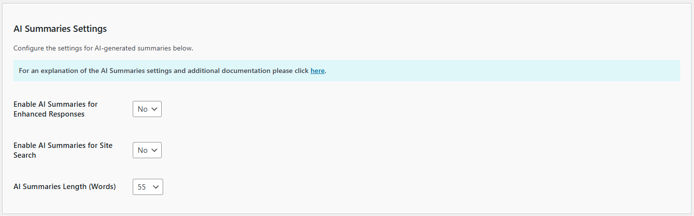

# Configuring the AI Summaries Settings

The **AI Summaries** feature enables your Kognetiks Chatbot to automatically generate concise summaries of pages, posts, and other content. These summaries can enhance the Chatbot and Search functionalities by providing visitors with quick, AI-powered insights into your content. Summaries are generated only when they do not already exist or if the content has been updated since the summary was last created.

Follow the steps below to configure this feature:

---

## AI Summaries Settings

### 1. **Enable AI Summaries for Enhanced Responses**
   - **Description**: Adds an AI-generated summary for any related links included in the chatbot's responses to visitor prompts.
   - **Options**:  
     - `Yes`: Include an AI summary for related links.  
     - `No` (default): Do not include AI summaries.
   - **Default Value**: `No`

---

### 2. **Enable AI Summaries for Site Search**
   - **Description**: Adds AI-generated summaries for search results, replacing traditional excerpts for related pages, posts, or content in search responses.
   - **Options**:  
     - `Yes`: Include an AI summary for search results.  
     - `No` (default): Use standard excerpts instead of AI summaries.
   - **Default Value**: `No`

---

### 3. **AI Summary Length (Words)**
   - **Description**: Sets the maximum word count for AI summaries included in Enhanced Responses or Site Search Results.
   - **Options**:  
     - Values range from `1` to `500` (increments of 1).
   - **Default Value**: `55` words

---

## Steps to Configure

1. **Navigate** to the **AI Summaries Settings** section of the Kognetiks Chatbot plugin in your WordPress dashboard.
2. **Adjust the settings** for each option using the dropdown menus.
3. **Click** **Save Settings** to apply your changes.

---

### Tips for Optimal Use

- AI summaries are only generated when **AI Summaries** are enabled and:
  - No summary exists.
  - The content has been updated since the last summary was generated.

- Summaries rely on the default AI Engine and model configured in the **General Settings** tab. Generating summaries consumes API tokens, so keep this in mind when enabling this feature.

- Generating summaries for the first time or after updates may cause slight delays in responses, as the plugin needs to call the AI API. However, once a summary is created, it is stored locally, eliminating the need for repeated API calls for the same content.

---

## Additional Resources
- **[Back to the Overview](/overview.md)**