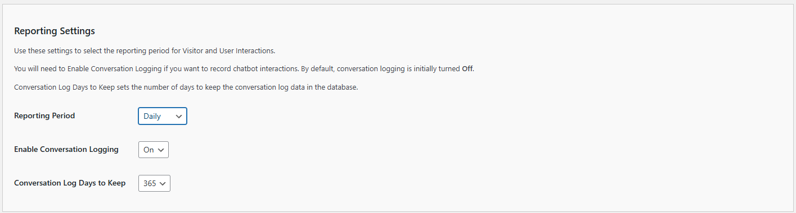

# 📊 Analytics Package Overview

The **Analytics Package** in the Kognetiks Chatbot for WordPress plugin provides comprehensive tools to track, measure, and optimize your chatbot's performance. The package consists of three powerful components that work together to give you complete visibility into your chatbot's interactions and effectiveness.

## Package Components

The Analytics Package includes:

1. **📈 Insights Dashboard** – Real-time analytics dashboard accessible directly in your WordPress admin panel
2. **📧 Conversation Digest Email** – Automated email reports delivering conversation summaries and transcripts to your inbox
3. **💎 Proof of Value Reports Email** – Premium email reports with actionable insights, performance metrics, and improvement recommendations

**Note**: Conversation logging must be enabled for all analytics features. Go to the **Reporting** tab, then scroll down to the **Reporting Settings** section to enable logging.

---

## How the Components Work Together

The three components of the Analytics Package complement each other to provide a complete picture of your chatbot's performance:

- **Insights Dashboard**: Use for real-time monitoring, detailed analysis, and on-demand exploration of your chatbot data
- **Conversation Digest Email**: Stay informed automatically with regular conversation summaries delivered to your inbox
- **Proof of Value Reports Email**: Receive strategic insights and actionable recommendations to improve your chatbot's effectiveness

Together, these tools ensure you never miss important conversations, can analyze trends over time, and have the data needed to continuously improve your chatbot's performance.

---

## 📈 Insights Dashboard

The **Insights** tab provides a powerful dashboard to help you track, measure, and optimize chatbot performance on your site in real-time.

The insights dashboard summarizes data for sentiment analysis, engagement analysis, message and session statistics, and token usage. You can quickly evaluate period-over-period changes in total conversations, unique visitors, average sentiment scores, and positive conversations. To give you further insights, you can filter for visitors only, chatbot responses only, or both together.

> ℹ️ **Note**: This feature is available to all users. Make sure conversation logging is enabled to see insights data.

### 📅 Period & Filter Controls

At the top of the Insights tab, you'll find controls that allow you to:

- **Period Selector** – Choose the comparison windows like `Today vs Yesterday`, `This Week vs Last Week`, etc.
- **Type Filter** – Filter results by conversation type, e.g., `All`, `Visitor`, `Chatbot`).
- **Scoring** – Switch between sentiment scoring that is `Manual` or `Automated`. If automated sentiment scores will be computed hourly.
- **Manual Controls** – Use `Start`, `Stop`, `Restart`, or `Reset` to control manual sentiment scoring.

---

### 🧠 Conversation Statistics

#### Overview
This section shows high-level metrics comparing today's activity to the previous day:

- **Total Conversations** – Number of unique chatbot conversations initiated.
- **Unique Visitors** – Number of individual visitors who interacted with the chatbot.

---

### 🧪 Conversation Quality Analysis

#### Sentiment Analysis
Gain insights into how users feel during interactions:

- **Average Sentiment Score** – Average sentiment across all conversations (range: -1.0 to +1.0).
- **Positive Conversations** – Percentage of conversations classified as overall positive.

---

### 💬 Engagement Analysis

These metrics help evaluate how engaging your chatbot is:

- **High Engagement Rate** – Percentage of users who sent multiple messages or stayed engaged.
- **Average Messages Before Drop-off** – How many messages users send before ending a conversation.

---

### ✉️ Message Statistics

Track message volume and types:

- **Total Messages** – Combined count of all messages exchanged.
- **Visitor Messages** – Messages sent by users/visitors.
- **Chatbot Messages** – Responses generated by the chatbot.

---

### ⏱️ Session Statistics

Understand how long users are staying in a session:

- **Average Session Duration** – The average time (in minutes) users spend interacting with the chatbot.

---

### 🔢 Token Usage Statistics

Monitor your OpenAI (or other LLM provider) usage:

- **Total Tokens Used** – Total number of tokens processed in conversations. Useful for API usage auditing and estimating costs.

---

### 🔍 Understanding Filter Prompts and Responses

The ability to filter and analyze visitor/user sentiment separately from chatbot sentiment is crucial for several reasons:

1. **Deeper Understanding of User Experience**
   - By separating visitor/user sentiment from chatbot sentiment, you can identify if negative sentiment is coming from frustrated users or if it's the chatbot's responses that are causing issues
   - This helps pinpoint exactly where in the conversation flow problems might be occurring

2. **Better Chatbot Optimization**
   - If visitor sentiment is consistently negative while chatbot sentiment is positive, it might indicate that the chatbot's responses, while technically correct, aren't effectively addressing user needs
   - Conversely, if chatbot sentiment is negative but visitor sentiment is positive, it could suggest the chatbot is being too formal or technical when users want more casual interaction

3. **Targeted Improvements**
   - You can make more informed decisions about what to improve:
     - If visitor sentiment is low, you might need to improve the chatbot's understanding of user intent
     - If chatbot sentiment is low, you might need to adjust the tone or style of responses
   - This separation allows for more precise tuning of the chatbot's personality and response patterns

4. **Quality Control**
   - It helps identify if the chatbot is maintaining appropriate emotional intelligence
   - You can ensure the chatbot's responses align with your desired brand voice and customer service standards
   - It provides a way to validate that the chatbot's sentiment analysis is working correctly

5. **Business Impact**
   - Understanding the sentiment dynamics helps improve customer satisfaction
   - It can lead to better conversion rates as you optimize the chatbot's interaction style
   - It helps maintain a positive brand image by ensuring the chatbot's tone matches your company's values

---

## 📧 Conversation Digest Email

The Conversation Digest email is an automated email report that delivers summaries of your chatbot conversations directly to your inbox. This feature helps you stay informed about user interactions with your chatbot without needing to log into your WordPress admin panel.

### Key Features

- **Automated Delivery**: Conversations are automatically collected and sent to your email at regular intervals
- **No Duplicates**: Each conversation appears in only one digest email
- **Session Grouping**: All messages from a single conversation are kept together
- **Flexible Frequency**: Choose how often you receive digests (varies by license tier)

### Free vs Premium

- **Free Users**: Receive summary statistics (total conversations, pages, unique visitors) weekly
- **Premium Users**: Receive full conversation transcripts with complete message-by-message details, available hourly, daily, or weekly

### Use Cases

- Monitor chatbot activity without daily logins
- Review chatbot responses for quality assurance
- Discover common questions users ask
- Track which pages generate the most chatbot interactions
- Review conversations that may need follow-up

### Configuration

Configure the Conversation Digest in **Chatbot Settings** → **Reporting** tab → **"Conversation Digest and Insight Settings"** section.

> 📖 **Learn More**: See the [Conversation Digest Email](./conversation-digest-email.md) documentation for complete details on configuration, troubleshooting, and best practices.

---

## 💎 Proof of Value Reports Email

The Proof of Value Reports email is a premium feature that provides actionable insights about your chatbot's performance. This automated email report includes key metrics, trends, and identifies areas for improvement.

### Key Features

- **Performance Metrics**: Conversations, estimated time saved, resolved rate, and engagement depth
- **Top Pages by Chat Activity**: Identify which pages on your site generate the most chatbot interactions
- **Top Assistants Used**: See which chatbot assistants are being used most frequently
- **Top Unanswered Questions**: Automatically detect questions your chatbot couldn't answer
- **Suggested Next Steps**: Receive actionable recommendations based on your chatbot's performance

### Unanswered Questions Detection

One of the most valuable features is the automatic detection of unanswered questions. The system:

- Monitors chatbot responses for fallback patterns (e.g., "I'm not following", "Could you rephrase")
- Identifies the original questions that triggered these fallback responses
- Groups and ranks questions by frequency
- Helps you identify knowledge gaps and improve your chatbot's responses

### Use Cases

- Identify knowledge gaps in your chatbot's understanding
- Improve your knowledge base with frequently asked questions
- Track chatbot performance trends over time
- Get actionable recommendations for improvement
- Measure the impact of your chatbot optimizations

### Configuration

Configure Proof of Value Reports in **Chatbot Settings** → **Reporting** tab → **"Conversation Digest and Insight Settings"** section.

> 📖 **Learn More**: See the [Proof of Value Reports Email](./proof-of-value-reports-email.md) documentation for complete details on unanswered questions detection, report sections, and best practices.

---

## 📈 Best Practices

### For All Users

- **Enable Conversation Logging**: All analytics features require conversation logging to be enabled
- **Monitor Daily Trends**: Watch for sudden drops or spikes in user activity
- **Track Engagement**: Low engagement could signal that users aren't getting helpful responses
- **Analyze Sentiment**: Negative sentiment may indicate confusion or frustration in the user journey
- **Filter Prompts and Responses**: Explore visitors/users sentiment separately from chatbot sentiment
- **Manage Token Usage**: Keep an eye on token counts if you're billed per token by your AI engine

### For Email Reports

- **Choose Appropriate Frequency**: 
  - **Hourly**: For high-traffic sites needing constant monitoring
  - **Daily**: For regular review and quality checks
  - **Weekly**: For general awareness and trend tracking
- **Review Regularly**: Check your digest emails to stay informed about chatbot activity
- **Take Action**: Use the information to identify questions that need better answers and opportunities to improve your knowledge base
- **Email Management**: Consider setting up email filters or folders to organize your digest emails
- **Team Sharing**: Forward relevant conversations to team members who can help improve responses

### For Premium Users

- **Leverage Full Transcripts**: Use detailed conversation transcripts to understand exact user questions and chatbot responses
- **Monitor Unanswered Questions**: Regularly review the "Top Unanswered Questions" section to identify knowledge gaps
- **Update Knowledge Base**: Add content that addresses frequently unanswered questions
- **Track Improvement**: Monitor whether unanswered questions decrease over time as you add content
- **Use Suggested Next Steps**: Follow the actionable recommendations provided in Proof of Value Reports

---

## 🧩 Compatibility

All Analytics Package features work seamlessly with:
- Conversation continuation
- Assistant-based interactions
- All AI Platform APIs supported by the plugin
- Requires Conversation Logging to be enabled

---

## Related Documentation

- [Conversation Digest Email](./conversation-digest-email.md) – Complete guide to conversation digest emails
- [Proof of Value Reports Email](./proof-of-value-reports-email.md) – Complete guide to proof of value reports

---

For more insights and tutorials, visit our documentation site or join our user community.

---

- **[Back to the Overview](/overview.md)**
