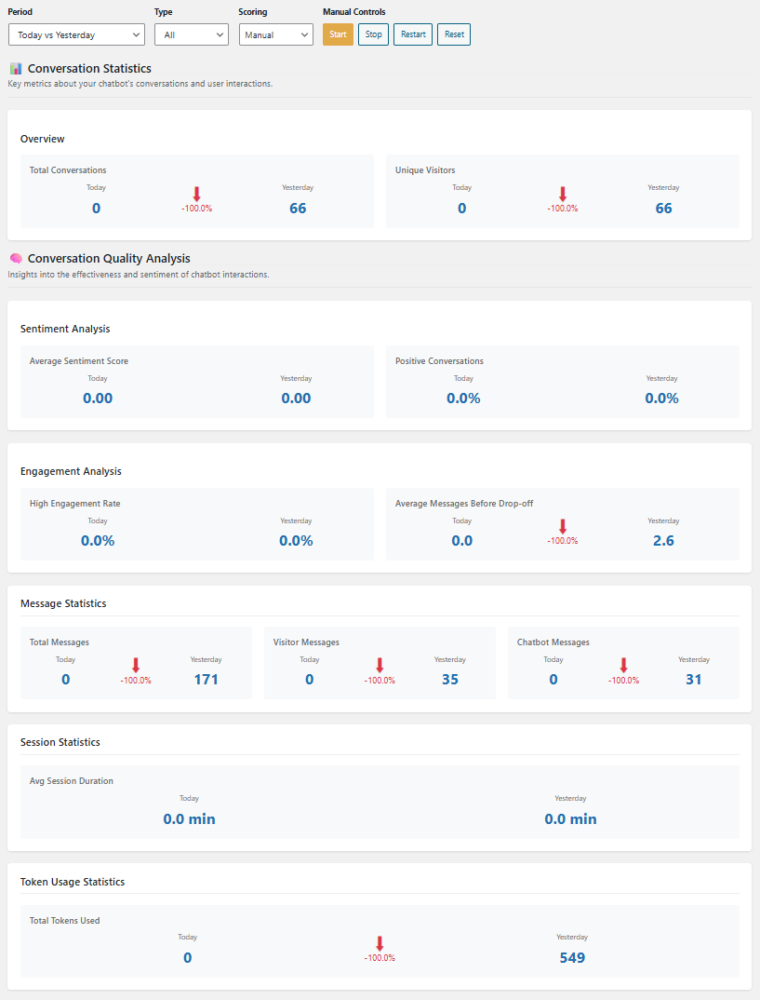

# 📊 Analytics Package Overview (Premium Feature)

The **Analytics** tab in the Kognetiks Chatbot for WordPress plugin provides a powerful dashboard to help you track, measure, and optimize chatbot performance on your site.

The analytics package summarizes data for sentiment analysis, engagement analysis, message and session statistics, and token usage.  You can quickly evaluate period-over-period changes in total conversations, unique visitors, average sentiment scores, and positive conversations.  To give you further insights, you can filter for visitors only, chatbot responses only, or both together.

**Note**: Conversation logging must be enabled for message scoring.  Go to the Reporting tab, then scoll down to the Reporting Settings section to enable logging.

# Analytics Overview

> ⚠️ **Note**: This feature is only available in the premium version of the plugin. Activation requires a valid license key.

## 📅 Period & Filter Controls

At the top of the Analytics tab, you’ll find controls that allow you to filter results:

- **Period Selector** – Choose comparison windows like “Today vs Yesterday,” “This Week vs Last Week,” etc.
- **Type Filter** – Filter results by conversation type (e.g., All, Knowledge Navigator, Assistant, Custom).
- **Scoring** – View results using manual or automatic scoring (if configured).
- **Manual Controls** – Use **Start**, **Stop**, **Restart**, or **Reset** to control manual tracking behavior.

---

## 🧠 Conversation Statistics

### Overview
This section shows high-level metrics comparing today’s activity to the previous day:

- **Total Conversations** – Number of unique chatbot conversations initiated.
- **Unique Visitors** – Number of individual visitors who interacted with the chatbot.

---

## 🧪 Conversation Quality Analysis

### Sentiment Analysis
Gain insights into how users feel during interactions:

- **Average Sentiment Score** – Average sentiment across all conversations (range: -1.0 to +1.0).
- **Positive Conversations** – Percentage of conversations classified as overall positive.

---

## 💬 Engagement Analysis

These metrics help evaluate how engaging your chatbot is:

- **High Engagement Rate** – Percentage of users who sent multiple messages or stayed engaged.
- **Average Messages Before Drop-off** – How many messages users send before ending a conversation.

---

## ✉️ Message Statistics

Track message volume and types:

- **Total Messages** – Combined count of all messages exchanged.
- **Visitor Messages** – Messages sent by users/visitors.
- **Chatbot Messages** – Responses generated by the chatbot.

---

## ⏱️ Session Statistics

Understand how long users are staying in a session:

- **Average Session Duration** – The average time (in minutes) users spend interacting with the chatbot.

---

## 🔢 Token Usage Statistics

Monitor your OpenAI (or other LLM provider) usage:

- **Total Tokens Used** – Total number of tokens processed in conversations. Useful for API usage auditing and estimating costs.

---

## 🔐 Premium Activation

To unlock this tab:

1. Go to the **Plugin Settings > License** tab.
2. Enter your activation key.
3. Save settings and refresh the Analytics tab.

Need help? Visit our support site or email [support@kognetiks.com](mailto:support@kognetiks.com).

---

## 📈 Best Practices

- **Monitor daily trends** – Watch for sudden drops or spikes in user activity.
- **Track engagement** – Low engagement could signal that users aren’t getting helpful responses.
- **Analyze sentiment** – Negative sentiment may indicate confusion or frustration in the user journey.
- **Manage token usage** – Keep an eye on token counts if you’re billed per token by your AI engine.

---

## 🧩 Compatibility

- Works seamlessly with conversation continuation, Assistant-based interactions, and all AI Platform APIs.

---

For more insights and tutorials, visit our documentation site or join our user community.

---

- **[Back to the Overview](/overview.md)**