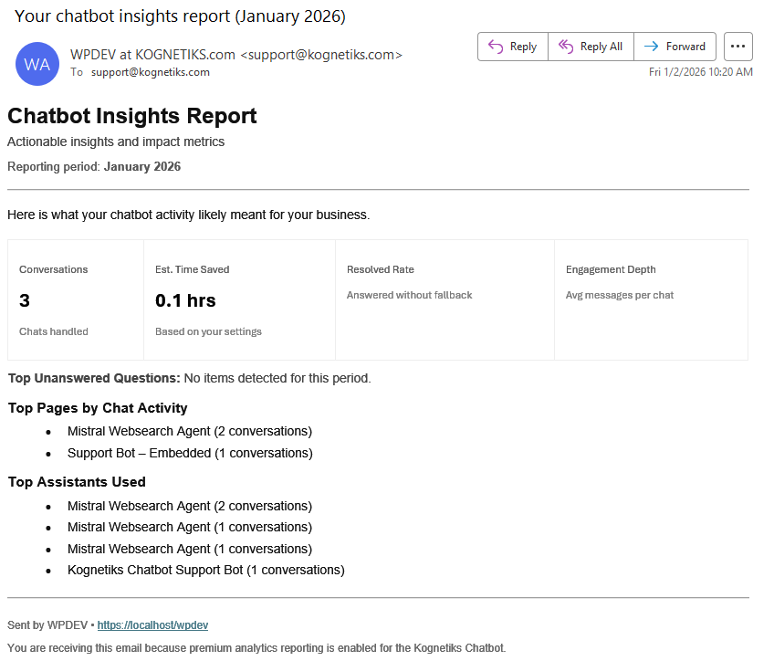

# Proof of Value Reports Email

## Overview

The Proof of Value Reports email is a premium feature that provides actionable insights about your chatbot's performance. This automated email report includes key metrics, trends, and identifies areas for improvement.

## Unanswered Questions Detection

One of the key features of the premium report is the "Top Unanswered Questions" section. This feature helps you identify questions that your chatbot couldn't answer, allowing you to improve your knowledge base and chatbot responses.

### How Unanswered Questions Are Detected

The system uses a pattern-matching approach to identify when the chatbot couldn't understand or answer a user's question. Here's how it works:

#### 1. Fallback Pattern Recognition

The system monitors chatbot responses for specific phrases that indicate the chatbot couldn't understand or answer a question. These patterns include messages like:

- "I'm not following"
- "Could you ask that"
- "That's unclear"
- "Didn't quite catch"
- "Could you try rephrasing"
- "Could you rephrase"
- "Try phrasing"
- "Please clarify"

When the chatbot responds with any of these patterns, it signals that the chatbot couldn't provide a satisfactory answer to the user's question.

#### 2. Question Identification Process

When a fallback pattern is detected, the system:

1. **Identifies the Fallback Response**: Finds chatbot messages within the reporting period that match the fallback patterns.

2. **Locates the Original Question**: For each fallback response, the system looks back in the same conversation session to find the most recent question asked by the user (Visitor or User) before the chatbot's fallback response.

3. **Groups and Counts**: The system groups identical questions together and counts how many times each question resulted in a fallback response.

4. **Ranks by Frequency**: Questions are ranked by how often they triggered fallback responses, with the most frequently unanswered questions appearing first.

For technical details, see [Unanswered Questions Dectection Analysis](unanswered-questions-dectection-analysis.md)

#### 3. Data Quality Filters

To ensure accuracy, the system applies several filters:

- Only counts questions from actual users (Visitor or User types)
- Excludes questions that are purely numeric (like "123")
- Requires both the question and chatbot response to have actual text content
- Only matches questions from the same conversation session as the fallback response
- Only includes questions that occurred before the chatbot's fallback response

#### 4. Why You Might See "No Items Detected"

If the report shows "No items detected for this period," it means:

- **All questions were answered**: The chatbot successfully handled all questions without needing to use fallback responses
- **Different fallback patterns**: Your chatbot might use different wording for unclear questions that doesn't match the current detection patterns
- **No conversations in period**: There may not have been any conversations during the reporting period
- **Pattern mismatch**: The chatbot's actual fallback messages may use different phrasing than the patterns being monitored

#### 5. Customization Options

The unanswered questions detection can be customized:

- **Add More Patterns**: Additional fallback phrases can be added to expand detection coverage
- **Filter Results**: Results can be filtered or modified using WordPress filters
- **Adjust Logic**: The detection logic can be adjusted if your chatbot uses a different fallback system

### Proof of Value Email Example

### Using This Information

The "Top Unanswered Questions" section helps you:

- **Identify Knowledge Gaps**: See what questions your chatbot struggles with
- **Improve Content**: Add information to your knowledge base to answer these questions
- **Enhance Training**: Use these questions to improve your chatbot's responses
- **Measure Improvement**: Track whether unanswered questions decrease over time as you add content

### Best Practices

1. **Review Regularly**: Check the unanswered questions in each report to identify patterns
2. **Update Knowledge Base**: Add content that addresses frequently unanswered questions
3. **Monitor Trends**: Watch for new unanswered questions that appear over time
4. **Customize Patterns**: If your chatbot uses specific fallback phrases, ensure they're included in the detection patterns

## Other Report Sections

The Proof of Value Report also includes:

- **Summary Metrics**: Conversations, estimated time saved, resolved rate, and engagement depth
- **Top Pages by Chat Activity**: Which pages on your site generate the most chatbot interactions
- **Top Assistants Used**: Which chatbot assistants are being used most frequently
- **Suggested Next Steps**: Actionable recommendations based on your chatbot's performance

## Related Documentation

- [Analytics Package Overview](analytics-package/analytics-package.md)
- [Conversation Digest Settings](analytics-package/conversation-digest-email.md)

---

- **[Back to the Overview](/overview.md)**
