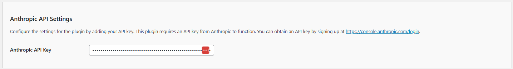

# Configuring the API/Anthropic Settings

The **Kognetiks Chatbot** plugin requires proper configuration to function correctly. Follow the steps below to set up your plugin:

1. **Anthropic API Key**:

   - **Description**: This field is for your Anthropic API key, which is necessary for the plugin to access the NVIDIA functionality.
   - **How to obtain**: You can get your API key by signing up at [Anthropic](https://console.anthropic.com/login).
   - **Input**: Paste your API key in the provided field.

## Steps to Configure

1. Navigate to the API Settings section of the Kognetiks Chatbot plugin in your WordPress dashboard.

2. Copy your Anthropic API key from [Anthropic](https://console.anthropic.com/login).

3. Paste the API key into the `Anthropic API Key` field.

4. Save the settings.

---

- **[Back to the Overview](/overview.md)**
