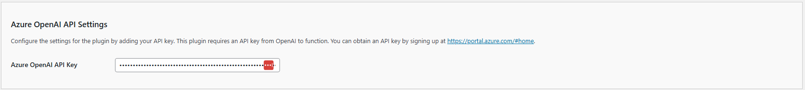

# Configuring the API/Azure OpenAI Settings

The **Kognetiks Chatbot** plugin requires proper configuration to function correctly. Follow the steps below to set up your plugin:

1. **Azure OpenAI API Key**:

   - **Description**: This field is for your OpenAI API key, which is necessary for the plugin to access the Azure OpenAI functionality.
   - **How to obtain**: You can get your API key by signing up at [API keys page](https://azure.microsoft.com/en-us/pricing/purchase-options/azure-account?icid=ai-services).
   - **Input**: Paste your API key in the provided field.

## Steps to Configure

1. Navigate to the API Settings section of the Kognetiks Chatbot plugin in your WordPress dashboard.

2. Copy your OpenAI API key from the [API keys page](https://azure.microsoft.com/en-us/pricing/purchase-options/azure-account?icid=ai-services).

3. Paste the API key into the `Azure OpenAI API Key` field.

4. Save the settings.

---

- **[Back to API Azure OpenAI Settings](api-azure-openai-model-settings.md)**
- **[Back to the Overview](/overview.md)**
