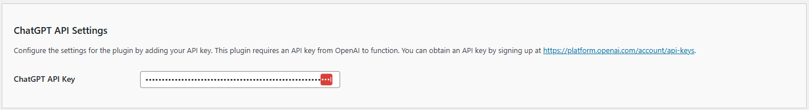

# Configuring the API/ChatGPT Settings

The **Kognetiks Chatbot for WordPress** plugin requires proper configuration to function correctly. Follow the steps below to set up your plugin:

1. **ChatGPT API Key**:

   - **Description**: This field is for your OpenAI API key, which is necessary for the plugin to access the ChatGPT functionality.
   - **How to obtain**: You can get your API key by signing up at [OpenAI's API keys page](https://platform.openai.com/account/api-keys).
   - **Input**: Paste your API key in the provided field.

## Steps to Configure

1. Navigate to the API Settings section of the Kognetiks Chatbot plugin in your WordPress dashboard.

2. Copy your OpenAI API key from the [OpenAI API keys page](https://platform.openai.com/account/api-keys).

3. Paste the API key into the `ChatGPT API Key` field.

4. Save the settings.

---

- **[Back to the Overview](/overview.md)**
