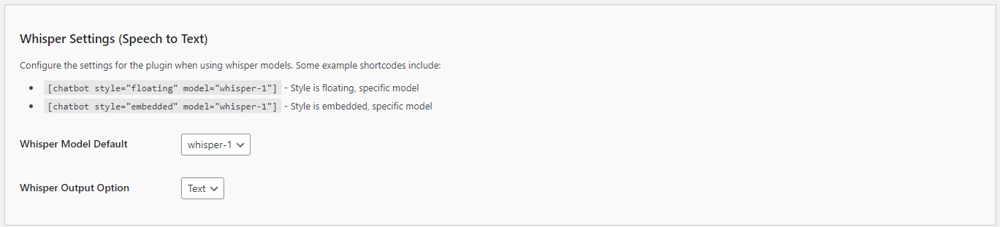

# Configuring the Whisper Settings (Speech to Text)

To enable and customize the speech-to-text capabilities of your Kognetiks Chatbot, follow these steps to configure the Whisper Settings:

1. **Whisper Model Default**:
   - **Description**: This dropdown allows you to select the default speech-to-text model the chatbot will use.
   - **Options**: Choose from available models such as `whisper-1`.
   - **Selection**: Select the model that best meets your needs for speech recognition quality and performance.

2. **Whisper Output Option**:
   - **Description**: This setting specifies the format for the output of the speech-to-text conversion.
   - **Options**: Common options include `Text` and potentially other formats if supported by the plugin.
   - **Selection**: Choose the format that best fits your application's requirements.

## Steps to Configure

1. Navigate to the Whisper Settings section of the Kognetiks Chatbot plugin in your WordPress dashboard.
2. Select the desired model from the `Whisper Model Default` dropdown.
3. Set the `Whisper Output Option` by selecting the desired output format, such as `Text`.
4. Save the settings.

## Example Shortcodes

Here are some example shortcodes you can use to customize the chatbot's speech-to-text functionality within your WordPress site:

- `[chatbot style="floating" model="whisper-1"]`: Style is floating, specific model.

- `[chatbot style="embedded" model="whisper-1"]`: Style is embedded, specific model.

## Tips

- **Model Selection**: Ensure the selected model provides the necessary accuracy and performance for your chatbot's speech recognition tasks.

- **Output Format**: Choose the output format that aligns with how you intend to use the transcribed speech data.

By configuring these settings, you ensure that your Kognetiks Chatbot can effectively convert spoken input into text, enhancing interaction and accessibility for users who prefer voice input.

---

- **[Back to API ChatGPT Settings](api-chatgpt-model-settings.md)**
- **[Back to the Overview](/overview.md)**
