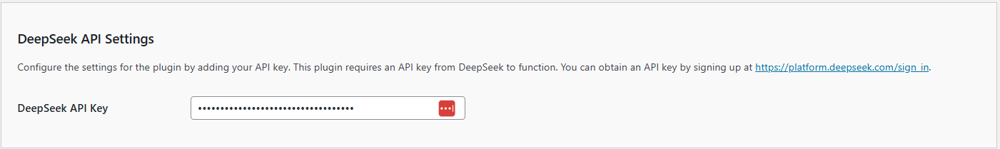

# Configuring the API/DeepSeek Settings

The **Kognetiks Chatbot** plugin requires proper configuration to function correctly. Follow the steps below to set up your plugin:

1. **DeepSeek API Key**:

   - **Description**: This field is for your DeepSeek API key, which is necessary for the plugin to access the DeepSeek functionality.
   - **How to obtain**: You can get your API key by signing up at [DeepSeek](https://platform.deepseek.com/sign_in).
   - **Input**: Paste your API key in the provided field.

## Steps to Configure

1. Navigate to the API Settings section of the **Kognetiks Chatbot** plugin in your WordPress dashboard.

2. Copy your DeepSeek API key from [DeepSeek](https://platform.deepseek.com/sign_in).

3. Paste the API key into the `DeepSeek API Key` field.

4. Save the settings.

---

- **[Back to API DeepSeek Settings](api-deepseep-model-settings.md)**
- **[Back to the Overview](/overview.md)**
