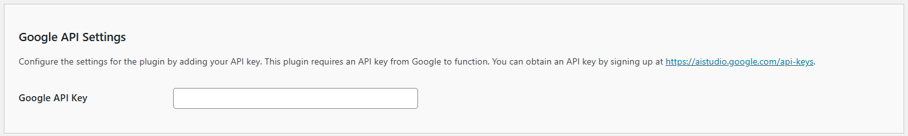

# Configuring the API/Google Settings

The **Kognetiks Chatbot** plugin requires proper configuration to function correctly. Follow the steps below to set up your plugin:

1. **Google API Key**:

   - **Description**: This field is for your Google API key, which is necessary for the plugin to access the Google functionality.
   - **How to obtain**: You can get your API key by signing up at [Google](https://aistudio.google.com/api-keys).
   - **Input**: Paste your API key in the provided field.

## Steps to Configure

1. Navigate to the API Settings section of the **Kognetiks Chatbot** plugin in your WordPress dashboard.

2. Copy your Google API key from [Google](https://aistudio.google.com/api-keys).

3. Paste the API key into the `Google API Key` field.

4. Save the settings.

---

- **[Back to API Google Gemini Settings](api-googe-model-settings.md)**
- **[Back to the Overview](/overview.md)**
