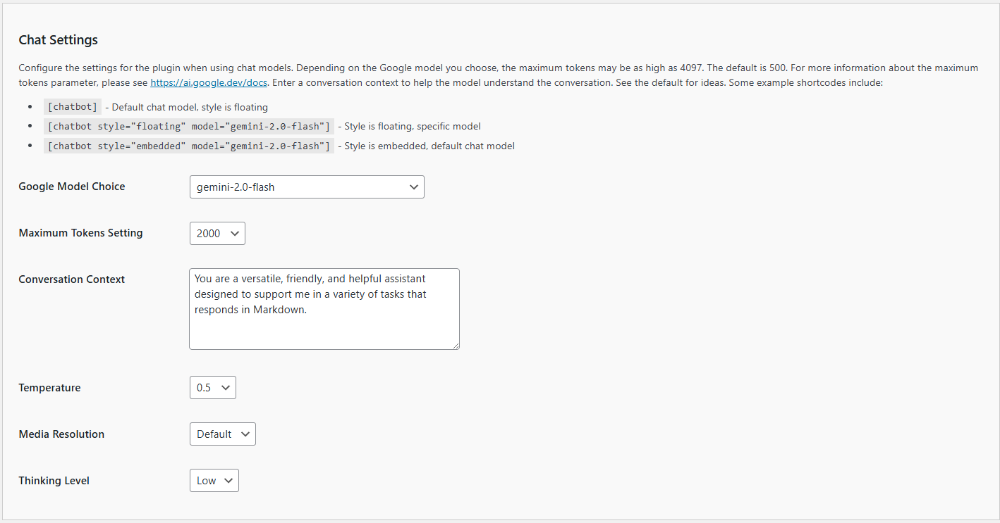

# Configuring Chat Settings

To ensure your Kognetiks Chatbot functions optimally, you need to configure the chat settings appropriately. Here's a detailed guide on how to use these settings:

1. **Google Model Default**:
   - **Description**: This setting allows you to choose the default Google model your chatbot will use.
   - **Options**: Depending on the available models, you can select from various options such as `gemini-2.0-flash`, etc.
   - **How to Set**: Select the desired model from the dropdown menu. For instance, `gemini-2.0-flash`.

2. **Maximum Tokens Setting**:
   - **Description**: This setting determines the maximum number of tokens (words and parts of words) the model can use in a single response. This helps control the length and detail of the responses.
   - **Default Value**: The default is set to 1000 tokens, but it can be adjusted between 100 and 10000 tokens.
   - **How to Set**: Select the desired number of tokens from the dropdown menu. For example, `1000`.

3. **Conversation Context**:
   - **Description**: This field is used to set the context for the conversation, helping the model understand the nature and tone of interactions.
   - **Default Example**: "You are a versatile, friendly, and helpful assistant designed to support me in a variety of tasks."
   - **How to Set**: Enter a suitable conversation context that matches the intended use of the chatbot.

4. **Temperature**:
   - **Description**: This setting controls the randomness of the model's responses. A lower value (closer to 0) makes the output more focused and deterministic, while a higher value (closer to 2) makes it more random and creative.
   - **Default Value**: The default is set to 0.5.
   - **How to Set**: Use the dropdown menu to select a value between 0.01 and 2.01.

5. **Media Resolution**:
   - **Description**: This setting controls the resolution quality for media (images) processed by the model. Higher resolutions provide more detail but may increase processing time and token usage. This setting is particularly useful when working with vision-enabled models.
   - **Options**: 
     - **Default**: Uses the model's default media resolution
     - **Low**: Lower resolution, faster processing, fewer tokens
     - **Medium**: Balanced resolution and processing
     - **High**: Higher resolution, more detailed analysis, more tokens
   - **Default Value**: The default is set to "Default".
   - **How to Set**: Select the desired resolution from the dropdown menu.

6. **Thinking Level**:
   - **Description**: This setting controls the depth of reasoning for thinking models (such as Gemini 2.0 Thinking models). A higher thinking level allows the model to engage in more complex reasoning processes, which can improve problem-solving capabilities but may increase response time.
   - **Options**:
     - **Low**: Faster responses with basic reasoning
     - **High**: Slower responses with deeper, more thorough reasoning
   - **Default Value**: The default is set to "Low".
   - **How to Set**: Select the desired thinking level from the dropdown menu.

## Example Shortcodes

- **Default Chat Model**:
  `
  [chatbot]
  `
  - **Description**: Uses the default chat model with a floating style.
  
- **Floating Style, Specific Model**:
  `
  [chatbot style="floating" model="gemini-2.0-flash"]
  `
  - **Description**: Uses a floating style with a specified model (`gemini-2.0-flash` in this case).

- **Embedded Style, Default Chat Model**:
  `
  [chatbot style="embedded" model="gemini-2.0-flash"]
  `
  - **Description**: Uses an embedded style with the default chat model.

## Steps to Configure

1. Navigate to the Chat Settings section of the Kognetiks Chatbot plugin in your WordPress dashboard.

2. Select the default chat model from the dropdown menu.

3. Select the maximum tokens setting appropriate for your needs.

4. Provide a clear and concise conversation context to guide the chatbot's interactions.

5. Adjust the temperature setting to control the creativity of the responses.

6. Select the media resolution appropriate for your use case (especially important for vision-enabled models).

7. Select the thinking level if you're using a thinking model (Low for faster responses, High for deeper reasoning).

8. Save the settings.

## Tips

- **Adjusting Token Limits**: Higher token limits can result in more detailed responses but also increase API usage.

- **Experiment with Temperature**: Fine-tuning this setting can help you achieve the desired balance between response creativity and coherence.

- **Media Resolution Considerations**: When working with images, choose a resolution that balances detail with processing speed and token usage. Higher resolutions are better for detailed image analysis but consume more tokens.

- **Thinking Level Selection**: Use "High" thinking level for complex problem-solving tasks, but expect longer response times. Use "Low" for faster, more straightforward interactions.

- **Context Matters**: Providing a well-defined conversation context can significantly improve the relevance and helpfulness of the chatbot's responses.

By following these steps and tips, you can ensure that your Kognetiks Chatbot is set up effectively to meet your needs.

---

- **[Back to the Overview](/overview.md)**