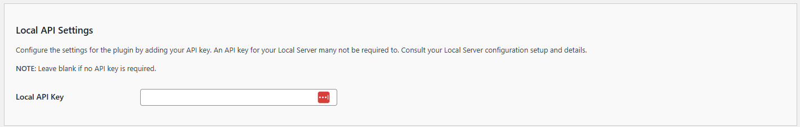

# Configuring the API/DeepSeek Settings

The **Kognetiks Chatbot** plugin requires proper configuration to function correctly. Follow the steps below to set up your plugin:

1. **Local Server API Key**:

   - **Description**: This field is for your Local Server API key, which may be required for the plugin to access the Local Server functionality.
   - **How to obtain**: TBD
   - **Input**: Paste your API key in the provided field.

## Steps to Configure

1. Navigate to the API Settings section of the **Kognetiks Chatbot** plugin in your WordPress dashboard.

2. Copy your Local Server API key.

3. Paste the API key into the `Local API Key` field.

4. Save the settings.

---

- **[Back to API Local Server Settings](api-local-model-settings.md)**
- **[Back to the Overview](/overview.md)**
