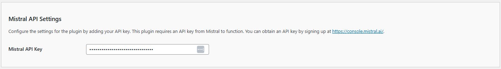

# Configuring the API/Mistral Settings

The **Kognetiks Chatbot** plugin requires proper configuration to function correctly. Follow the steps below to set up your plugin:

1. **Mistral API Key**:

   - **Description**: This field is for your Mistral API key, which is necessary for the plugin to access the Mistral functionality.
   - **How to obtain**: You can get your API key by signing up at [Mistral](https://console.mistral.ai/api-keys).
   - **Input**: Paste your API key in the provided field.

## Steps to Configure

1. Navigate to the API Settings section of the **Kognetiks Chatbot** plugin in your WordPress dashboard.

2. Copy your Mistral API key from [Mistral](https://console.mistral.ai/api-keys).

3. Paste the API key into the `Mistral API Key` field.

4. Save the settings.

---

- **[Back to the Overview](/overview.md)**
