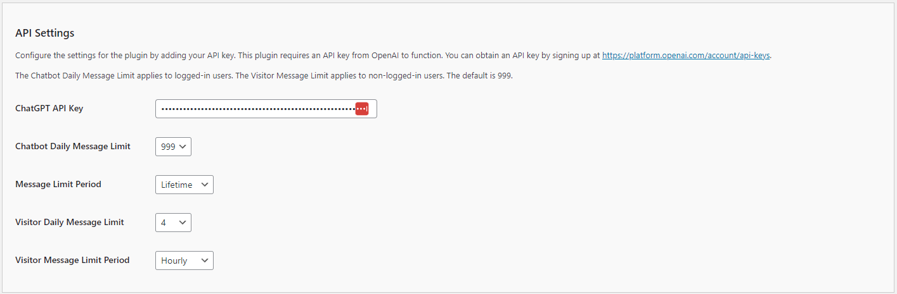

# Configuring the API/Model Settings

The **Kognetiks Chatbot for WordPress** plugin requires proper configuration to function correctly. Follow the steps below to set up your plugin:

1. **ChatGPT API Key**:
   - **Description**: This field is for your OpenAI API key, which is necessary for the plugin to access the ChatGPT functionality.
   - **How to obtain**: You can get your API key by signing up at [OpenAI's API keys page](https://platform.openai.com/account/api-keys).
   - **Input**: Paste your API key in the provided field.

2. **Chatbot Daily Message Limit**:
   - **Description**: This setting limits the number of messages logged-in users can send to the chatbot per day. It helps manage API usage and costs.
   - **Default Value**: The default limit is set to 999 messages per day.
   - **Customization**: You can adjust this number based on your needs. Enter the desired limit in the provided field.

3. **Message Limit Period**:
   - **Description**:This setting defines the time period during which non-logged-in users (visitors) and logged-in users can send messages to the chatbot. It allows you to manage how often users can interact with the chatbot and helps regulate API usage and associated costs.
   - **Default Value**: By default, users are allowed to send up to 999 messages per day.
   - **Customization**: You can customize the number of allowed messages and the reset period based on your specific needs. Enter the desired message limit in the provided field. The following time periods are available for customization:
   
      - **Hourly**: Resets the message count every hour, providing a more granular control over usage within a single day. This is useful if you want to limit message bursts within short time frames.
      - **Daily**: Resets the message count once per day. This is the most common setting, providing users with a fixed number of messages each day.
      - **Weekly**: Resets the message count once every week. This can help spread out usage over a longer period, ideal for scenarios where more extended engagement is anticipated.
      - **Monthly**: Resets the message count at the start of each month. Useful for managing API usage on a month-to-month basis, ensuring that your usage aligns with monthly API cost limits.
      - **Quarterly**: Resets the message count every three months. This option is useful for managing seasonal fluctuations in chatbot usage.
      - **Yearly**: Resets the message count once per year. This is ideal for long-term planning and budgeting for API usage.
   - **NOTE**: Lifetime: No reset occurs. This option allows unlimited messages over a user's lifetime, which can be useful for creating limited-time access.
   
4. **Visitor Daily Message Limit**:
   - **Description**: This setting limits the number of messages non-logged-in users (visitors) can send to the chatbot per day. It also helps manage API usage and costs.
   - **Default Value**: The default limit is set to 999 messages per day.
   - **Customization**: You can adjust this number based on your needs. Enter the desired limit in the provided field.

5. **Visitor Message Limit Period**:
   - **Description**:This setting defines the time period during which non-logged-in users (visitors) and logged-in users can send messages to the chatbot. It allows you to manage how often users can interact with the chatbot and helps regulate API usage and associated costs.
   - **Default Value**: By default, users are allowed to send up to 999 messages per day.
   - **Customization**: You can customize the number of allowed messages and the reset period based on your specific needs. Enter the desired message limit in the provided field. The following time periods are available for customization:
   
      - **Hourly**: Resets the message count every hour, providing a more granular control over usage within a single day. This is useful if you want to limit message bursts within short time frames.
      - **Daily**: Resets the message count once per day. This is the most common setting, providing users with a fixed number of messages each day.
      - **Weekly**: Resets the message count once every week. This can help spread out usage over a longer period, ideal for scenarios where more extended engagement is anticipated.
      - **Monthly**: Resets the message count at the start of each month. Useful for managing API usage on a month-to-month basis, ensuring that your usage aligns with monthly API cost limits.
      - **Quarterly**: Resets the message count every three months. This option is useful for managing seasonal fluctuations in chatbot usage.
      - **Yearly**: Resets the message count once per year. This is ideal for long-term planning and budgeting for API usage.
   - **NOTE**: Lifetime: No reset occurs. This option allows unlimited messages over a user's lifetime, which can be useful for creating limited-time access.

## Steps to Configure

1. Navigate to the API Settings section of the Kognetiks Chatbot plugin in your WordPress dashboard.

2. Copy your OpenAI API key from the [OpenAI API keys page](https://platform.openai.com/account/api-keys).

3. Paste the API key into the `ChatGPT API Key` field.

4. Set the `Chatbot Daily Message Limit` for logged-in users by entering a numeric value.

5. Set the `Visitor Daily Message Limit` for non-logged-in users by entering a numeric value.

6. Save the settings.

## Tips

- **Monitoring Usage**: Regularly monitor your API usage in the OpenAI dashboard to ensure that your limits are appropriate and adjust them as necessary.

- **Cost Management**: Setting appropriate message limits helps control costs associated with API usage.

By configuring these settings, you ensure that your Kognetiks Chatbot plugin operates smoothly and efficiently, providing a seamless experience for both logged-in users and visitors.

---

- **[Back to the Overview](/overview.md)**
