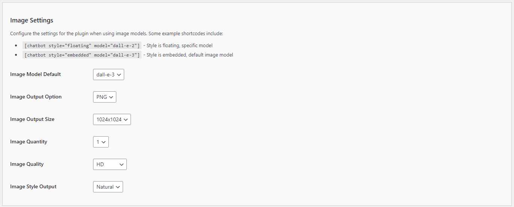

# Configuring the Image Settings

To enhance your Kognetiks Chatbot with image generation capabilities, follow these steps to configure the Image Settings:

1. **Image Model Default**:
   - **Description**: This dropdown allows you to select the default image generation model the chatbot will use.
   - **Options**: Choose from various models such as `dall-e-2`, `dall-e-3`, and others provided by OpenAI.
   - **Selection**: Select the model that best fits your needs for image quality and style.

2. **Image Output Option**:
   - **Description**: This setting specifies the format for the generated image.
   - **Options**: Common formats include `PNG`, with other options avaliable in the future.
   - **Selection**: Choose the format that works best for your application’s requirements and compatibility.

3. **Image Output Size**:
   - **Description**: This setting allows you to specify the dimensions of the generated image.
   - **Options**: Available sizes include `1024x1024`, `1792x1024`, `1024x1792`, etc.
   - **Selection**: Select the size that best fits your design needs.

4. **Image Quantity**:
   - **Description**: This setting determines how many images are generated per request.
   - **Options**: You can choose to generate 1 or more images.
   - **Selection**: Set the quantity based on your needs, typically `1` for a single image per request.

5. **Image Quality**:
   - **Description**: This setting controls the quality of the generated images.
   - **Options**: Options might include `HD` or `Standard`
   - **Selection**: Choose `HD` for higher quality images or `Standard` for faster generation times and lower quality.

6. **Image Style Output**:
   - **Description**: This setting defines the style of the generated images.
   - **Options**: Styles might include `Natural` or `Vivid`, with other options avaliable in the future.
   - **Selection**: Select the style that aligns with your content’s theme and desired appearance.

## Steps to Configure

1. Navigate to the Image Settings section of the Kognetiks Chatbot plugin in your WordPress dashboard.

2. Select the desired model from the `Image Model Default` dropdown.

3. Set the `Image Output Option` by choosing the preferred image format.

4. Specify the `Image Output Size` by selecting the desired dimensions from the dropdown.

5. Set the `Image Quantity` to the number of images you want to generate per request.

6. Choose the `Image Quality` based on your preference for image resolution.

7. Select the `Image Style Output` that matches your desired aesthetic.

8. Save the settings.

## Example Shortcodes

Here are some example shortcodes you can use to customize the chatbot's image generation functionality within your WordPress site:

- `[chatbot style="floating" model="dall-e-2"]`: Style is floating, specific model.

- `[chatbot style="embedded" model="dall-e-3"]`: Style is embedded, default image model.

## Tips

- **Quality vs. Speed**: Higher quality images (e.g., `HD`) may take longer to generate. Adjust the quality setting based on your need for speed versus visual fidelity.

- **Format Compatibility**: Ensure the selected image format is compatible with your website and other platforms where the images will be used.

- **Style Consistency**: Choose an image style that aligns with your brand or the specific theme of your content for a consistent user experience.

By configuring these settings, you ensure that your Kognetiks Chatbot can effectively generate images that meet your aesthetic and functional requirements, enhancing user engagement and visual appeal.
