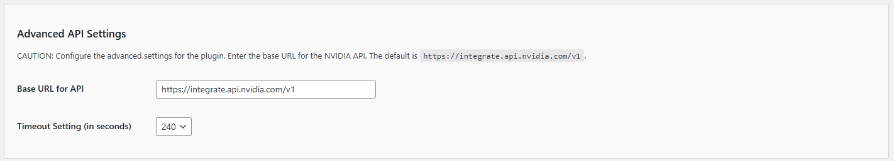

# Configuring the Advanced API Settings

The Advanced API Settings allow you to configure critical parameters for the API connection used by the Kognetiks Chatbot. Follow these steps to ensure the plugin is properly set up:

1. **Base URL for API**:
   - **Description**: This field specifies the base URL for the NVIDIA API. The plugin uses this URL to connect to the NVIDIA servers.
   - **Default Value**: The default URL is `https://integrate.api.nvidia.com/v1`.
   - **Customization**: Typically, you should not need to change this value unless directed by NVIDIA support or if there are specific requirements for your integration.

2. **Timeout Setting (in seconds)**:
   - **Description**: This setting determines how long the plugin will wait for a response from the API before timing out.
   - **Default Value**: The default is set to 240 seconds.
   - **Customization**: Adjust this value based on your server's performance and network conditions. A higher value might be needed if you experience frequent timeouts, while a lower value can be used to reduce wait times in case of unresponsive requests.

## Steps to Configure

1. Navigate to the Advanced API Settings section of the Kognetiks Chatbot plugin in your WordPress dashboard.
2. Verify the `Base URL for API` is set to `https://integrate.api.nvidia.com/v1`. Change it only if instructed by NVIDIA or if you have specific requirements.
3. Set the `Timeout Setting (in seconds)` by entering a numeric value that suits your server and network conditions.
4. Save the settings.

## Tips

- **Avoid Unnecessary Changes**: Unless you have a specific reason, it's best to leave the Base URL as the default provided by NVIDIA.
- **Monitor Performance**: If you experience issues with response times or API connectivity, consider adjusting the timeout setting and monitor the performance impact.
- **Consult Documentation**: For more information on API parameters and troubleshooting, refer to the [NVIDIA API Documentation](https://docs.api.nvidia.com/).

By configuring these settings, you ensure that your Kognetiks Chatbot maintains a stable and efficient connection to the NVIDIA API, providing reliable performance for your users.

---

- **[Back to API Nvidia Settings](api-nvidia-model-settings.md)**
- **[Back to the Overview](/overview.md)**