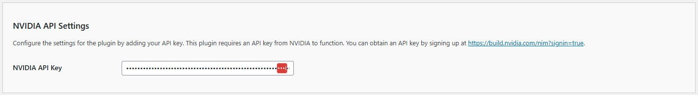

# Configuring the API/NVIDIA Settings

The **Kognetiks Chatbot for WordPress** plugin requires proper configuration to function correctly. Follow the steps below to set up your plugin:

1. **NVIDIA API Key**:

   - **Description**: This field is for your OpenAI API key, which is necessary for the plugin to access the NVIDIA functionality.
   - **How to obtain**: You can get your API key by signing up at [NVIDIA](https://build.nvidia.com/explore/discover?signin=true).
   - **Input**: Paste your API key in the provided field.

## Steps to Configure

1. Navigate to the API Settings section of the Kognetiks Chatbot plugin in your WordPress dashboard.

2. Copy your NVIDIA API key from [NVIDIA](https://build.nvidia.com/explore/discover?signin=true).

3. Paste the API key into the `NVIDIA API Key` field.

4. Save the settings.

---

- **[Back to the Overview](/overview.md)**
