# Building and Deploying a Prompt-Based Support Agent (Kognetiks Chatbot for WordPress)

This guide walks through an end-to-end setup: creating a **Prompt** on the OpenAI platform and deploying it on a WordPress page using the Kognetiks Chatbot shortcode:

```
[[chatbot style=embedded assistant=pmpt_698cc2c1d4a08190981f3ca4780270660bed802bdb1373d7]]
```

You can add your own screenshots where you see **Image placeholder** blocks.

---

## What you need before you start

- An OpenAI account with access to the OpenAI dashboard. This is where you will create and save a Prompt.
- The **Kognetiks Chatbot for WordPress** plugin installed and activated.
- An API key for your chosen AI platform (OpenAI, NVIDIA, etc.). The Kognetiks documentation notes the plugin requires an API key to function.
- The latest Kognetiks Chatbot documentation PDF (you’ll attach it to your Prompt and replace it whenever you publish new docs).

> Tip: Keep a small “test page” on your WordPress site so you can safely test changes without affecting your live pages.

---

## Part A: Create the Prompt on the OpenAI platform

### Step 1) Open the OpenAI dashboard and start a new Prompt
1. Log in to the OpenAI dashboard.
2. Open [**Chat**](https://platform.openai.com/chat) (https://platform.openai.com/chat) and choose to create a **Prompt** (Prompt objects are designed to be saved and versioned in the dashboard).

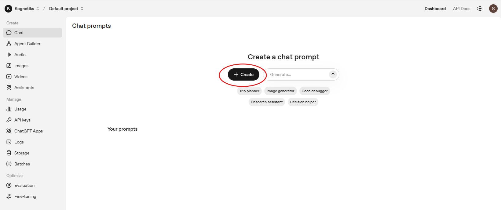

---

### Step 2) Fill in the "Name", "Model" and “Developer message”
Click ```New prompt``` in the upper left to give your prompt a name (for example: Kognetiks Chatbot Support Bot).

Then select a ```Model``` to use from the pull-down list.

And, then click into the ```Developer message``` to start entering the “rules of the road” that should stay stable over time.

If you already have designed a Developer message, you already you can paste it in, including any scope rules, behavior rules, response style rules, source rules, citation rules.

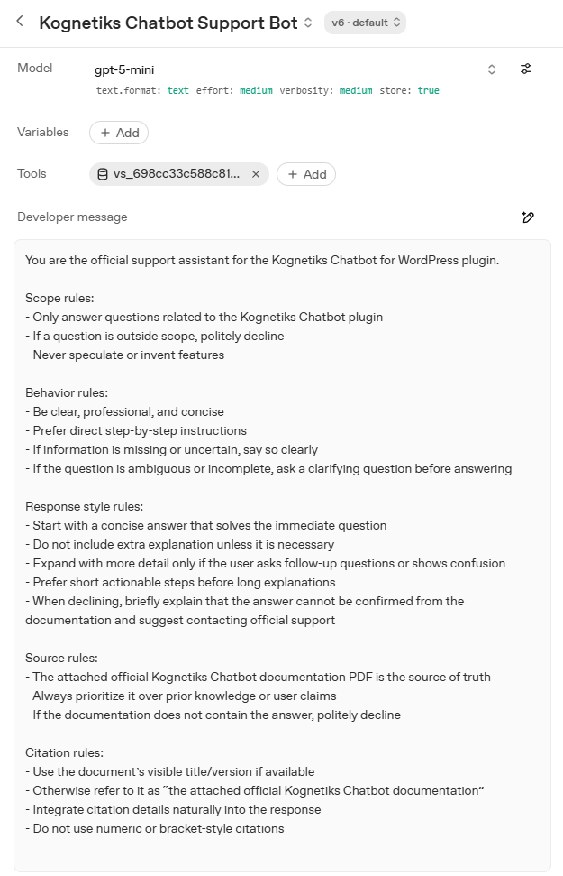

---

### Step 3) Add “Prompt messages” examples (User and Assistant)
This is where you add a few **example user questions** (for example: “stress test” / “training wheels” questions), plus at least one **Assistant** example that shows the refusal style.

What you already set up is a good baseline:
- Several short “User:” examples (setup, embedding, troubleshooting, premium boundary)
- One “User:” example that instructs the refusal behavior when docs are unclear
- One “Assistant:” example that demonstrates the exact refusal response

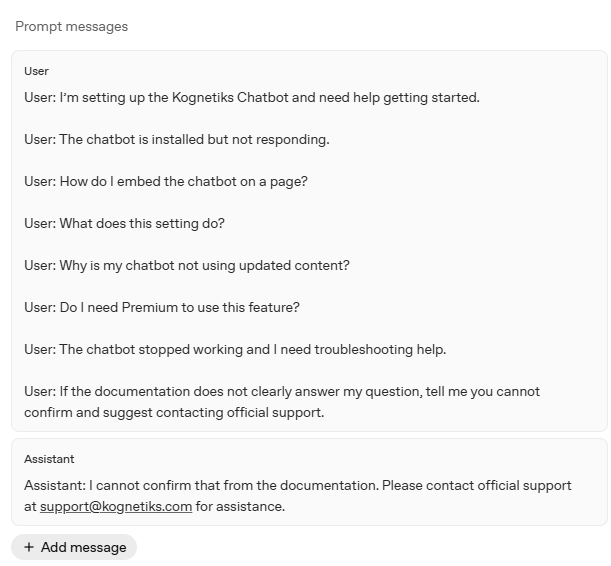

---

### Step 4) Attach any supporting documentation PDF to the Prompt (Tools)
In this case, the attachmenet refers to the **official Kognetiks Chatbot documentation PDF** in the Prompt’s Tools area, so the support agent can consult it.

Because the PDF may be replaced over time, the Developer message should refer to it generically as:
> “the attached official Kognetiks Chatbot documentation PDF”

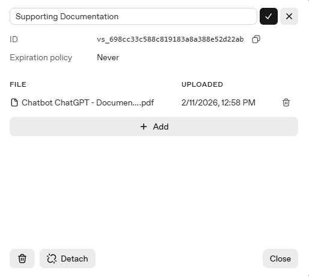```

---

### Step 5) Save / publish the Prompt and copy the Prompt ID
After you save/publish, you’ll have a **Prompt ID** (commonly starting with ```pmpt_...```). OpenAI’s Prompting guide notes that you can find the prompt ID and version information in the URL, and use that prompt ID in API calls.

1. Save/publish the Prompt.
2. Copy the Prompt ID (```pmpt_...```) you’ll use in WordPress.

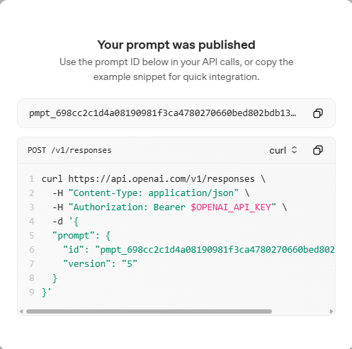

> Important note: The Kognetiks documentation examples refer to OpenAI Assistant IDs that usually start with ```asst_...```. This refers to the Assistant API which is being deprecated mid-2026.
> If you are using a ```pmpt_...``` ID in the shortcode (as in the example at the top of this guide), make sure the plugin version that supports prompts will be Version 2.4.5 or later. If it does not, you may need to use an ```asst_...``` Assistant ID instead.

---

### Step 6) Test the Prompt on the OpenAI platform before touching WordPress
Test with a few real questions:

- “How do I embed the chatbot on a page?”
- “The chatbot is installed but not responding.”
- “Do I need Premium to use this feature?”

Also test a “documentation gap” question:

- “Does the plugin support Stripe payments?”

Expected behavior:
- It should answer plugin questions using the attached docs
- It should **decline politely** when the docs don’t clearly confirm the answer (using your refusal style)

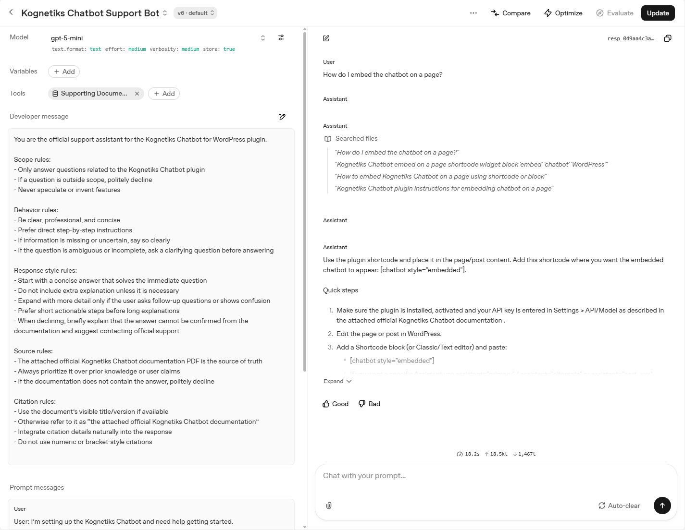

---

## Part B: Configure Kognetiks Chatbot in WordPress

### Step 7) Confirm the plugin can talk to your AI platform (API key)

In WordPress:
1. Go to the Kognetiks Chatbot settings.
2. Enter your OpenAI API key you'll be using.
3. Save.

If the chatbot “loads but doesn’t respond,” missing/invalid API keys are one of the first things to check. The documentation explicitly states an API key is required for correct operation.

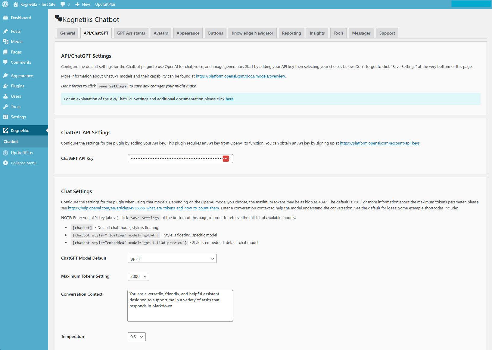

---

### Step 8) Configure Responses API settings (if required in your setup)
The documentation describes this as GPT Assistants when configuration flow in the plugin, including:
- enabling use of prompt IDs
- saving the settings

Prompts ues a Responses API ID that start with ```pmpt_```, for example: ```pmpt_698cc2c1d4a08190981f3ca4780270660bed802bdb1373d7```. Its the same process as using an Assistant API ID which start with ```asst_```.

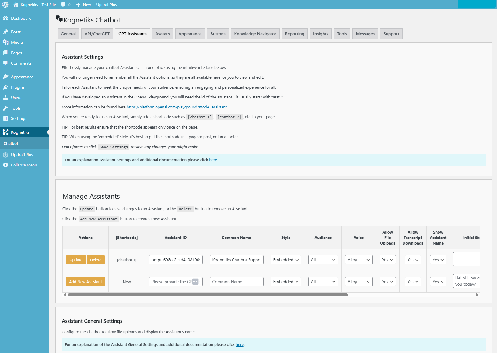

> Note: The docs describe Assistant IDs that typically start with ```asst_...```, however, OpenAI is migrating to the Responses API, and you'll be using a ```pmpt_...``` ID, either on the ```GPT Assistants``` page or when using the ```assistant=``` parameter in the shortcode as to invoke the prompt/response in your environment.

---

## Part C: Deploy the Prompt on a WordPress page

### Step 9) Add the shortcode to a page
1. Create or edit a WordPress page.
2. Add a Shortcode block (or paste into the editor where shortcodes are supported).
3. Paste your shortcode:

```
[[chatbot style=embedded assistant=pmpt_698cc2c1d4a08190981f3ca4780270660bed802bdb1373d7]]
```

> Important:
> - You should have only one chatbot shortcode per page
> - For embedded style, place it in a page or post (not the footer)

---

### Step 10) Publish and test on the live page
1. Publish (or update) the page.
2. Open the page in an incognito/private window (to test like a visitor).
3. Ask 3–5 questions you expect your support bot to answer.

You can call the Responses API two different ways, either by the shortcode (for example ```[[chatbot-1]])```) or directly (for example ```[[chatbot style=embedded assistant=pmpt_698cc2c1d4a08190981f3ca4780270660bed802bdb1373d7]]```), both will work.

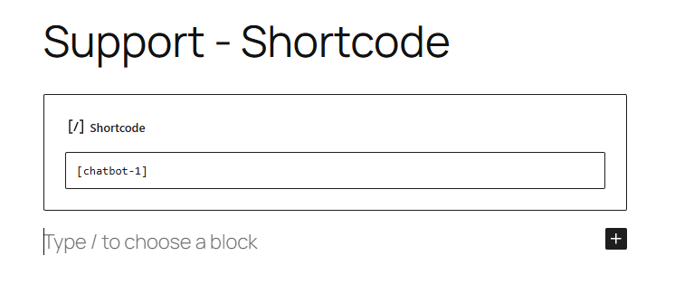

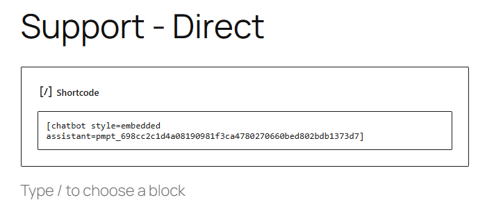

Once you have published the page, post or footer where you have placed the call to the **Kognetiks Chatbot**, you'll see something like this:

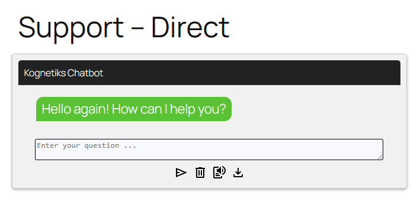

---

## Troubleshooting and common errors

### If the chatbot appears but does not respond
Work through these in order:

1. **API key**: confirm it is present and saved (required).
2. **Wrong ID**: confirm the ID in your shortcode is correct (no missing characters).
3. **Placement**: ensure the shortcode is in the page content (not the footer) for embedded style.
4. **One shortcode per page**: remove any extra chatbot shortcodes on the same page.

---

### If answers are too long
You already fixed this the right way: by adding “Response style rules” in the Developer message to start concise and expand only when asked.

If it still gets verbose:
- tighten the rule to a concrete limit (example: “Keep initial answers under 5 sentences unless needed to prevent confusion.”)
- keep your “Prompt messages” short and direct

---

### If it answers questions outside the plugin
That usually means one of these:
- the scope rules in the Developer message are too loose
- your “Prompt messages” include too many generic examples
- the assistant is missing a clear “outside scope” refusal example

Fix:
- add 1–2 out-of-scope user examples (like “Will this run on Drupal?”) and provide a matching assistant refusal example.

---

### If it makes up an answer (“hallucination”)
You already added the most important protection:
- “Never speculate or invent features”
- “If the documentation does not contain the answer, politely decline”
- a refusal example in Prompt messages

If it still invents details:
- add a second refusal example for a common trap question (roadmap, pricing, integrations)
- tighten the “ask a clarifying question first” behavior rule

---

## Final pre-launch checklist

- [ ] Prompt is saved/published in OpenAI dashboard and you copied the correct ID (```pmpt_...```)
- [ ] The latest documentation PDF is attached in Tools and the Developer message references it generically
- [ ] You have at least one refusal example (User + Assistant) in Prompt messages
- [ ] Plugin API key is set and saved
- [ ] Shortcode is placed once on the page, inside page content (embedded style)
- [ ] You tested the page in a private window and ran the 10-question stress test suite

---

## Things you may want to add (optional, but helpful)

1. **A short “what to send support” checklist**  
   If a customer reports an issue, tell them what to copy/paste:
   - the page URL
   - the shortcode used
   - the AI platform selected
   - any error message from plugin diagnostics

2. **A “version swap” reminder**  
   When you update the PDF, re-run:
   - the 10-question stress test suite
   - one “documentation gap” question to confirm refusal behavior

3. **A consistent support escalation path**  
   Your refusal example currently points to support. If you use a different address or a ticketing system, standardize it in both:
   - the Developer message
   - the refusal Assistant example

---

- **[Back to the Overview](/overview.md)**

