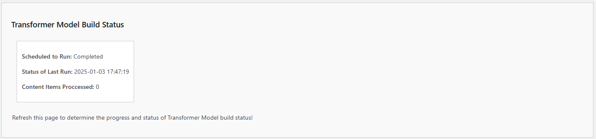
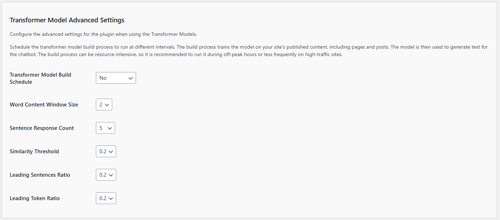

# Configuring Transformer Model Settings

The Sentential Context Model empowers your chatbot to generate intelligent, content-driven responses directly from your website, eliminating the need for external AI platforms.  It's a new plugin feature designed to make your chatbot more intelligent and self-reliant. Instead of relying on external AI platforms, this model builds its knowledge base directly from your website's content. By analyzing and contextualizing information from your posts, pages, and other site elements, it generates meaningful, contextually aware responses tailored to your website visitors.

This feature is ideal for use cases where:

- You prefer not to connect to an external AI platform.
- Your content is highly specific or localized, making external data sources less relevant.
- Privacy and data control are top priorities for your site.
- With easy configuration and advanced options for fine-tuning, the Sentential Context Model ensures a seamless, content-driven chatbot experience.

**IMPORTANT**:

- Beta features should only be enabled in testing or staging environments.

- Avoid enabling beta features on live or production sites.

- Use at your own risk. Kognetiks assumes no liability for issues caused by beta features.

- *Explore the Sentential Context Model today and share your feedback to help us shape the future of Kognetiks Chatbot!*

To ensure your **Kognetiks Chatbot** functions optimally, you need to configure the settings below appropriately. Here's a detailed guide on how to use these settings:

## Model Selection

1. **Transformer Model Choice**:
   - **Description**: This setting allows you to choose the default Transformer model your chatbot will use.
   - **Options**: Depending on the available models, you can select from various options such as `contextual-context-model`, `sentential-context-model`, etc.
   - **How to Set**: Select the desired model from the dropdown menu, for instance, `sentential-context-model`.

2. **Maximum Tokens Setting**:
   - **Description**: This setting determines the maximum number of tokens (words and parts of words) the model can use in a single response. This helps control the length and detail of the responses.
   - **Default Value**: The default is set to 500 tokens, but it can be increased up to 4000 tokens.
   - **How to Set**: Enter the desired number of tokens in the provided field, for example, `1000`.

## Model Build Status

1. **Scheduled to Run**:
   - **Description**: Indicates how frequently the **Transformer Model** is scheduled to run.
   - **Example**: If it’s set to "Daily," the system will automatically analyze content every day.
   - **Use**: Verify that the schedule aligns with your content update frequency to keep the chatbot's knowledge current.

2. **Status of Last Run**:
   - **Description**: Provides the date and time of the last completed run of the **Tranformer Model Build**.
   - **Example**: "Completed on 2024-05-19 12:20:13."
   - **Use**: Ensure that the last run date is recent, confirming that the content analysis is happening as scheduled.

3. **Content Items Analyzed**:
   - **Description**: Displays the number of content items analyzed during the last run.
   - **Example**: "28" items.
   - **Use**: Check the number of items to ensure that all expected content is being analyzed. A significant change in this number may indicate new content additions or deletions.

## Advanced Settings

1. **Scheduled to Run**:

   - **Description**: This dropdown allows you to set the frequency at which the Knowledge Navigator scans your website content.
   - **Options**: 
     - `No`: No schedule has been set.
     - `Now`: Runs the scan immediately - non-recurring schedule.
     - `Hourly`: Runs the scan every hour.
     - `Twice Daily`: Runs the scan twice a day.
     - `Daily`: Runs the scan once a day.
     - `Weekly`: Runs the scan once a week.
     - `Disable`: Disables the scheduled runs altogether.
     - `Cancel`: Stops the current run.
   - **Selection**: Choose the frequency that best suits your content update schedule. For frequently updated sites, `Hourly` or `Daily` is recommended.

2. **Word Content Windows Size**:
    - **Description**: This sets the ngram size when building the transformer model.
    - **Default Value**: The default is set to 2.
    - **How to Set**: Use the dropdown menu to select a value between 1 and 5.
    - **Tip**: The higher the setting the more sentive the model, i.e., more words will need to match the input window.  The lower the setting, fewer words will be considered.  Experiment with various settings to determine what works best with your content.
    - **IMPORTANT NOTE**: When changing this setting you may **WILL** to update the build schedule to force a rebuild of the transformer model cache.

3. **Sentence Response Count**:
    - **Description**: This sets the limit to the number of sentences included in the response.
    - **Default Value**: The default is set to 2.
    - **How to Set**: Use the dropdown menu to select a value between 1 and 5.
    - **Tip**: The higher the setting the longer the response from the model, i.e., more sentences will returned.  The lower the setting, fewer sentences will be returned.  Experiment with various settings to determine what works best with your content.

4. **Similarity Threshold**:
    - **Description**: This sets the sensitivity of the transformer model.
    - **Default Value**: The default is set to 0.2.
    - **How to Set**: Use the dropdown menu to select a value between 0.1 and 1.
    - **Tip**: The higher the setting the more sentive the model, i.e., content will need to match the prompts more precisely.  The lower the settings will be less sensitieve to content matching.  Experiment with various settings to determine what works best with your content.

5. **Leading Sentences Ratio**:
    - **Description**: This determines how much content in sentences ahead of a transformer model match is returned.
    - **Default Value**: The default is set to 0.2, i.e., twenty percent (20%)
    - **How to Set**: Use the dropdown menu to select a value between 0.1 and 1.
    - **Tip**: The higher the setting the more content ahead of the match based on the prompt will be returned,  Experiment with various settings to determine what works best with your content.
    - **NOTE**: This setting controls how much additional context is included before a match. Adjust with care, as they may overlap or conflict with the `Leading Token Ratio`.

6. **Leading Token Ratio**:
    - **Description**: This determines how much content in tokens (i.e., words) ahead of a transformer model match is returned.
    - **Default Value**: The default is set to 0.2, i.e., twenty percent (20%)
    - **How to Set**: Use the dropdown menu to select a value between 0.1 and 1.
    - **Tip**: The higher the setting the more content ahead of the match based on the prompt will be returned,  Experiment with various settings to determine what works best with your content.
    - **NOTE**: This setting controls how much additional context is included before a match. Adjust with care, as they may overlap or conflict with the `Leading Sentence Ratio`.

