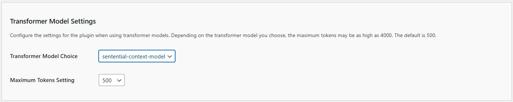
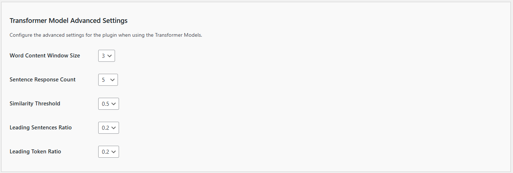

# Configuring Transformer Model Settings

The Sentential Context Model empowers your chatbot to generate intelligent, content-driven responses directly from your website, eliminating the need for external AI platforms.  It's a new plugin feature designed to make your chatbot more intelligent and self-reliant. Instead of relying on external AI platforms, this model builds its knowledge base directly from your website's content. By analyzing and contextualizing information from your posts, pages, and other site elements, it generates meaningful, contextually aware responses tailored to your website visitors.

This feature is ideal for use cases where:

- You prefer not to connect to an external AI platform.
- Your content is highly specific or localized, making external data sources less relevant.
- Privacy and data control are top priorities for your site.
- With easy configuration and advanced options for fine-tuning, the Sentential Context Model ensures a seamless, content-driven chatbot experience.

**IMPORTANT**:

- Beta features should only be enabled in testing or staging environments.

- Avoid enabling beta features on live or production sites.

- Use at your own risk. Kognetiks assumes no liability for issues caused by beta features.

- *Explore the Sentential Context Model today and share your feedback to help us shape the future of Kognetiks Chatbot!*

To ensure your **Kognetiks Chatbot** functions optimally, you need to configure the settings below appropriately. Here's a detailed guide on how to use these settings:

## Model Selection

1. **Transformer Model Choice**:
   - **Description**: This setting allows you to choose the default Transformer model your chatbot will use.
   - **Options**: Depending on the available models, you can select from various options such as `contextual-context-model`, `sentential-context-model`, etc.
   - **How to Set**: Select the desired model from the dropdown menu, for instance, `sentential-context-model`.

2. **Maximum Tokens Setting**:
   - **Description**: This setting determines the maximum number of tokens (words and parts of words) the model can use in a single response. This helps control the length and detail of the responses.
   - **Default Value**: The default is set to 500 tokens, but it can be increased up to 10000 tokens.
   - **How to Set**: Enter the desired number of tokens in the provided field, for example, `1000`.

## Advanced Settings

1. **Word Content Windows Size**:
    - **Description**: This sets the ngram size when building the transformer model.
    - **Default Value**: The default is set to 2.
    - **How to Set**: Use the dropdown menu to select a value between 1 and 5.
    - **Tip**: The higher the setting the more sentive the model, i.e., more words will need to match the input window.  The lower the setting, fewer words will be considered.  Experiment with various settings to determine what works best with your content.
    - **IMPORTANT NOTE**: When changing this setting you may **WILL** to update the build schedule to force a rebuild of the transformer model cache.

2. **Sentence Response Count**:
    - **Description**: This sets the limit to the number of sentences included in the response.
    - **Default Value**: The default is set to 2.
    - **How to Set**: Use the dropdown menu to select a value between 1 and 5.
    - **Tip**: The higher the setting the longer the response from the model, i.e., more sentences will returned.  The lower the setting, fewer sentences will be returned.  Experiment with various settings to determine what works best with your content.

3. **Similarity Threshold**:
    - **Description**: This sets the sensitivity of the transformer model.
    - **Default Value**: The default is set to 0.2.
    - **How to Set**: Use the dropdown menu to select a value between 0.1 and 1.
    - **Tip**: The higher the setting the more sentive the model, i.e., content will need to match the prompts more precisely.  The lower the settings will be less sensitieve to content matching.  Experiment with various settings to determine what works best with your content.

4. **Leading Sentences Ratio**:
    - **Description**: This determines how much content in sentences ahead of a transformer model match is returned.
    - **Default Value**: The default is set to 0.2, i.e., twenty percent (20%)
    - **How to Set**: Use the dropdown menu to select a value between 0.1 and 1.
    - **Tip**: The higher the setting the more content ahead of the match based on the prompt will be returned,  Experiment with various settings to determine what works best with your content.
    - **NOTE**: This setting controls how much additional context is included before a match. Adjust with care, as they may overlap or conflict with the `Leading Token Ratio`.

5. **Leading Token Ratio**:
    - **Description**: This determines how much content in tokens (i.e., words) ahead of a transformer model match is returned.
    - **Default Value**: The default is set to 0.2, i.e., twenty percent (20%)
    - **How to Set**: Use the dropdown menu to select a value between 0.1 and 1.
    - **Tip**: The higher the setting the more content ahead of the match based on the prompt will be returned,  Experiment with various settings to determine what works best with your content.
    - **NOTE**: This setting controls how much additional context is included before a match. Adjust with care, as they may overlap or conflict with the `Leading Sentence Ratio`.

## Tuning Guide

### Recommended Parameter Settings for Tighter Responses

For tighter, more concise responses, try these settings:

1. **Sentence Response Count: 2-3** (instead of 5)
   - Fewer sentences = more focused responses

2. **Similarity Threshold: 0.4-0.5** (instead of 0.3)
   - Higher threshold = only the most relevant sentences

3. **Leading Sentences Ratio: 0.1** (instead of 0.2)
   - Less leading context = more direct answers

4. **Leading Token Ratio: 0.1** (instead of 0.2)
   - Less padding before the main answer

5. **Maximum Tokens: 200-300** (instead of 500)
   - Shorter responses = more concise

### Quick Tuning Guide

Use these guidelines to fine-tune your responses:

- **Too verbose?** → Increase Similarity Threshold to 0.5, reduce Sentence Response Count to 2
- **Too brief?** → Decrease Similarity Threshold to 0.2, increase Sentence Response Count to 4
- **Too much padding?** → Reduce Leading Sentences/Token Ratios to 0.05-0.1
- **Want more context?** → Increase Leading Ratios to 0.3-0.4

### Algorithm Improvements for Tighter Responses

The lexical context model includes several improvements to generate more concise, direct responses:

1. **Sentence Length Filtering**
   - Automatically skips sentences over 60 words
   - Applies length penalties: ideal length is 10-25 words
   - Slight penalty for 30-40 words, stronger penalty for >40 words

2. **Citation and Metadata Filtering**
   - Automatically detects and skips citation-style sentences (author lists, publication info)
   - Skips sentences with excessive commas (likely lists)
   - Reduces introductory padding

3. **Relevance Density Scoring**
   - Calculates how much of each sentence is actually relevant
   - Prefers sentences with higher relevance density
   - Reduces filler content

4. **Input Word Position Bonus**
   - Gives bonus points for input words appearing in the first 10 words
   - Prioritizes direct, upfront answers

5. **Improved Sorting Algorithm**
   - Priority order:
     1. Input words at sentence start
     2. Number of input words matched
     3. Relevance density
     4. Total score
     5. Shorter sentences (when scores are similar)
     6. Unique words matched

6. **Early Stopping**
   - Stops after 2-3 good sentences if quality is high
   - Prevents run-on responses

7. **Smarter Context Allocation**
   - Only adds leading context for sentences with input words
   - Prefers trailing context for tighter flow

## Resource Limits and What to Watch For

Although there is no hard-coded maximum corpus size, the transformer models ultimately depend on the PHP resources available on your host. Keep the following in mind:

1. **PHP Memory Usage**
   - Loading the compressed cache (`lexical_embeddings_cache.php.gz`) requires enough memory for the compressed blob, the decompressed blob, and the full PHP array produced by `unserialize()`.
   - On large sites it's easy to hit the default `memory_limit` (128 MB or 256 MB). If you see “Allowed memory size exhausted” errors, raise the limit in `wp-config.php` – e.g. `define('WP_MEMORY_LIMIT', '512M');`.

2. **Corpus Size and PMI Generation**
   - Building the PMI matrix scales with both the number of words and the window size. Very large corpora (tens of thousands of long posts) can consume huge amounts of RAM/time when the cache is rebuilt.
   - Symptoms include timeouts, rebuilds that never finish, or the cache failing to write because PHP ran out of memory.
   - Mitigations:
     - Lower the **Word Content Window Size** so fewer co-occurrences are tracked.
     - Exclude extremely long or low-value content from the corpus.
     - Rebuild during off-peak hours and monitor `memory_limit` and `max_execution_time`.

3. **Cache File Size Monitoring**
   - When `lexical_embeddings_cache.php.gz` grows into the tens of megabytes, you are approaching the practical limits of typical shared hosting.
   - Keep an eye on both the compressed and decompressed sizes; the uncompressed array can be several times larger than the `.gz` file.

4. **Execution Time**
   - Rebuilding the cache iterates through the entire corpus. For large sites, ensure `max_execution_time` is high enough (e.g., 300 s) or run rebuilds via WP-CLI/cron where higher limits are permitted.

If you encounter recurring memory or timeout issues, consider splitting the site into smaller topic-focused corpora, trimming the content included in the corpus, or migrating to the Sentential Context Model, which scales differently.

---

- **[Back to the Overview](/overview.md)**
