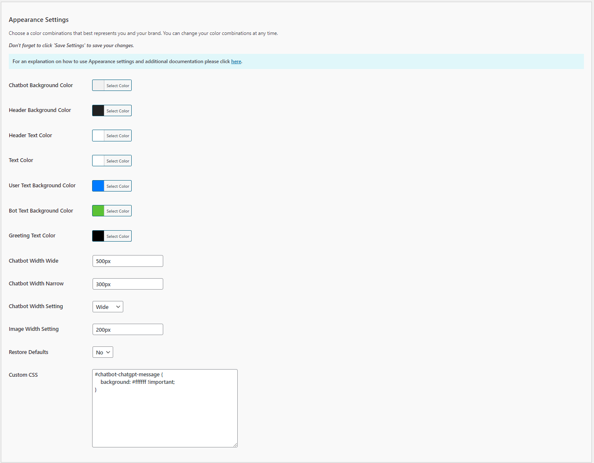

# Configuring the Appearance Settings

The Appearance Settings allow you to customize the visual aspects of your chatbot, ensuring it matches your website's design and branding. Follow these steps to configure these options:

1. **Chatbot Background Color**:
   - **Description**: Sets the background color of the chatbot window.
   - **Selection**: Click 'Select Color' to choose a color from the palette or enter a hex color code.

2. **Header Background Color**:
   - **Description**: Sets the background color of the chatbot header.
   - **Selection**: Click 'Select Color' to choose a color from the palette or enter a hex color code.

3. **Header Text Color**:
   - **Description**: Sets the color of the text in the chatbot header.
   - **Selection**: Click 'Select Color' to choose a color from the palette or enter a hex color code.

4. **Text Color**:
   - **Description**: Sets the default text color in the chatbot messages.
   - **Selection**: Click 'Select Color' to choose a color from the palette or enter a hex color code.

5. **User Text Background Color**:
   - **Description**: Sets the background color of the user's messages.
   - **Selection**: Click 'Select Color' to choose a color from the palette or enter a hex color code.

6. **Bot Text Background Color**:
   - **Description**: Sets the background color of the chatbot's messages.
   - **Selection**: Click 'Select Color' to choose a color from the palette or enter a hex color code.

7. **Greeting Text Color**:
   - **Description**: Sets the color of the greeting text in the chatbot.
   - **Selection**: Click 'Select Color' to choose a color from the palette or enter a hex color code.

8. **Chatbot Width Wide**:
   - **Description**: Sets the width of the chatbot when in wide mode.
   - **Input**: Enter the desired width in pixels (e.g., `500px`).

9. **Chatbot Width Narrow**:
   - **Description**: Sets the width of the chatbot when in narrow mode.
   - **Input**: Enter the desired width in pixels (e.g., `300px`).

10. **Chatbot Width Setting**:
    - **Description**: Sets the default width setting for the chatbot.
    - **Options**: `Wide` or `Narrow`.
    - **Selection**: Choose `Wide` or `Narrow` based on your preference for the chatbot's appearance on your site.  Selecting `Wide` will use the pixel width set in the `Chatbot Width Wide` setting.  Selecting Narrow will use the pixel width set in the `Chatbot Width Narrow` setting.

11. **Image Width Setting**:
    - **Description**: Sets the default image width setting for the chatbot.
    - **Options**: A value between `1%` and `100%` or an actual values in pixels such as `200px`.
    - **Selection**: Choose `100%` to display images at actual size up to the 95% max width of the viewable area of the chatbot.If you choose 200px the **all** images will be 200px regardless of their actual size, so smaller images will scale up and larger images will scale down to be 200px, but in no case will be larger than 95% max width of the viewable area of the chatbot.

12. **Restore Defaults**:
    - **Description**: Resets the appearance settings to their default values.
    - **Options**: `Yes` or `No`.
    - **Selection**: Choose `Yes` to restore default settings.

13. **Custom CSS**:
    - **Description**: Allows you to add custom CSS to further style the chatbot.
    - **Input**: Enter any custom CSS rules to override the default styles and achieve specific design requirements.

## Steps to Configure

1. Navigate to the Appearance Settings section of the Kognetiks Chatbot plugin in your WordPress dashboard.

2. Use the color pickers to select the desired colors for the chatbot's background, header, text, user messages, bot messages, and greeting text.

3. Enter the desired widths for `Chatbot Width Wide` and `Chatbot Width Narrow`.

4. Choose the `Chatbot Width Setting` to define the default mode (wide or narrow).

5. If you want to reset all appearance settings to their defaults, set `Restore Defaults` to `Yes`.

6. Add any `Custom CSS` rules to further customize the chatbot's appearance.

7. Save the settings.

## Tips

- **Consistent Branding**: Use colors that match your website's theme to ensure a seamless integration of the chatbot.

- **Readability**: Choose text and background colors with good contrast to ensure messages are easy to read.

- **Custom CSS**: Utilize custom CSS for advanced styling needs that aren't covered by the basic settings.

By configuring these settings, you can ensure that your Kognetiks Chatbot blends well with your website's design, providing a cohesive and visually appealing user experience.

---

- **[Back to the Overview](/overview.md)**
