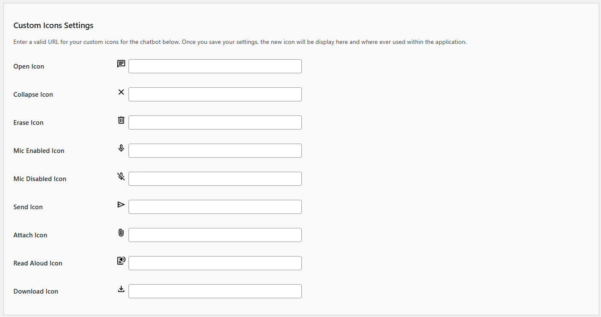

# Configuring Custom Icons Settings

The Custom Icons Settings allow you to customize the visual aspects the chatbot icons for opening, sending, attaching, downloading, another other actions.  This allow you to match your website's design and branding. Follow these steps to configure these options:

Next to each named icon is the default icon preloaded with the plugin.  Should you want to replace the icon with one of your own, you will need to add a valid URL to web location where that icon resides.  For example, if you want replace the Send Icon with the image of a paper airplane, you would enter `https://yoursite.com//wp-content/uploads/2025/01/paper-airplane.png` where the `yoursite.com` is the domain, and the rest of the path located the icon.  The icon will automatically be resized to 20 by 20 pixels.  If the path is valid, after you click the `Save Settings` at the bottom of the screen, your icon will be displayed next to the setting.  To revert back to the plugin's default icons, just remove the URL from the field and save the settings.

1. **Open Icon**: The icon displayed when the chatbot styling is set to `floating` and the chatbot is minimized.

2. **Collapse Icon**: The icon displayed in the upper right corner when the chatbot user interface with the chatbot styling is set to `floating` and the chatbot is open.

3. **Erase Icon**: The icon displayed when clicked that will reset the chat conversation.

4. **Mic Enabled Icon**: The icon displayed when voice-to-text is enabled.

5. **Mic Disabled Icon**: The icon displayed when voice-to-text is disabled.

6. **Send Icon**: The icon displayed when clicked that will send the prompt to chatbot.

7. **Attach Icon**: The icon displayed when file uploads to the chatbot are enabled.

8. **Read Aloud Icon**: The icon displayed when text-to-speech is enabled.

9. **Download Icon**: The icon displayed when downloading transcripts is enabled.

## TIPS

Icons for functions supported by your AI platform of choice and those that you have enabled will be displayed in the user interface of the chatbot.

**NOTE**: Not all AI Platform support all functions described above.  Consult the AI Platform for the capabilities it offers.

---

- **[Back to Appearance Settings]](appearance.md)**
- **[Back to the Overview](/overview.md)**