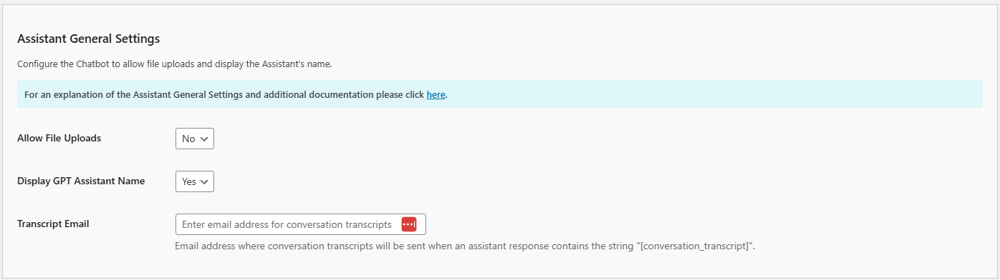

# Configuring the Assistant/Agent Settings

Configure settings for your Assistants or Agents by adding your below.

If you have developed an Assistant or Agent you will need the id:

   - OpenAI Assistants usually starts with "asst_"
   - Azure OpenAI Assistants also usually start with with "asst_"
   - Mistral Agents often start with "ag:"

More information can be found here:

   - [OpeanAI Assistants](https://platform.openai.com/playground?mode=assistant)

   - [Mistral Agents](https://console.mistral.ai/build/agents)

## Using Multiple Assistants

You can integrate Assistants and Agents into your platform using one of shortcode configurations such as ```[chatbot-1]```, ```[assistant-1]``` or ```[agent-1]```.

Assistants work with both 'floating' and 'embedded' styles.

**PRO TIP:** For best results ensure that the shortcode appears only once on the page.

## Configuring the Assistant General Settings

These settings allow you to configure the behavior and capabilities of the Assistant in your Kognetiks Chatbot. Follow these steps to set up these options:


1. **Assistant ID or Agent ID**:
   - **Description**: This field is for specifying the primary Assistant ID.
   - **Input**: Enter the Assistant ID provided by OpenAI or your specific setup.

2. **Common Name**:
   - **Description**: This field is for specifying the common name that you will refer to the assistant in the shortcode.
   - **Input**: Enter name you want to use in the shortcode.

3. **Style**:
   - **Description**: This field sets the styling for the chatbot either as embedded or floating.
   - **Input**: Enter name you want to use in the shortcode.

4. **Audience for Chatbot**:
   - **Description**: This setting allows you to specify the intended audience for the chatbot.
   - **Options**: `All`, `Visitors`, `Logged-in` etc.
   - **Selection**: Choose the appropriate audience based on the content and purpose of your chatbot.

5. **Voice**:
   - **Description**: This setting lets you choose the specific voice the text-to-speech model will use.
   - **Options**: Available voices include options like `Fable`, `Nova`, etc.
   - **Selection**: Pick a voice that aligns with the desired personality and tone of your chatbot.
   - **Tip**: Choose `None` to disable Read Aloud functionality or choose a voice to enable it.  This setting override the global setting.

   - **NOTE**: Voices are currently with OpenAI Assistants only.

6. **Allow File Uploads**:
   - **Description**: This setting allows users to upload files through the chatbot interface.
   - **Options**: `Yes` or `No`.
   - **Selection**: Choose `Yes` if you want to enable file uploads, facilitating richer interactions.
   - **Tip**: This setting override the global setting.

   - **NOTE**: File Uploads only work with OpenAI Assistants and Azure OpenAI Assistants.

7. **Allow Transcript Downloads**:
   - **Description**: This setting allows users to download a transcript of their interaction with the chatbot.
   - **Options**: `Yes` or `No`.
   - **Selection**: Choose `Yes` if you want to enable transcript downloads.
   - **Tip**: This setting override the global setting.

8. **Initial Greeting**:
   - **Description**: This is the message the chatbot sends when a user first opens it.
   - **Example**: "Hello [first_name]! How can I help you today?" Use placeholders like `[first_name]` to personalize the greeting.

9. **Subsequent Greeting**:
   - **Description**: This message appears when a returning user opens the chatbot.
   - **Example**: "Hello again [first_name]! How can I help you?" Customize this to acknowledge returning visitors.

10. **Chatbot Prompt**:
    - **Description**: This is the initial prompt that appears in the chatbot input field.
    - **Example**: "Tell me your deepest secrets ..." can be customized to something more appropriate for your audience and use case.

11. **Additional Instructions**:
    - **Description**: This field allows you to provide specific instructions to the primary assistant.
    - **Input**: Enter any special instructions or context that will guide the assistant's responses.

## Assistant General Settings



1. **Allow File Uploads**:
   - **Description**: This setting allows users to upload files through the chatbot interface.
   - **Options**: `Yes` or `No`.
   - **Selection**: Choose `Yes` if you want to enable file uploads, facilitating richer interactions.
   - **Tip**: This is a global setting that will be overridden by assistant specific settings.

2. **Display Assistant Name**:
   - **Description**: This toggle controls whether the Assistant's name is displayed in interactions.
   - **Options**: `Yes` or `No`.
   - **Selection**: Choose `Yes` to display the assistant's name for a more personalized user experience.## Advanced Additional Settings
   - **Tip**: This is a global setting that will be overridden by assistant specific settings.

3. **Transcript Email**:
    - **Description**: Email address where conversation transcripts will be sent when an assistant response contains the string "[conversation_transcript]".
    - **Input**: Enter a valid email address.
    - **Usage**: When an assistant's response includes "[conversation_transcript]", the system will automatically send a formatted transcript of the conversation to this email address.

## Advanced Additional Settings

**NOTE**: Applies only to OpenAI and OpenAI Azure Assistants.


1. **Max Prompt Tokens**:
   - **Description**: This setting determines the maximum number of tokens for the input prompt.
   - **Options**: A numeric value between `1,000` and `20,000` (the default is `20000`).
   - **Selection**: Set this based on the complexity of the queries you expect. Higher values allow for longer inputs.

2. **Max Response Tokens**:
   - **Description**: This setting determines the maximum number of tokens for the assistant's response.
   - **Options**: A numeric value between `1,000` and `100,000` (the default is `20000`).
   - **Selection**: Set this based on the level of detail you want in the responses. Higher values allow for longer responses.
   - **Additional Info**: For a deeper explanation, please see [Max Completion and Max Prompt Tokens](https://platform.openai.com/docs/assistants/deep-dive/max-completion-and-max-prompt-tokens).

3. **Thread Retention Period (hrs)**:
    - **Description**: This setting specifies how long conversation threads are retained.
    - **Options**: A numeric value between 6 and 720 hours (the default is `36` hours).
    - **Selection**: Choose a duration that balances user privacy with the need for context in ongoing conversations.

4. **Beta Assistant Version**:
    - **Description**: This setting allows you to select the version of the beta assistant to use.
    - **Options**: Versions `V1` and `v2` (the default is now `V2`).
    - **Selection**: Choose the version that fits your needs, typically the latest for the most up-to-date features.
    - **Additional Info**: For a deeper explanation, please see [Migration Guide](https://platform.openai.com/docs/assistants/migration/agents).

## Remote Widget Access

The **Kognetiks Chatbot** now includes the advanced feature to allow access to your assistants from remote servers.  Coupled with security measures to control and monitor remote access to your chatbots, you must enable the **Remote Widget Access** feature.  This will allow specific remote servers to interact with your chatbot(s) via an endpoint. To ensure that only authorized servers and chatbots can access your resources, the system uses a whitelisting mechanism that pairs domains with specific chatbot shortcodes, for example ```kognetiks.com,chatbot-4``` which will only allow calls from kognetiks.com and only then to chatbot-4.  Your resources are valuable, take appropriate precautions when allowing remote server access.


### Field Descriptions

1. **Enable Remote Widget**:
   - **Description**: This setting enables and disables remote access on a global basis.  By default, it is set to ```No```.  To allow access by a remote server to a chatbot, you will need to change this setting to ```Yes```.
   - **Input**: Choose ```Yes``` or ```No```.

2. **Allowed Domains**:
    - **Description**: Enter the domain and assistant identified to allow remote access to a chatbot.  For example if the domain is ```kognetiks.com``` and you the chatbot is ```chatbot-4```, then enter ```kognetiks.com,chatbot-4```.  The pairs will be checked at when the remote server calls the chatbot widget endpoint.  If the pair is domain and chatbot are not paired correctly, no chatbot will be present.
    - **Input**: ```domain.com,chatbot-n```
    - **Tip**: Be sure to put each pair on its own line, seperated the domain name and the chatbot shortcode identifier with a coma.
    - **Caution**: Your server and OpenAI resources are valuable.  Be sure to secure those resources by carefully maintaining the allowed pairs of domains and chatbots that you have white listed in this section.

3. **Widget Logging**:
    - **Description**: Widget logging records valid and invalid access to your chatbot(s) from remote servers.  This is especially helpful to ensure that your resources are used only by those that you have allowed.  On the ```Tools``` tab you will find a section titled **Manage Widget Access Logs** where you can download and delete remote widget access.

For more information refer to the [Managing Remote Assess to the Kognetiks Chatbot](remote-widget-settings.md) section for details on how to configure a remote server.

---

## Steps to Configure

1. Navigate to the GPT Assistant settings section of the Kognetiks Chatbot plugin in your WordPress dashboard.

2. Toggle `Use GPT Assistant Id` to `Yes` if you want to use specific assistant IDs.

3. Enable `Allow File Uploads` by setting it to `Yes` if you want users to upload files.

4. Enable `Display GPT Assistant Name` by setting it to `Yes` to show the assistant's name during interactions.

5. Enter the `Primary GPT Assistant Id` provided by OpenAI or your setup.

6. Add any `Assistant Instructions` to guide the primary assistant's behavior.

7. Enter an `Alternate GPT Assistant Id` if you have one.

8. Add any `Alternate Assistant Instructions` to guide the alternate assistant.

9. Set the `Max Prompt Tokens` to a suitable value based on your needs.

10. Set the `Max Response Tokens` to a suitable value based on your needs.

11. Choose an appropriate `Thread Retention Period (hrs)` for retaining conversation context.

12. Select the desired `Beta Assistant Version` from the dropdown.

13. Save the settings.

## Example Usage

Use the following format to invoke the primary or alternate assistant:

*-* `[chatbot assistant"my custom assistant"]` - Configuration is determined by setting in the section titled "Manage Assistants"

*-* `[chatbot style="floating" assistant="primary"]` - Floating style, Assistant as set in Primary setting

*-* `[chatbot style="embedded" assistant="alternate"]` - Embedded style, Assistant as set in Alternate setting

*-* `[chatbot style="floating" assistant="asst_xxxxxxxxxxxxxxxxxxxxxxxx"]` - Floating style, Assistant as set in Assistant ID setting

*-* `[chatbot style="embedded" assistant="asst_xxxxxxxxxxxxxxxxxxxxxxxx"]` - Embedded style, Assistant as set in Assistant ID setting
Mix and match the style and assistant attributes to suit your needs.

**NOTE**: When using the 'embedded' style, it's best to put the shortcode in a page or post, not in a footer.

## Tips

*-* **Assistant Instructions**: Provide clear and concise instructions to tailor the assistant’s responses to your specific needs.

*-* **Token Limits**: Adjust token limits based on the balance between detailed responses and performance considerations.

*-* **Retention Period**: A longer retention period can improve user experience by maintaining context but consider privacy implications.

*-* **Audience Shortcode Parameter**: Use the 'audience' parameter to target specific user groups:

  - `[chatbot style="embedded" assistant="asst_123456789ASDFGHJKL" audience="all"]` - Available to all users.

  - `[chatbot style="embedded" assistant="asst_123456789ASDFGHJKL" audience="logged-in"]` - Available only to logged-in users.

  - `[chatbot style="embedded" assistant="asst_123456789ASDFGHJKL" audience="visitors"]` - Available only to visitors.

  or

  - `[chatbot style="floating" assistant="asst_123456789ASDFGHJKL" audience="all"]` - Available to all users.

  - `[chatbot style="floating" assistant="asst_123456789ASDFGHJKL" audience="logged-in"]` - Available only to logged-in users.

  - `[chatbot style="floating" assistant="asst_123456789ASDFGHJKL" audience="visitors"]` - Available only to visitors.

By configuring these settings, you ensure that your Kognetiks Chatbot can effectively utilize the Assistant to provide personalized and contextually aware interactions for your users.

## More Information

See [Chatbots and Assistants](support/chatbots-and-assistants.md) for more details on using multiple Assistants.

---

- **[Back to the Overview](/overview.md)**
