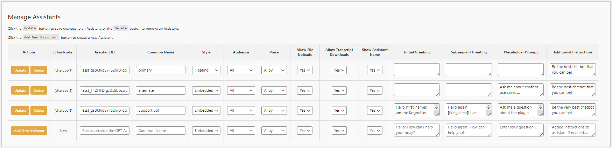
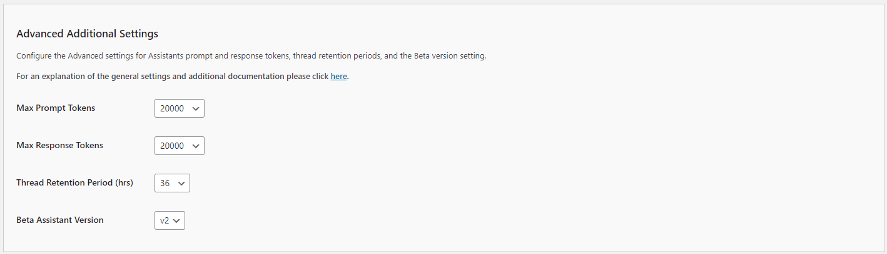
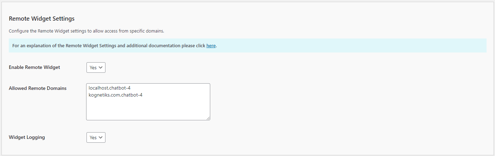

## Managing Assistants and Agents

Effortlessly manage you chatbot Assistants all in one place using an intuitive interface.

You will no longer need to remember all the Assistant options, as they are all available on the GTP Assistants tab for you to view and edit.

Tailor each Assistant to meet the unique needs of your audience, ensuring an engaging and personalized experience for all.

If you have developed an Assistant in the OpenAI Playground, you will need the id of the assistant - it usually starts with `asst_`.

More information can be found here:

   - [OpenAI Assistants](https://platform.openai.com/playground?mode=assistant)
   - [AzureAI Assistants](https://learn.microsoft.com/en-us/azure/ai-services/openai/how-to/assistant)
   - [Mistral Agents](https://docs.mistral.ai/capabilities/agents/)

When you're ready to use an Assistant, simply add a shortcode such as `[chatbot-1]`, `[chatbot-2]`, etc. to your page.  You can also use if you prefer `[assistant-1]`, `[assistant-2]`, etc, and `[agent-1]`, `[agent-2]`, etc.

TIP: For best results ensure that the shortcode appears only once on the page.

TIP: When using the `embedded` style, it's best to put the shortcode in a page or post, not in the footer.

### Field Descriptions

1. **Actions**: `Update`, `Delete`, `Add New Assistant`
   - **Update/Delete**: Use these buttons to update or delete an assistant.
   - **Add New Assistant**: Use this button to add a new assistant.

2. **Shortcode**:
   - **Description**: The unique identifier for each assistant, such as `[chatbot-1]` or `[chatbot-2]`.
   - **Usage**: `[chatbot-n]` where n=1, 2, etc. You'll use this name to call the assistant in the shortcode.
   - **Input**: Automatically generated.

3. **Assistant ID**:
   - **Description**: The specific ID for the assistant provided by OpenAI at the time you set up your assistant (it usually starts with `asst_`).
   - **Input**: Enter the OpenAI Assistant ID.
   - **Required**: This is a required field.

   - **TIP**: If you want a realtime webserach assistant, use `websearach` (all lowercase) as the Assistant ID.  This will enable the tool.

4. **Common Name**:
   - **Description**: A user-friendly name for the assistant.
   - **Input**: Enter a name that easily identifies the assistant.
   - **Required**: This is a required field.
   - **Tip**: Be sure to use regular quote marks around the "Common Name" if there are any spaces.

5. **Style**:
   - **Description**: Determines how the assistant is displayed on your site.
   - **Input**: Choose between `Embedded` and `Floating`.

6. **Audience**:
   - **Description**: Specifies the target audience for the assistant.
   - **Input**: Options include `All`, `Visitors`, and `Logged-in`.

7. **Voice**:
   - **Description**: The voice used by the assistant, one of `Alloy`, `Echo`, `Fable`, `Onyx`, `Nova`, or `Shimmer`.  Select `None` to disable the Read Aloud options for this Assistant.
   - **Input**: Select from available voice options.

8. **Allow File Uploads**:
   - **Description**: Indicates whether users can upload files to the Assistant.
   - **Input**: Choose `Yes` or `No`.

9. **Allow Transcript Downloads**:
   - **Description**: Allows users to download a transcript of their conversation with the assistant.
   - **Input**: Choose `Yes` or `No`.

10. **Show Assistant Name**:
    - **Description**: Displays the assistant's name in interactions.
    - **Input**: Choose `Yes` or `No`.

11. **Initial Greeting**:
    - **Description**: The first message the assistant sends to users.
    - **Input**: Enter the greeting message.

12. **Subsequent Greeting**:
    - **Description**: Messages the assistant sends after the initial greeting.
    - **Input**: Enter the follow-up greeting messages.

13. **Placeholder Prompt**:
    - **Description**: A sample prompt shown in the input field.
    - **Input**: Enter a placeholder prompt to guide user input.

14. **Additional Instructions**:
    - **Description**: Extra instructions or context for the assistant.
    - **Input**: Enter any additional instructions needed for the assistant.

## Advanced Additional Settings

1. **Max Prompt Tokens**:
   - **Description**: This setting determines the maximum number of tokens for the input prompt.
   - **Options**: A numeric value between `1,000` and `20,000` (the default is `20000`).
   - **Selection**: Set this based on the complexity of the queries you expect. Higher values allow for longer inputs.

2. **Max Response Tokens**:
   - **Description**: This setting determines the maximum number of tokens for the assistant's response.
   - **Options**: A numeric value between `1,000` and `100,000` (the default is `20000`).
   - **Selection**: Set this based on the level of detail you want in the responses. Higher values allow for longer responses.
   - **Additional Info**: For a deeper explanation, please see [Max Completion and Max Prompt Tokens](https://platform.openai.com/docs/assistants/deep-dive#max-completion-and-max-prompt-tokens).

3. **Thread Retention Period (hrs)**:
    - **Description**: This setting specifies how long conversation threads are retained.
    - **Options**: A numeric value between 6 and 720 hours (the default is `36` hours).
    - **Selection**: Choose a duration that balances user privacy with the need for context in ongoing conversations.

4. **Beta Assistant Version**:
    - **Description**: This setting allows you to select the version of the beta assistant to use.
    - **Options**: Versions `V1` and `v2` (the default is now `V2`).
    - **Selection**: Choose the version that fits your needs, typically the latest for the most up-to-date features.
    - **Additional Info**: For a deeper explanation, please see [Migration Guide](https://platform.openai.com/docs/assistants/migration/agents).

## Remote Widget Access

The **Kognetiks Chatbot** now includes the advanced feature to allow access to your assistants from remote servers.  Coupled with security measures to control and monitor remote access to your chatbots, you must enable the **Remote Widget Access** feature.  This will allow specific remote servers to interact with your chatbot(s) via an endpoint. To ensure that only authorized servers and chatbots can access your resources, the system uses a whitelisting mechanism that pairs domains with specific chatbot shortcodes, for example `kognetiks.com,chatbot-4` which will only allow calls from kognetiks.com and only then to chatbot-4.  Your resources are valuable, take appropriate precautions when allowing remote server access.

### Field Descriptions

1. **Enable Remote Widget**:
   - **Description**: This setting enables and disables remote access on a global basis.  By default, it is set to `No`.  To allow access by a remote server to a chatbot, you will need to change this setting to `Yes`.
   - **Input**: Choose `Yes` or `No`.

2. **Allowed Domains**:
    - **Description**: Enter the domain and assistant identified to allow remote access to a chatbot.  For example if the domain is `kognetiks.com` and you the chatbot is `chatbot-4`, then enter `kognetiks.com,chatbot-4`.  The pairs will be checked at when the remote server calls the chatbot widget endpoint.  If the pair is domain and chatbot are not paired correctly, no chatbot will be present.
    - **Input**: `domain.com,chatbot-n`
    - **Tip**: Be sure to put each pair on its own line, seperated the domain name and the chatbot shortcode identifier with a coma.
    - **Caution**: Your server and OpenAI resources are valuable.  Be sure to secure those resources by carefully maintaining the allowed pairs of domains and chatbots that you have white listed in this section.

3. **Widget Logging**:
    - **Description**: Widget logging records valid and invalid access to your chatbot(s) from remote servers.  This is especially helpful to ensure that your resources are used only by those that you have allowed.  On the `Tools` tab you will find a section titled **Manage Widget Access Logs** where you can download and delete remote widget access.

For more information refer to the [Managing Remote Assess to the Kognetiks Chatbot](remote-widget-settings.md) section for details on how to configure a remote server.
   
---

- **[Back to the Overview](/overview.md)**
