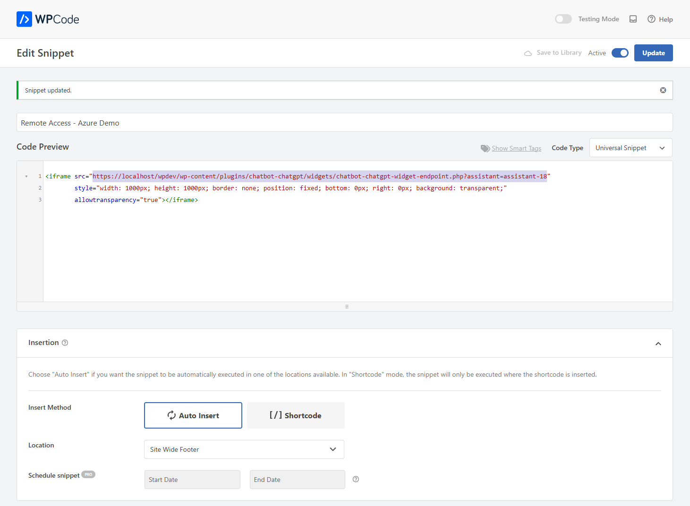

## Managing Remote Assess to the Kognetiks Chatbot

The **Kognetiks Chatbot** now includes the advanced feature to allow access to your assistants from remote servers.  Coupled with security measures to control and monitor remote access to your chatbots, you must enable the **Remote Widget Access** feature.  This will allow specific remote servers to interact with your chatbot(s) via an endpoint. To ensure that only authorized servers and chatbots can access your resources, the system uses a whitelisting mechanism that pairs domains with specific chatbot shortcodes, for example `kognetiks.com,chatbot-4` which will only allow calls from kognetiks.com and only then to chatbot-4.  Your resources are valuable, take appropriate precautions when allowing remote server access.


### Field Descriptions

1. **Enable Remote Widget**:
   - **Description**: This setting enables and disables remote access on a global basis.  By default, it is set to `No`.  To allow access by a remote server to a chatbot, you will need to change this setting to `Yes`.
   - **Input**: Choose `Yes` or `No`.

2. **Allowed Domains**:
    - **Description**: Enter the domain and assistant identified to allow remote access to a chatbot.  For example if the domain is `kognetiks.com` and you the chatbot is `chatbot-4`, then enter `kognetiks.com,chatbot-4`.  The pairs will be checked at when the remote server calls the chatbot widget endpoint.  If the pair is domain and chatbot are not paired correctly, no chatbot will be present.
    - **Input**: `domain.com,chatbot-n`
    - **Tip**: Be sure to put each pair on its own line, seperated the domain name and the chatbot shortcode identifier with a coma.
    - **Caution**: Your server and OpenAI resources are valuable.  Be sure to secure those resources by carefully maintaining the allowed pairs of domains and chatbots that you have white listed in this section.

3. **Widget Logging**:
    - **Description**: Widget logging records valid and invalid access to your chatbot(s) from remote servers.  This is especially helpful to ensure that your resources are used only by those that you have allowed.  On the `Tools` tab you will find a section titled **Manage Widget Access Logs** where you can download and delete remote widget access.

---

### Configuring Remote Server Access

1. **Remote Server Script**:
    - **Description**: The code block below illustrates how to configure the remote server call to your chatbot.  It consists of a `<script></script>` and `<iframe></iframe >`.  In the iframe is the call to your endpoint and a specific assistant.  In this example, the endpoint is located on the kognetiks.com domain, nestled deep within the subdirectories where the Kognetiks Chatbot resides.  To get started, you can copy this code and substitute `kognetiks.com` and `chatbot-4` for your domain and one of your assistants.

    For example:

    ```
    <iframe
        id="chatbot-widget-iframe"
        src="https://localhost/wpdev/wp-content/plugins/chatbot-chatgpt/widgets/chatbot-widget-endpoint.php?assistant=assistant-21"
        style="width: 100%; max-width: 600px; height: 100%; max-height: 600px; border: none; position: fixed; bottom: 20px; right: 20px; background: transparent; z-index: 999999 !important; outline: none; box-shadow: none;"
        allowtransparency="true"
        scrolling="no"
        frameborder="0">
    </iframe>

    <script>
    function rightsizeChatbot(event) {
        if (event.origin !== "http://localhost") return; // Change this to match your domain

            const iframe = document.getElementById("chatbot-widget-iframe");
            if (event.data.height) {
                let newHeight = Math.min(event.data.height, window.innerHeight - 40); // Prevent overflow
                iframe.style.height = newHeight + "px";
            }
        }

        // Ensure the iframe resizes dynamically
        window.addEventListener("message", rightsizeChatbot, false);
        window.addEventListener("resize", () => {
            document.getElementById("chatbot-widget-iframe").contentWindow.postMessage("resize", "*");
        });
    </script>
    ```

    **NOTE**: Be sure to substitute your `domain name` for `localhost` in the above examples.

    **TIP**: You can use either chatbot-nn (OpenAI) or assistant-nn (Azure OpenAI), either will work.

---

### Using WPCode to embedded Remote Server Access

The screen capture below shows how to configure Remote Server Access using WPCode to embedded the iframe in a website's site-wide footer.  As illustrated, this will place a floating chatbot on a remote website for interaction with an Assistant.  **TIP**: This works best with a floating chatbot.



---

### Key Security Features:

1. **Domain-Assistant Pair Whitelisting**:
   - The core of the security model lies in the ability to whitelist pairs of domains and chatbot shortcodes. Each remote server that calls the chatbot endpoint must be pre-approved by listing its domain along with the specific chatbot it is authorized to access. For example, the pair `kognetiks.com,chatbot-4` explicitly allows only `kognetiks.com` to access `chatbot-4`.
   - **Security Level**: This pairing provides a robust layer of security, ensuring that even if a domain is compromised, it cannot access unauthorized chatbots. This measure helps prevent misuse of your chatbot resources and protects your OpenAI API quota from unauthorized use.

2. **Request Validation and Logging**:
   - Each incoming request from a remote server undergoes strict validation. The system checks if the domain and chatbot shortcode are correctly paired as per the whitelist. If the pair does not match, the request is denied, and the attempt is logged as an unauthorized access attempt.
   - **Logging**: Detailed logs of both successful and failed access attempts are recorded. This logging not only helps in auditing but also in detecting any unauthorized access patterns. The **Manage Widget Access Logs** feature on the **Tools** tab allows you to download or delete these logs, helping you manage your resources effectively.

3. **Global Remote Access Control**:
   - The **Enable Remote Widget** setting allows you to control remote access on a global basis. When disabled (`No`), no remote servers can access the chatbot endpoint, regardless of the domain-assistant pairs listed. This feature provides an immediate and effective way to halt all remote access, should the need arise.

### Implementation Considerations:

- **Careful Pair Management**: It's crucial to regularly review and update the allowed domain-assistant pairs to ensure that only trusted servers have access. This proactive management helps in safeguarding your server resources and the integrity of your chatbot interactions.
- **Error Prevention**: Ensure that each domain-assistant pair is entered correctly, with the domain and shortcode separated by a comma and each pair on a new line. Incorrect formatting or pairing can lead to access issues or potential security gaps.

By implementing these security measures, you significantly enhance the protection of your chatbot resources, ensuring that only authorized domains and chatbots can interact with your system. This not only secures your OpenAI resources but also maintains the integrity and availability of your chatbot services.

---

- **[Back to Managing Assistants and Agents](manage-assistants.md)**
- **[Back to the Overview](/overview.md)**
