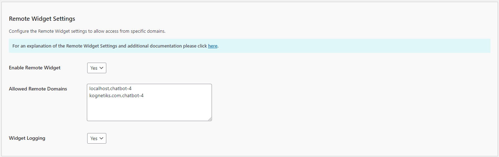
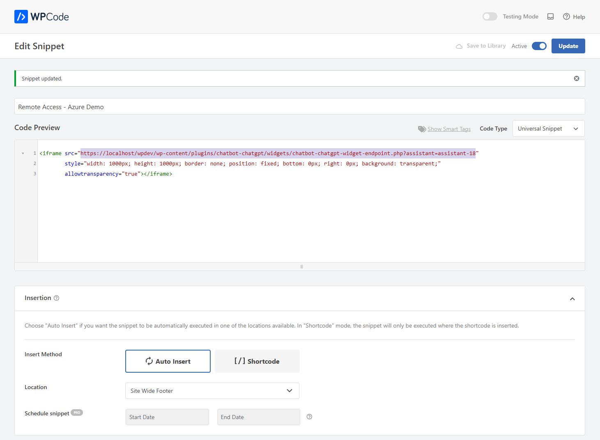

## Managing Remote Access to the Kognetiks Chatbot

The **Kognetiks Chatbot** can be embedded on remote sites through a signed widget endpoint. Remote access is off by default (`Enable Remote Widget` = `No`). When you turn it on, only domain + assistant pairs you list are valid, and each pair is issued an HMAC token. The HTTP Referer is logged for monitoring; it is not used for authorization.

### Field Descriptions

1. **Enable Remote Widget**:
   - **Description**: Global on/off for remote iframe access. Default is `No`.
   - **Input**: Choose `Yes` or `No`.

2. **Allowed Domains**:
    - **Description**: Enter one `domain,shortcode` pair per line, for example `kognetiks.com,chatbot-4`. Hosts are matched exactly (after stripping a leading `www.`); `example.co.uk` does not match every `.co.uk` site. After you save, the settings page shows an iframe snippet that includes a signed `token` query argument bound to that pair.
    - **Input**: `domain.com,chatbot-n`
    - **Tip**: One pair per line, domain and shortcode separated by a comma.
    - **Caution**: Treat the token like an embed key. Anyone with the iframe HTML can load that assistant until you remove the pair.

3. **Widget Logging**:
    - **Description**: Records allowed and denied remote widget requests (including Referer, for audit only). Download or delete logs under **Manage Widget Access Logs** on the `Tools` tab.

---

### Configuring Remote Server Access

1. **Embed snippet**:
    - Copy the iframe from Remote Widget Settings. The `src` uses `/kognetiks-chatbot-widget/` (or `?kognetiks_chatbot_widget=1` when pretty permalinks are off) plus `assistant` and `token`.
    - The legacy plugin file `widgets/chatbot-widget-endpoint.php` only redirects to that WordPress endpoint. It does not load `wp-load.php`.
    - Browsers are additionally restricted with `Content-Security-Policy: frame-ancestors` for the allowlisted host.

    **NOTE**: Use the generated snippet rather than building the URL by hand. Tokens change if WordPress salts are rotated. If you copy only the `src` into the address bar, use `&` between query arguments — not the HTML entity `&#038;`.

    **Localhost:** Open the **Test URL** shown in Remote Widget Settings in a new tab. Putting the iframe on this same WordPress site works. A local `file://` page or a different port will be blocked by `frame-ancestors`.

    **TIP**: You can use either chatbot-nn (OpenAI) or assistant-nn (Azure OpenAI), either will work.

---

### Using WPCode to embed Remote Server Access

Paste the generated iframe into a site-wide footer snippet on the remote site. This works best with a floating chatbot.

---

### Key Security Features:

1. **Signed domain-assistant tokens**:
   - Each allowlisted pair is authorized with an HMAC of `host + assistant` using the site's WordPress auth salt. A spoofed Referer is not enough to load the widget.

2. **Exact host allowlist and frame-ancestors**:
   - Hosts are not reduced to the last two DNS labels. Embedding is also limited in supporting browsers by CSP `frame-ancestors`.

3. **Request logging**:
   - Allowed and denied attempts are logged when widget logging is enabled.

4. **Global remote access control**:
   - Setting Enable Remote Widget to `No` denies every remote widget request, including those with a valid token.

### Implementation Considerations:

- Review allowlisted pairs regularly.
- After changing permalinks, visit the widget URL once (or re-save permalinks) so the rewrite is registered.
- Enter each pair as `domain,shortcode` on its own line.

---

- **[Back to Managing Assistants and Agents](manage-assistants.md)**
- **[Back to the Overview](/overview.md)**
