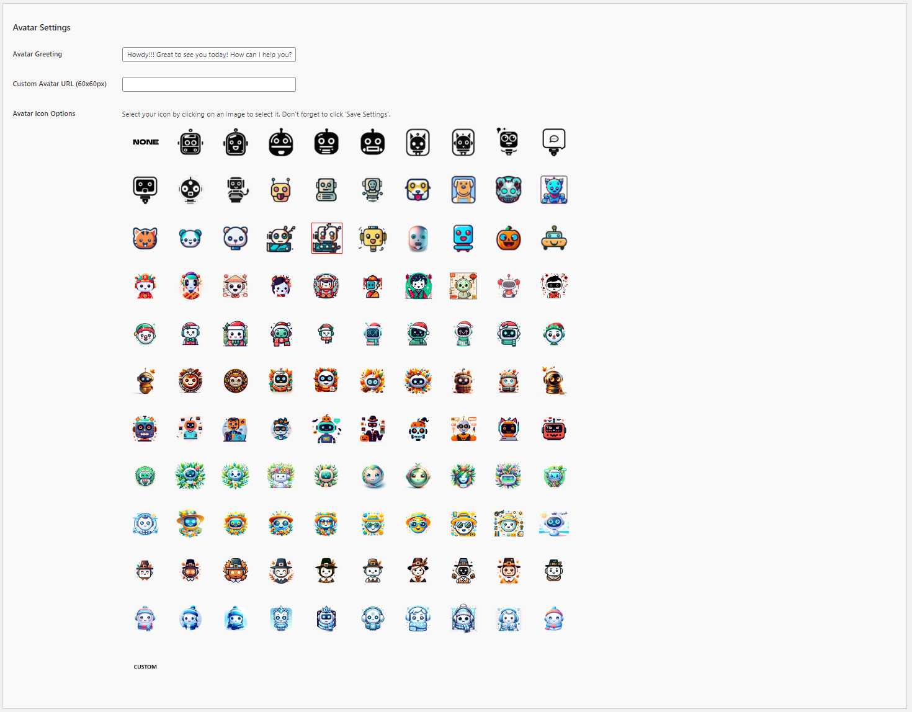

# Configuring the Avatar Settings

The Avatar Settings allow you to customize the appearance and greeting of your chatbot, enhancing its personality and user engagement. Follow these steps to configure these options:

1. **Avatar Greeting**:
   - **Description**: This field allows you to set a custom greeting message that appears with the avatar.
   - **Example**: "Howdy! Great to see you today! How can I help you?" Customize this message to suit the tone and style of your chatbot.

2. **Custom Avatar URL (60x60px)**:
   - **Description**: This field allows you to upload a custom avatar for your chatbot.
   - **Input**: Provide the URL of a 60x60 pixels image that you want to use as the chatbot's avatar. Ensure the URL is accessible and the image meets the size requirements.
   - **Example**: `https://yourwebsite.com/path/to/avatar.png`.

3. **Avatar Icon Options**:
   - **Description**: This section provides a variety of pre-designed avatar icons you can choose for your chatbot.
   - **Selection**: Click on any avatar icon to select it. The selected icon will be highlighted with a border.
   - **Saving**: After selecting an avatar, make sure to click 'Save Settings' to apply the changes.

## Steps to Configure

1. Navigate to the Avatar Settings section of the Kognetiks Chatbot plugin in your WordPress dashboard.

2. Enter a custom greeting message in the `Avatar Greeting` field to personalize your chatbot's interactions.

3. If you have a specific image you want to use, enter its URL in the `Custom Avatar URL (60x60px)` field.

4. Browse through the `Avatar Icon Options` and click on the icon you wish to use as your chatbot's avatar. The selected icon will be highlighted.

5. Ensure you click 'Save Settings' to apply your changes.

## Tips

- **Personalized Greetings**: Craft a greeting message that aligns with your brand's voice and the purpose of your chatbot. A friendly and engaging greeting can enhance user interaction.

- **Custom Avatars**: Using a custom avatar can make your chatbot more recognizable and aligned with your brand's visual identity.

- **Icon Selection**: If you prefer not to upload a custom avatar, choose from the wide array of pre-designed icons to give your chatbot a unique and friendly appearance.

By configuring these settings, you can personalize the appearance and initial interaction of your Kognetiks Chatbot, making it more engaging and visually appealing to users.

---

- **[Back to the Overview](/overview.md)**
