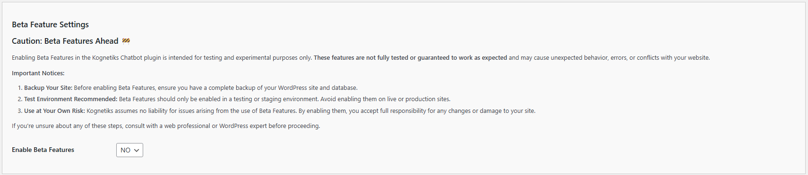

# Configuring Beta Features

The **Kogentiks Chatbot for WordPress** plugin now includes the option to enable beta features that may be released in the future.

Enabling Beta Features in the **Kognetiks Chatbot** plugin is intended for **testing and experimental** purposes only. These features are not fully tested or guaranteed to work as expected and may cause unexpected behavior, errors, or conflicts with your website.

**Important Notices**:

**Backup Your Site**: Before enabling Beta Features, ensure you have a complete backup of your WordPress site and database.

Test Environment Recommended: Beta Features should only be enabled in a testing or staging environment. Avoid enabling them on live or production sites.
Use at Your Own Risk: Kognetiks assumes no liability for issues arising from the use of Beta Features. By enabling them, you accept full responsibility for any changes or damage to your site.

If you're unsure about any of these steps, consult with a web professional or WordPress expert before proceeding.



1. **Enable Beta Features**:
   - **Description**: This setting determines if beta features included in the current release have been enabled.
   - **Default Value**: The default value is ```NO```.
   - **Options**: `YES` or `NO`.
   - **Selection**: Choose `YES` to enable any beta features for this release mentioned below, otherwise choose to `NO` at any time to disable any beta features.

If you change any settings, be sure to click the `Save Settings` button at the bottom of the settings page.

## Beta Features in Version 2.2.1

**Transformer Model**

1. Enable beta features to select `Transformer` as your AI Platform Selection of choice on the `General` tab.  Then click the `Save Settings` button of the bottom of the setting page.

2. A new tab called `API/Transformer` will appear in place of the AI Platform Selection you have previously made.  Click this tab to choose your transformer settings.

3. You can set the `Transformer Model Choice` (currently only choice is `sentential-context-model`, other choices may be available in later releases), `Maximum Tokens Setting`, and various `Transformore Model Advanced Settings`, such as the build scheduled, the window size (commonly referred to a n-gram), sentence reponse count, similarity thresholds, and leading sentence and token ratios.

4. Refer to this Support Documentation for more details [here](api-transformer-settings/api-transformer-model-settings.md).

---

- **[Back to the Overview](/overview.md)**