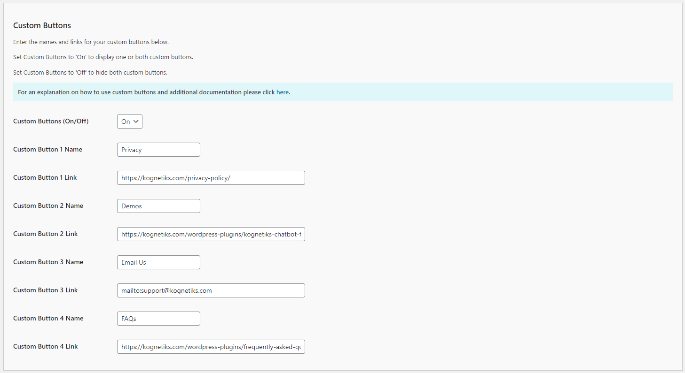

# Configuring the Custom Buttons

The Custom Buttons settings allow you to add personalized buttons to your chatbot, linking to specific pages or actions. Follow these steps to configure these options:

1. **Custom Buttons (On/Off)**:
   - **Description**: This toggle allows you to enable or disable the custom buttons feature in the chatbot.
   - **Options**: `On` or `Off`.
   - **Selection**: Choose `On` to enable custom buttons, or `Off` to disable them.

2. **Custom Button 1 Name**:
   - **Description**: This field allows you to set the name or label for the first custom button.
   - **Input**: Enter a descriptive name for the button (e.g., `Privacy`).

3. **Custom Button 1 Link**:
   - **Description**: This field allows you to specify the URL that the first custom button will link to.
   - **Input**: Enter the full URL (e.g., `https://yourwebsite.com/privacy-policy`).

4. **Custom Button 2 Name**:
   - **Description**: This field allows you to set the name or label for the second custom button.
   - **Input**: Enter a descriptive name for the button (e.g., `Contact`).

5. **Custom Button 2 Link**:
   - **Description**: This field allows you to specify the URL that the second custom button will link to.
   - **Input**: Enter the full URL (e.g., `https://yourwebsite.com/contact-us`).

## Steps to Configure

1. Navigate to the Custom Buttons section of the Kognetiks Chatbot plugin in your WordPress dashboard.

2. Toggle the `Custom Buttons (On/Off)` setting to `On` to enable custom buttons.

3. Enter the desired name for the first button in the `Custom Button 1 Name` field.

4. Enter the URL that the first button should link to in the `Custom Button 1 Link` field.

5. Enter the desired name for the second button in the `Custom Button 2 Name` field.

6. Enter the URL that the second button should link to in the `Custom Button 2 Link` field.

7. Save the settings.

## Tips

- **Descriptive Names**: Use clear and concise names for the buttons to ensure users understand their purpose.

- **Valid URLs**: Ensure the URLs entered are correct and lead to the intended pages.

- **User Experience**: Custom buttons can enhance user experience by providing quick access to important information or actions directly from the chatbot.

By configuring these settings, you can add useful custom buttons to your Kognetiks Chatbot, making it easier for users to navigate to key areas of your website.

---

- **[Back to the Overview](/overview.md)**
