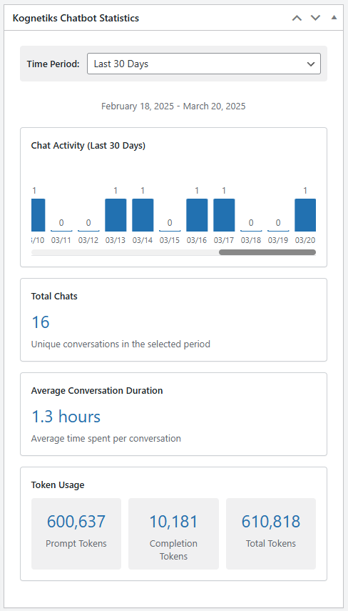

# Dashboard Widget

The Kognetiks Chatbot Dashboard Widget provides real-time insights into your chatbot's performance and usage statistics directly in your WordPress admin dashboard.

## Overview

The dashboard widget displays:
- Chat activity graph
- Total number of conversations
- Average conversation duration
- Token usage statistics

## Accessing the Dashboard Widget

1. Log in to your WordPress admin panel
2. Navigate to the Dashboard
3. Look for the "Kognetiks Chatbot Statistics" widget

## Features

### Time Period Selection
You can view statistics for different time periods:
- Last 24 Hours
- Last 7 Days
- Last 30 Days
- Last 90 Days
- Last 365 Days

### View Type
You can view statistics for either Sessions or Interactions per Time Period

### Statistics Display

#### Chat Activity Graph
- Visual representation of chat activity over time
- Bar chart showing the number of conversations per day/hour
- Scroll horizontally to view all data points

#### Total Sessions or Interactions
- Shows the total number of unique sessions, i.e., converations, or interactions (prompts and completions) in the selected time period
- Each session is counted only once, regardless of the number of messages
- Prompts and Completions are totaled then divided by two

#### Average Conversation Duration
- Displays the average time users spend in conversations
- Duration is shown in a human-readable format (seconds, minutes, hours, or days)

#### Token Usage
Shows three key metrics:
- Prompt Tokens: Number of tokens used in user messages
- Completion Tokens: Number of tokens used in AI responses
- Total Tokens: Combined token usage

## Understanding the Data

### Chat Activity Graph
- The height of each bar represents the number of conversations
- Higher bars indicate more active periods
- Use this to identify peak usage times

### Token Usage
- Helps track API consumption
- Useful for monitoring costs and usage patterns
- Can help optimize prompt engineering

## Best Practices

1. **Regular Monitoring**
   - Check the dashboard regularly to track usage patterns
   - Monitor token usage to manage API costs

2. **Performance Analysis**
   - Use the time period selector to analyze trends
   - Compare different periods to identify growth or issues

3. **Cost Management**
   - Keep an eye on token usage
   - Use the data to optimize conversation flows

## Troubleshooting

If you don't see the dashboard widget:
1. Ensure you have administrator privileges
2. Check if the widget is enabled in your dashboard settings
3. Verify that the chatbot plugin is properly activated

For data discrepancies:
1. Check the selected time period
2. Verify that conversation logging is enabled
3. Ensure your database has the necessary tables

## Support

For additional help with the dashboard widget:
- Check the [FAQ section](../support/faqs.md)
- Review the [Diagnostics guide](../support/diagnostics.md)
- Contact support through the official channels

---

* **[Back to Overview](../overview.md)** 