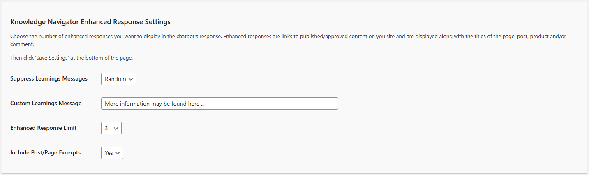

# Configuring the Knowledge Navigator Enhanced Response Settings

The Enhanced Response settings allow you to customize how additional information is presented in the chatbot’s responses. These enhanced responses include links to related content on your site, helping users find more detailed information. Follow these steps to configure these options:

1. **Suppress Learnings Messages**:
   - **Description**: This setting controls whether to display or suppress learning messages in the chatbot's responses.
   - **Options**: 
     - `Random`: Display random learning messages.
     - `Custom`: Displays your custom learning messages.
     - `None`: Never display learning messages.
   - **Selection**: Choose the option that best fits your content strategy and user engagement goals.

2. **Custom Learnings Message**:
   - **Description**: This field allows you to customize the message that accompanies the enhanced responses.
   - **Input**: Enter a custom message that will be displayed along with links to related content.
   - **Example**: "More information may be found here..."

3. **Enhanced Response Limit**:
   - **Description**: This setting determines the maximum number of enhanced responses to display with each chatbot interaction.
   - **Options**: A numeric value between `1` and `10` items (the default is 3).
   - **Selection**: Choose a number based on how much supplementary content you want to provide without overwhelming the user.

4. **Include Post/Page Excerpts**:
   - **Decription**: This setting determines if post or page excerpts are include with any learning messages.
   - **Options**: `Yes` to return post or page excerpts with learning messages, `No` (default) to exclude excerpts.
   - **Selection**: Choose the option that best fist your content strategy and user engagement goals.

## Steps to Configure

1. Navigate to the Knowledge Navigator Enhanced Response Settings section of the Kognetiks Chatbot plugin in your WordPress dashboard.

2. Set the `Suppress Learnings Messages` dropdown to the desired option (`Random`, `Always`, or `Never`).

3. Enter a custom message in the `Custom Learnings Message` field to guide users towards additional information.

4. Set the `Enhanced Response Limit` to the number of enhanced responses you want to display with each chatbot interaction.

5. Set the `Include Post/Page Excerpts` dropdown to the desired option (`Yes` or `No`).

6. Click 'Save Settings' to apply your changes.

## Tips

- **Balancing Information**: Choose an enhanced response limit that provides valuable information without overwhelming the user. Typically, 3-5 responses strike a good balance.

- **Engagement**: Custom learning messages can encourage users to explore more of your content, increasing engagement and time spent on your site.

- **Relevance**: Ensure that the related content linked in enhanced responses is relevant to the user's query to maintain usefulness and user satisfaction.

By configuring these settings, you can enhance the chatbot's responses with additional relevant content from your site, improving the overall user experience and engagement.

---

- **[Back to the Overview](/overview.md)**
