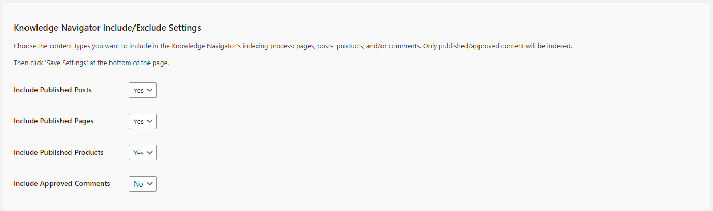

# Configuring the Knowledge Navigator Include/Exclude Settings

The Include/Exclude settings allow you to specify which types of content the **Knowledge Navigator** should index. This helps you control the scope of the content that your chatbot can reference. Follow these steps to configure these options:

1. **Dynamic Post Type Selection**:
   - **Description**: The Knowledge Navigator automatically detects all public post types on your site that have published content.
   - **Options**: For each post type, you can select `Yes` or `No`.
   - **Default**: `No` for any new post types.
   - **Selection**: Choose `Yes` to include a post type's content in the indexing process or `No` to exclude it.

2. **Include Approved Comments**:
   - **Description**: This setting determines whether the **Knowledge Navigator** should include approved comments in its indexing process.
   - **Options**: `Yes` or `No`.
   - **Default**: `No`.
   - **Selection**: Choose `Yes` to include approved comments or `No` to exclude them.

## Steps to Configure

1. Navigate to the Knowledge Navigator Include/Exclude Settings section of the Kognetiks Chatbot plugin in your WordPress dashboard.

2. For each post type displayed:
   - Set the option to `Yes` if you want that type of content to be included in the indexing process.
   - Set the option to `No` if you want to exclude that type of content.

3. Set the `Include Approved Comments` option to `Yes` or `No` depending on whether you want comments to be indexed.

4. Click 'Save Settings' to apply your changes.

## Tips

- **Content Relevance**: Include only the content types that are relevant to your chatbot's purpose. For instance, if your chatbot primarily provides customer support, you might include products and approved comments but exclude blog posts.

- **Performance Considerations**: Excluding less relevant content can improve indexing performance and reduce the load on your server.

- **Updating Settings**: Revisit these settings periodically, especially if your content strategy changes or if you add new post types to your site, to ensure the chatbot indexes the most relevant information.

- **New Post Types**: When you add new post types to your site, they will automatically appear in the settings with a default value of `No`. Review and update these settings as needed.

By configuring these settings, you ensure that your Kognetiks Chatbot indexes only the content that is most pertinent to its function, improving the relevance and accuracy of the information it provides to users.

---

- **[Back to Knowledge Navigator Settings](knowledge-navigator.md)**
- **[Back to the Overview](/overview.md)**
