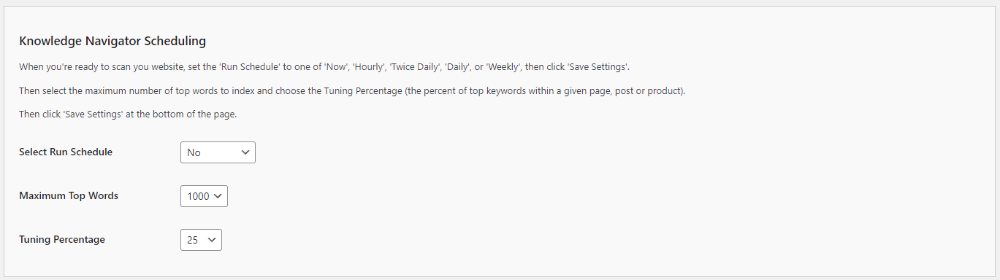

# Configuring the Knowledge Navigator Scheduling

The Knowledge Navigator Scheduling settings allow you to automate the content analysis process, ensuring that your chatbot's knowledge base remains current. Follow these steps to configure these options:

1. **Select Run Schedule**:
   - **Description**: This dropdown allows you to set the frequency at which the Knowledge Navigator scans your website content.
   - **Options**: 
     - `No`: Disables the scheduled runs.
     - `Now`: Runs the scan immediately.
     - `Hourly`: Runs the scan every hour.
     - `Twice Daily`: Runs the scan twice a day.
     - `Daily`: Runs the scan once a day.
     - `Weekly`: Runs the scan once a week.
   - **Selection**: Choose the frequency that best suits your content update schedule. For frequently updated sites, `Hourly` or `Daily` is recommended.

2. **Maximum Top Words**:
   - **Description**: This setting determines the maximum number of top words to index during the scan.
   - **Options**: A numeric values between 100 and 1,000 (the default is `100`).
   - **Selection**: Set a value that balances thorough indexing with performance. A higher number will index more words but may take longer.

3. **Tuning Percentage**:
   - **Description**: This setting specifies the percentage of top keywords within a given page, post, or product to include in the index.
   - **Options**: A number value - expresses as a percentage between 10 and 100 (the default values is `25` or 25%).
   - **Selection**: Adjust the percentage based on the desired level of keyword detail. A higher percentage will include more keywords from each item.

## Steps to Configure

1. Navigate to the Knowledge Navigator Scheduling section of the Kognetiks Chatbot plugin in your WordPress dashboard.

2. Set the `Select Run Schedule` dropdown to the desired frequency for content scans.

3. Enter the desired number of `Maximum Top Words` to index during each scan.

4. Set the `Tuning Percentage` to the desired level of keyword inclusion from each content item.

5. Click 'Save Settings' to apply the changes.

## Example Configuration

- **Select Run Schedule**: `Daily`

- **Maximum Top Words**: `1000`

- **Tuning Percentage**: `25%`

This configuration will ensure that the Knowledge Navigator scans your website content once a day, indexing up to 1,000 top words and including 25% of the top keywords from each content item.

## Tips

- **Frequency of Updates**: Choose a run schedule that matches how frequently your content is updated. For static sites, a weekly scan might be sufficient, while dynamic sites may benefit from hourly or daily scans.

- **Performance Considerations**: Higher values for top words and tuning percentage provide more detailed indexing but can affect performance. Adjust these settings based on your server capacity and performance requirements.

- **Immediate Updates**: Use the `Now` option if you need to run an immediate scan after significant content changes.

By configuring these settings, you ensure that your Kognetiks Chatbot stays up-to-date with the latest content on your website, providing accurate and relevant information to users.
