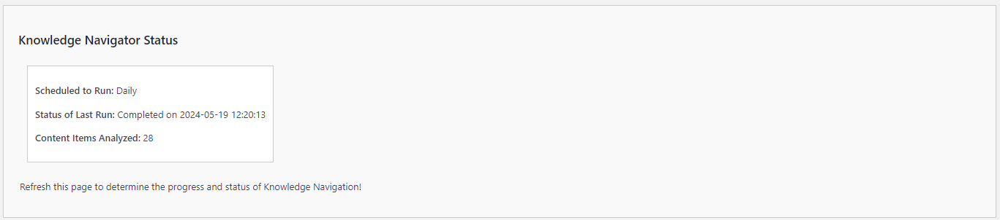

# Understanding the Knowledge Navigator Status

The Knowledge Navigator Status section provides an overview of the automated content analysis process performed by the Kognetiks Chatbot. This helps ensure that the chatbot's knowledge base is up-to-date and accurate. Here's how to interpret and use the information provided:

1. **Scheduled to Run**:
   - **Description**: Indicates how frequently the Knowledge Navigator is scheduled to run.
   - **Example**: If it's set to "Daily," the system will automatically analyze content every day.
   - **Use**: Verify that the schedule aligns with your content update frequency to keep the chatbot's knowledge current.

2. **Status of Last Run**:
   - **Description**: Provides the date and time of the last completed run of the Knowledge Navigator.
   - **Example**: "Completed on 2024-05-19 12:20:13."
   - **Use**: Ensure that the last run date is recent, confirming that the content analysis is happening as scheduled.

3. **Content Items Analyzed**:
   - **Description**: Displays the number of content items analyzed during the last run.
   - **Example**: "28" items.
   - **Use**: Check the number of items to ensure that all expected content is being analyzed. A significant change in this number may indicate new content additions or deletions.

## Steps to Utilize

1. **Verify Schedule**:
   - Ensure that the "Scheduled to Run" frequency matches your requirements for content updates. If you frequently update your site content, a daily schedule is recommended.

2. **Monitor Last Run Status**:
   - Regularly check the "Status of Last Run" to ensure that the Knowledge Navigator is running as expected. If the last run date is not recent, there may be an issue that needs attention.

3. **Check Content Items Analyzed**:
   - Look at the "Content Items Analyzed" to confirm that the expected number of items are being processed. This helps in verifying that the Knowledge Navigator is correctly scanning your content.

4. **Refresh for Updates**:
   - Refresh the page periodically to get the latest status updates. This can be helpful immediately after making significant changes to your content or settings.

## Troubleshooting Tips

- **Inconsistent Analysis**: If the number of content items analyzed seems incorrect, check for recent content additions or deletions that may have affected the count.

- **Stale Data**: If the "Status of Last Run" is outdated, ensure that the scheduler is configured correctly and that there are no issues with the automated process.

- **Frequency Adjustments**: If your content updates vary, adjust the "Scheduled to Run" frequency accordingly to ensure timely content analysis.

By understanding and utilizing the Knowledge Navigator Status settings, you can ensure that your Kognetiks Chatbot remains accurate and effective in providing up-to-date information to users.

---

- **[Back to Knowledge Navigator Settings](knowledge-navigator.md)**
- **[Back to the Overview](/overview.md)**
