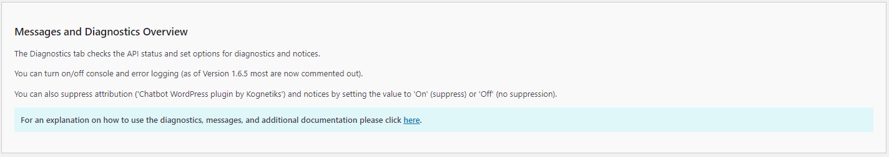
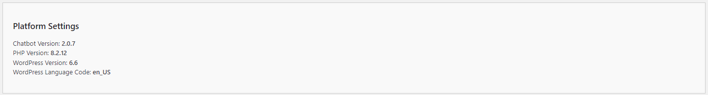
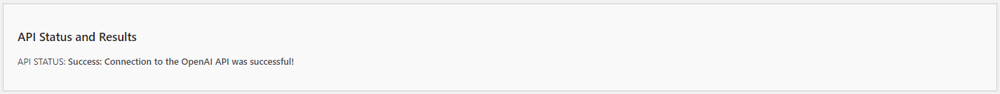
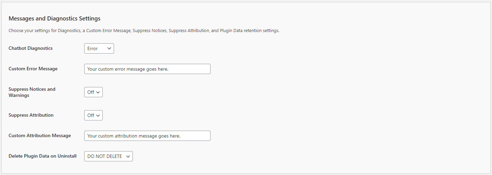
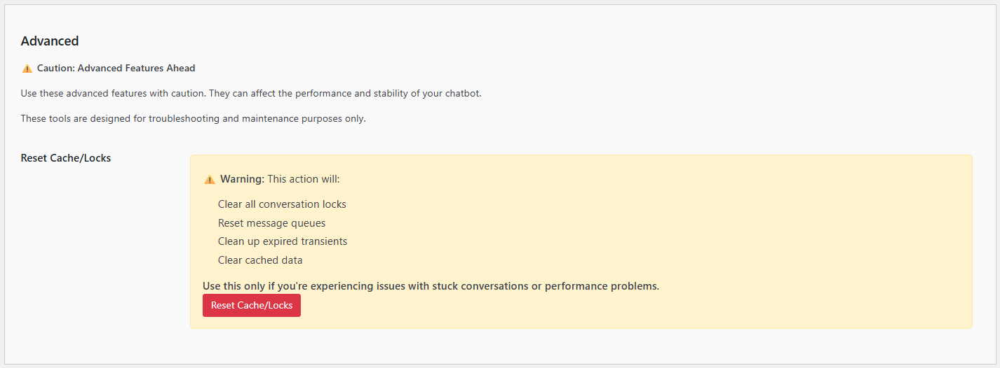
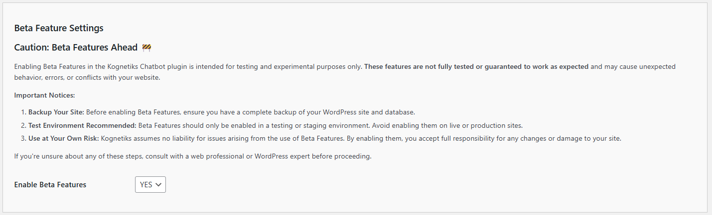

# Messages and Diagnostics Settings

The Messages and Diagnostics Settings help you monitor the health and performance of the **Kognetiks Chatbot**, providing tools for error logging, API connection checks, and other diagnostics. Follow these steps to configure these options effectively:

# Platform Settings Details

1. **System and Plugin Information**:
   - **Description**: Displays key information about your system and the chatbot plugin, including PHP version, WordPress version, Chatbot version, and WordPress language code.
   - **Usage**: Use this information for troubleshooting and ensuring compatibility with your environment.

# API Status and Results

1. **API Status and Results**:
   - **Description**: Shows the status of the connection to the OpenAI API.
   - **Details**: Indicates whether the connection was successful.
   - **Usage**: Check this status to verify that the chatbot can communicate with the OpenAI API. A successful connection is necessary for the chatbot to function correctly.

# Messages and Diagnostics Settings

1. **Chatbot Diagnostics**:
   - **Description**: Allows you to select the level of diagnostics to be logged.
   - **Options**: 
     - `Off`: No logging.
     - `Success`: Success messages.
     - `Notice`: General messages.
     - `Failure`: Failure messages.
     - `Warning`: Warning massages.
     - `Error`: Error messages.
   - **Selection**: Choose the appropriate level based on your need for diagnostics information. `Off` is the default and recommended setting for general use. Use `Error` for in-depth troubleshooting. `Error` logs all levels.

   **NOTE:** You can enable error and console logging at any time, however in the production releases of the chatbot all error logging has been commented out.

2. **Custom Error Message**:
   - **Description**: This setting allows administrators to define a custom error message that will be displayed to users when the chatbot encounters an issue. This ensures a more consistent and branded user experience, even in cases of unexpected errors.
   - **Options**: Any text string that you want to use as the error message.
   - **Selection**: Enter your preferred error message in the provided text field on the "Messages" tab. An example of a custom error message could be:
     `
     Sorry, it appears our chat isn't working right now. If you're looking for support, click <a href="https://www.kognetiks.com/">here</a>.
     `
   - **Additional Requirements**:
     - **Chatbot Diagnostics**: Ensure that the Chatbot Diagnostics setting is turned from `Off` to `Error` to enable the display of custom error messages.
     - **WordPress Error Logging**: You may also need to turn on WordPress error logging to fully utilize this feature.

3. **Suppress Notices and Warnings**:
   - **Description**: Allows you to suppress notices and warnings such as those associated with the **Knowledge Navigator** and other administrative functions.  These messages and warnings are not shown to users, only to site administrators.
   - **Options**: `On` or `Off`.
   - **Selection**: Choose `On` to suppress notices and warnings if you prefer a less verbose experience, otherwise set to `Off` to see all administrative messages associated with the chatbot.

4. **Suppress Attribution**:
   - **Description**: Allows you to suppress the attribution message ("Chatbot plugin by Kognetiks") displayed in both the `floating` and `embedded` style of the chatbot.
   - **Options**: `On` or `Off`.
   - **Selection**: Choose `On` to suppress the attribution message. Set to `Off` to display the message.

5. **Custom Attribution Message**:
   - **Description**: This setting allows administrators to define a custom attribution message that will be displayed to users.
   - **Options**: Any text string that you want to use as the attribution message.
   - **Tip**: To remove custom attribution, just delete the value and save your settings.

6. **Delete Plugin Data on Uninstall**:
   - **Description**: Determines whether to delete all plugin data when the plugin is uninstalled.
   - **Options**: `Yes` or `No`.
   - **Selection**: Choose `Yes` to delete all data when uninstalling the plugin, ensuring no residual data remains. Select `No` to retain data even after uninstallation, which can be useful if you plan to reinstall the plugin later.

## Steps to Configure

1. Navigate to the Diagnostics Settings section of the Kognetiks Chatbot plugin in your WordPress dashboard.

2. Review the **System and Plugin Information** to ensure compatibility and identify the current versions in use.

3. Check the **API Test Results** to confirm a successful connection to the OpenAI API.

4. Set the **Chatbot Diagnostics** level based on your need for error and performance logging.

5. Toggle **Suppress Notices and Warnings** to `On` or `Off` as desired.

6. Toggle **Suppress Attribution** to `On` or `Off` based on whether you want to hide the attribution message.

7. Decide whether to enable **Delete Plugin Data on Uninstall** by setting it to `Yes` or `No`.

8. Click 'Save Settings' to apply your changes.

## Tips

- **Regular Monitoring**: Regularly check the diagnostics settings and logs to ensure the chatbot is functioning correctly and to identify any issues early.

- **Error Logging**: Start with the `Error` logging level and increase to `Warning` or `Debug` if you encounter issues that require more detailed diagnostics.

- **Data Management**: Be cautious with the "Delete Plugin Data on Uninstall" setting if you might need the data in the future.

By configuring these settings, you can effectively monitor and maintain the health and performance of your Kognetiks Chatbot, ensuring a smooth and reliable user experience.

## How To Enable Error Logging

To enable error logging in WordPress, you need to modify the `wp-config.php` file in your WordPress installation directory.

**NOTE: Enabling debugging in WordPress is useful for troubleshooting issues, but it may expose sensitive information and affect site performance. Be sure to disable debugging on live sites after resolving issues to maintain security and optimal performance.**

Here are the basic steps to enable error logging:

1. **Access the `wp-config.php` File**:
   - Use an FTP client or your hosting provider's file manager to navigate to the root directory of your WordPress installation. This is typically where you will find the `wp-config.php` file.

2. **Edit the `wp-config.php` File**:
   - Open the `wp-config.php` file in a text editor.

3. **Enable Debugging**:
   - Locate the following line in the file (if it exists):

     `define('WP_DEBUG', false);`

   - Change `false` to `true` to enable debugging:

     `define('WP_DEBUG', true);`

4. **Enable Debug Log**:
   - Add or modify the following lines to enable the debug log:

     `define('WP_DEBUG_LOG', true);`

     `define('WP_DEBUG_DISPLAY', false);`
     
     `@ini_set('display_errors', 0);`

   - This will log errors to a file named `debug.log` located in the `wp-content` directory, but it will not display errors on the screen.

5. **Save and Upload the File**:
   - Save the changes to the `wp-config.php` file and upload it back to your server if you are using an FTP client.

### Optional: More Detailed Logging

If you want more detailed logging, you can also add the following lines to `wp-config.php`:

`define('SCRIPT_DEBUG', true);`

`define('SAVEQUERIES', true);`

- `SCRIPT_DEBUG`: Forces WordPress to use the "dev" versions of core CSS and JavaScript files rather than the minified versions.

- `SAVEQUERIES`: Saves the database queries to an array and makes them available via the global `$wpdb->queries`.

### Accessing the Error Log

- You can access the error log by navigating to the `wp-content` directory and opening the `debug.log` file.

By enabling these settings, you can track and troubleshoot errors that occur within your WordPress site. If you need more advanced logging or custom error handling, consider using a logging plugin like WP Debugging or Error Log Monitor.

# Advanced

**Caution: Advanced Features Ahead**

Use these advanced features with caution. They can affect the performance and stability of your chatbot. These tools are designed for troubleshooting and maintenance purposes only.

## Reset Cache/Locks

1. **Reset Cache/Locks**:
   - **Description**: A maintenance tool that allows you to clear various cached data and reset conversation locks that may be causing issues with your chatbot.
   - **Warning**: This action will:
     - Clear all conversation locks
     - Reset message queues
     - Clean up expired transients
     - Clear cached data
   - **Usage**: Use this only if you're experiencing issues with stuck conversations or performance problems. This tool should be used as a last resort when other troubleshooting methods have failed.
   - **When to Use**:
     - Conversations appear to be stuck or not responding
     - Messages are not being processed correctly
     - Performance issues that may be related to cached data
     - After making significant configuration changes that require a fresh start
   - **How to Use**:
     1. Navigate to the Advanced section of the Messages and Diagnostics settings.
     2. Review the warning message to understand what will be cleared.
     3. Click the "Reset Cache/Locks" button to perform the reset.
     4. Wait for the confirmation message indicating the reset was successful.
   - **Important Notes**:
     - This action cannot be undone. All cached data and locks will be permanently cleared.
     - Active conversations may be interrupted when this action is performed.
     - The chatbot will rebuild its cache and locks as new conversations begin.
     - It is recommended to perform this action during low-traffic periods if possible.

# Beta Features

**Caution: Beta Features Ahead** 🚧

Enabling Beta Features in the Kognetiks Chatbot plugin is intended for testing and experimental purposes only. These features are not fully tested or guaranteed to work as expected and may cause unexpected behavior, errors, or conflicts with your website.

## Important Notices

1. **Backup Your Site**:
   - Before enabling Beta Features, ensure you have a complete backup of your WordPress site and database.
   - This includes all files, database tables, and any custom configurations.
   - Having a backup allows you to quickly restore your site if any issues occur.

2. **Test Environment Recommended**:
   - Beta Features should only be enabled in a testing or staging environment.
   - Avoid enabling them on live or production sites.
   - Use a development or staging site to test beta features before considering them for production use.

3. **Use at Your Own Risk**:
   - Kognetiks assumes no liability for issues arising from the use of Beta Features.
   - By enabling them, you accept full responsibility for any changes or damage to your site.
   - Beta features may be unstable, incomplete, or subject to change without notice.

If you're unsure about any of these steps, consult with a web professional or WordPress expert before proceeding.

## Enable Beta Features

1. **Enable Beta Features**:
   - **Description**: This setting allows you to enable experimental and beta features that are still in development. These features may provide new functionality but are not yet fully tested or stable.
   - **Options**: 
     - `No`: Beta features are disabled (default and recommended for production sites).
     - `Yes`: Beta features are enabled for testing purposes.
   - **Selection**: Choose `Yes` to enable beta features if you want to test experimental functionality. Select `No` to keep beta features disabled.
   - **Usage**: 
     - Only enable beta features if you understand the risks and have taken appropriate precautions (backup, testing environment, etc.).
     - Monitor your site closely after enabling beta features to identify any issues or conflicts.
     - Report any bugs or issues you encounter to help improve the features before they are released as stable.
   - **Important Notes**:
     - Beta features may change or be removed in future updates without notice.
     - Some beta features may conflict with other plugins or themes.
     - Performance may be affected when using beta features.
     - Always disable beta features before updating the plugin to avoid potential conflicts.

---

- **[Back to the Overview](/overview.md)**
