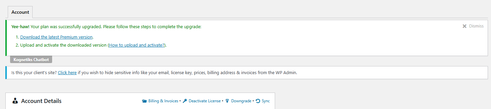

# Premium Support

## Activation



Yee-haw! Your plan was successfully upgraded. Please follow these steps to complete the upgrade:
Download the latest Premium version.
Upload and activate the downloaded version (How to upload and activate?).

## Download the latest Premium version


```Choose File```

```chatbot-chatgpt-premium-latest.zip```

```Install Now```


```Activate Plugin```


```W00t! Premium pluign version was successfully activated.```


```Kognetiks Chatbot``` is ```deactivated```

```Kognetiks Chatbot Premium``` is ```activated```

## How to upload and activate

http://bit.ly/wp-plugin-upload

https://www.youtube.com/watch?v=kfDZDijL-Wg


