# Kognetiks Chatbot: Free → Trial → Premium Upgrade Flow

This document explains how the Kognetiks Chatbot upgrade process works, from the free version to a 7-day Premium trial, and finally to a paid Premium subscription.

The goal of this process is to let you fully experience all Premium features before deciding whether to upgrade.

---

## Overview of the Upgrade Journey

The Kognetiks Chatbot follows a three-step upgrade path:

1. **Free Version** – Installed from WordPress.org
2. **Premium Trial (7 Days)** – Full Premium features, no credit card required
3. **Premium Subscription** – Continued access after the trial ends

Each step is intentional and includes confirmation so you always know what’s happening.

---

## Step 1: Using the Free Version

When you install **Kognetiks Chatbot (Free)** from the WordPress plugin directory:

- The plugin is fully functional with core chatbot features
- Advanced Premium features are visible but locked
- You may see “Start Free Trial” or “Unlock Premium Features” buttons in:
  - Plugin settings
  - Reporting or Insights screens
  - Admin notices

At this stage, **no account is required**, and **no data is sent to Freemius** until you choose to start a trial.

---

## Step 2: Starting the Free 7-Day Trial

When you click **Start Free Trial**, you are taken to the Kognetiks Chatbot pricing page.

### What You’ll See

- A clear banner indicating:
  > *Start your 7-day free trial*
- Confirmation that:
  - No credit card is required
  - All Premium features are included

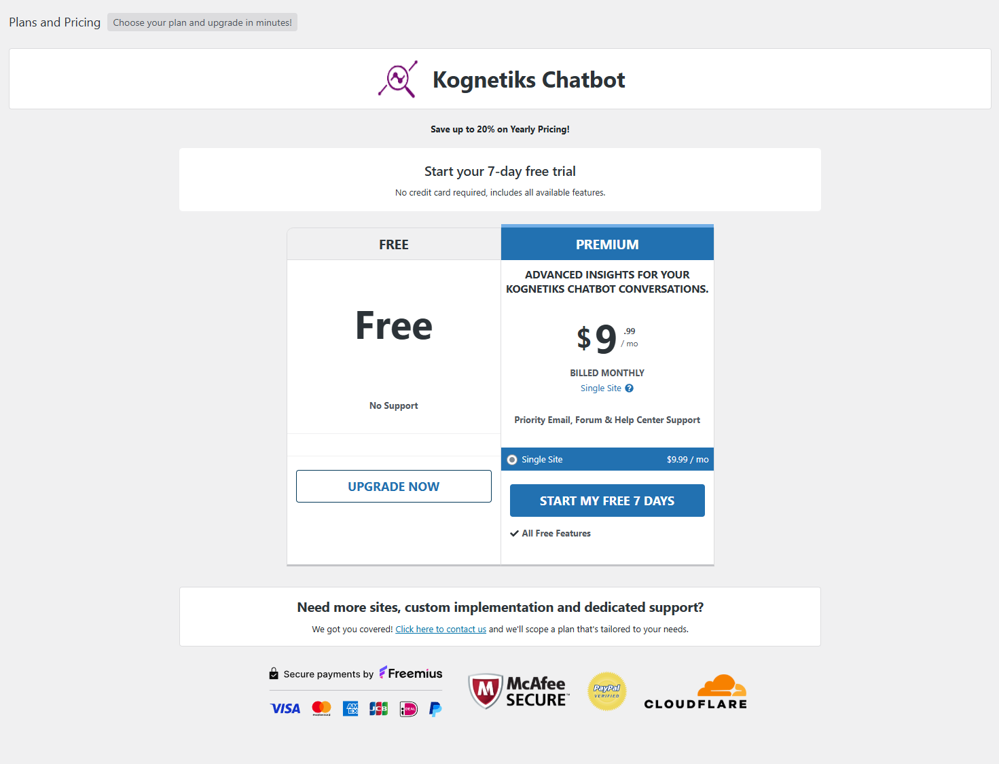

---

## Step 3: Approving the Trial

When you click **Start My Free 7 Days**, a confirmation modal appears.

This step is required for WordPress.org compliance.

### What This Means

By clicking **Approve & Start Trial**, you are:

- Opting in to non-sensitive usage and site data sharing
- Allowing Freemius to validate your trial
- Creating a Freemius account (if one does not already exist)

**This approval is the opt-in step.**

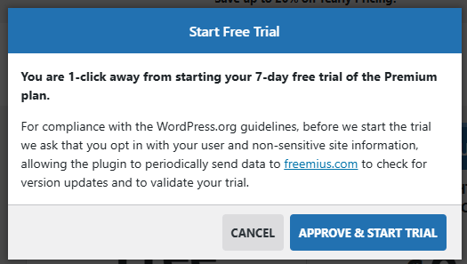

---

## Step 4: Email Confirmation (Important)

After approval, you’ll see a notice in WordPress asking you to confirm your email address.

You will receive an email titled something like:

> **Activate Kognetiks Chatbot Trial**

Inside the email is a link:

> **Activate Trial on your site**

You must click this link to continue.

### Start Trial Notice

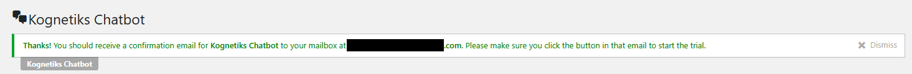

### Start Trial Email Activation

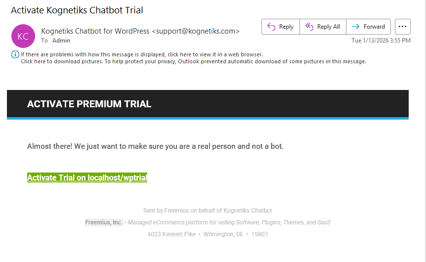

---

## Step 5: Trial Activated — Next Steps

Once the email confirmation link is clicked:

- Your trial officially starts
- You are redirected back to your WordPress admin
- A notice appears confirming:
  > *Your trial has been successfully started*

You will now see instructions to:

1. Download the **Premium version**
2. Upload and activate it in WordPress

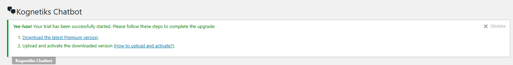

---

## Step 6: Installing the Premium Plugin

During the trial, **Premium features are unlocked only when the Premium plugin is installed**.

### How This Works

- The Free plugin remains installed but is deactivated
- The Premium plugin is uploaded and activated
- No data or settings are lost
- The site immediately gains access to all Premium features

Start by clicking the "Download the latest Premium version" link.  Once downloaded, click "Choose File", Upload, then click "Install Now"

### Add Plugins

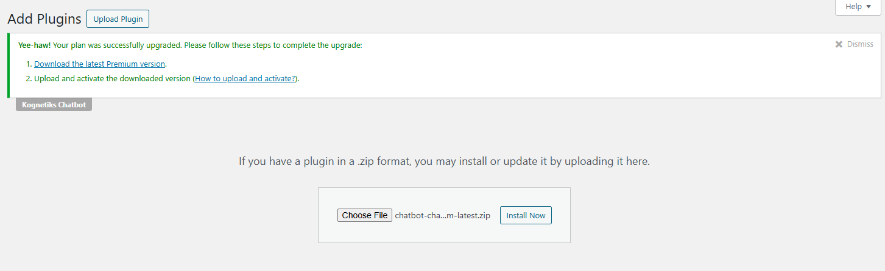

### Installing the Premium Plugin

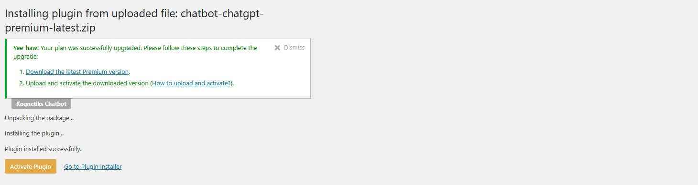

### Activating the Premium Plugin

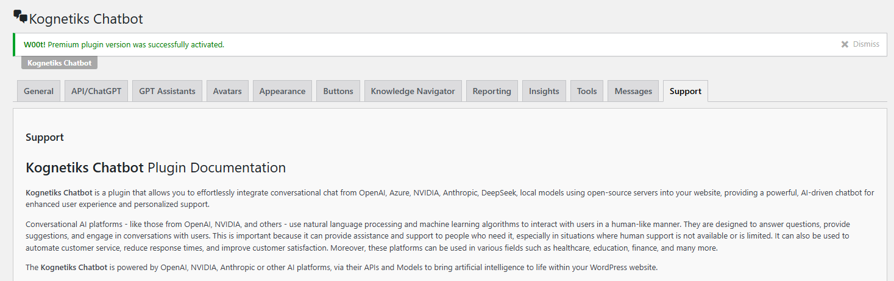

### Confirmation the Premium Plugin was installed and activated.

You’ll see a confirmation message like:

> *Premium plugin version was successfully activated.*

---

## Step 7: Using Premium During the Trial

While the trial is active:

- All Premium features are fully unlocked
- There are no feature limitations
- No payment method is required
- You can cancel at any time before the trial ends

You’ll also receive a confirmation email:

> **Your free 7-day trial has started**

This email includes:
- Trial duration
- Setup confirmation
- Account access details

---

## Step 8: Trial Expiration and Upgrade to Premium

Before the 7-day trial ends, you can choose to upgrade to a paid plan.

### If You Upgrade

- You select a Premium plan (monthly or annual)
- Payment is handled securely by Freemius
- No plugin reinstallation is required
- Your Premium access continues uninterrupted

### If You Do Not Upgrade

- Premium features are automatically locked when the trial ends
- The Premium plugin remains installed but gated
- You can downgrade to the Free version at any time

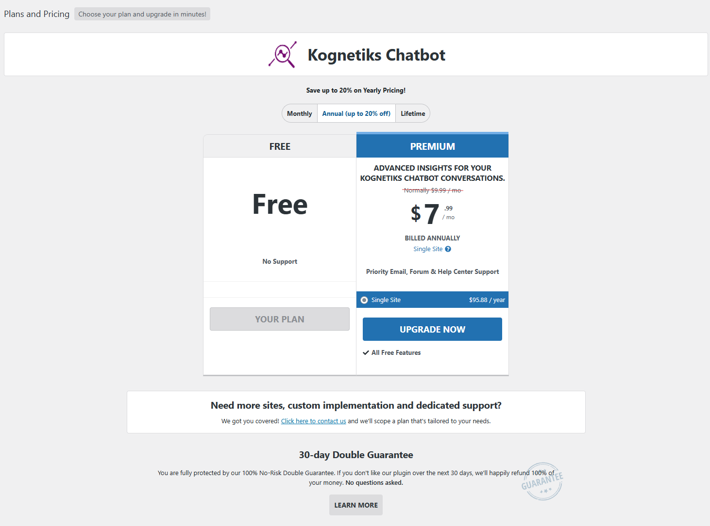

---

## Key Notes & Common Questions

### Do I need a credit card to start the trial?

No. The 7-day trial does not require a credit card.

### Why do I need to confirm my email?

Email confirmation prevents abuse and ensures the trial is tied to a real user and site.

### Why do I need to install a separate Premium plugin?

This ensures:

- WordPress.org compliance
- Clean separation between Free and Premium code
- Safe feature gating during trials and upgrades

### Can I test Premium safely?

Yes. The trial gives full access with no obligation to upgrade.

---

## Summary

The Kognetiks Chatbot upgrade flow is designed to be:

- Transparent
- Reversible
- Fully testable before purchase

**Free → Trial → Premium** is a deliberate, user-friendly progression that ensures you always stay in control.

If you have questions at any stage, visit the Support tab in the plugin or contact us directly.

---

## Note

Both the "free" plugin and "premium" plugin can be found amoung the list of installed plugins.  Keep or delete the original "Kognetiks Chatbot".  Be sure to set the "Delete Plugin Data on Unistall" to "DO NOT DELETE".  You can access this setting from the Kognetiks Chatbot settings on the "Messages" tab (see screen capture below).

### Installed Plugins

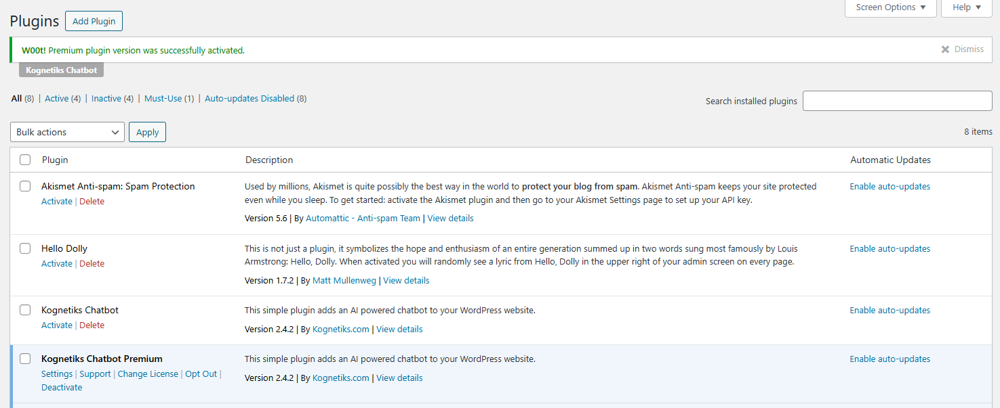

### Delete Plugin Data on Uninstall Setting

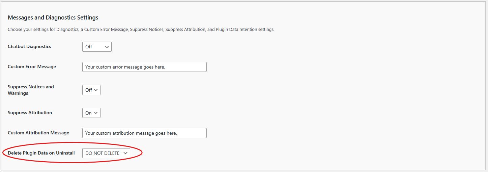

---

## Support

Please use one of these resources to obtain support for the **Kognetiks Chatbot** plugin.

- [Support @ Discord](https://discord.gg/nXRzxUKvya)

- [Support @ Kognetiks.com](https://kognetiks.com/plugin-support/)

- [Support @ WordPress.org](https://wordpress.org/support/plugin/chatbot-chatgpt/)

- [Support @ GitHub.com](https://github.com/kognetiks/kognetiks-chatbot/issues)

---

- **[Back to the Overview](/overview.md)**

