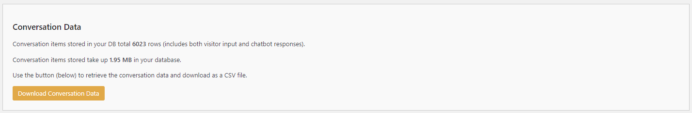

# Using the Conversation Data

The Conversation Data settings allow you to manage and export the interaction data collected by the **Kognetiks Chatbot**. This data includes both visitor inputs and chatbot responses, amd token usages which can be useful for analysis and improving the chatbot's performance. Follow these steps to understand and use these settings:

1. **Conversation Data Overview**:
   - **Description**: This section provides a summary of the conversation data stored in your database.
   - **Details**:
     - **Total Rows**: The number of conversation items stored, including both visitor inputs and chatbot responses.
     - **Database Size**: The total space taken up by the conversation data in your database.

2. **Download Conversation Data**:
   - **Description**: This button allows you to download the stored conversation data as a `CSV` file.
   - **Action**: Click the "Download Conversation Data" button to retrieve the data.
   - **Usage**: Use this data for analysis, backup, or further processing in tools like Excel or other data analysis software.

### Steps to Use

1. **View Summary**:
   - Check the total number of conversation items and the database size to understand the volume of data collected by the chatbot.

2. **Download Data**:
   - Click the "Download Conversation Data" button to export the conversation data as a `CSV` file. Save this file to your local machine for analysis or backup.

### Tips

- **Regular Downloads**: Periodically download the conversation data to keep a backup and perform regular analysis.

- **Data Analysis**: Use spreadsheet software or data analysis tools to examine the conversation data, identify trends, and improve the chatbot's performance.

- **Data Cleanup**: If the database size becomes too large, consider setting up a routine to archive older conversation data.

By using these settings, you can effectively manage and analyze the conversation data from your Kognetiks Chatbot, helping you gain insights into user interactions and improve the chatbot's performance.

---

- **[Back to the Overview](/overview.md)**
