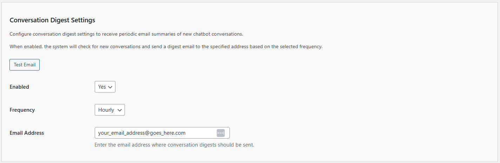

# Configuring Conversation Digest Settings

The Conversation Digest Settings allow you to receive periodic email summaries of new chatbot conversations. This feature automatically checks for new conversations and sends a formatted digest email to a specified address based on your selected frequency. Follow these steps to configure these settings:

## Settings Overview

1. **Enabled**:
   - **Description**: This toggle enables or disables the conversation digest email feature.
   - **Options**: `Yes` or `No`.
   - **Default**: `No`.
   - **Selection**: Choose `Yes` to enable automatic digest emails, or `No` to disable them. When enabled, the system will automatically schedule email digests based on your selected frequency.

2. **Frequency**:
   - **Description**: This setting determines how often digest emails are sent.
   - **Options**: 
     - `Hourly`: Sends a digest email every hour with new conversations from the past hour.
     - `Daily`: Sends a digest email once per day with new conversations from the past 24 hours.
     - `Weekly`: Sends a digest email once per week with new conversations from the past 7 days.
   - **Default**: `Daily`.
   - **Selection**: Choose the frequency that best suits your monitoring needs. `Daily` is recommended for most use cases.

3. **Email Address**:
   - **Description**: The email address where conversation digest emails will be sent.
   - **Format**: Must be a valid email address.
   - **Requirement**: This field is required when "Enabled" is set to `Yes`.
   - **Usage**: Enter the email address where you want to receive conversation summaries.

4. **Test Email Button**:
   - **Description**: This button allows you to send a test email to verify your email configuration is working correctly.
   - **Action**: Click the "Test Email" button to send a test digest email with conversations from the last 24 hours.
   - **Usage**: Use this button after configuring your settings to ensure emails are being sent successfully.

## Steps to Configure

1. Navigate to the Reporting tab in the Kognetiks Chatbot plugin settings in your WordPress dashboard.

2. Scroll to the "Conversation Digest Settings" section.

3. Set the `Enabled` dropdown to `Yes` to enable conversation digest emails.

4. Select your preferred `Frequency` from the dropdown (`Hourly`, `Daily`, or `Weekly`).

5. Enter a valid `Email Address` in the text field where you want to receive digest emails.

6. Click "Save Settings" to apply your changes. The system will automatically schedule the digest emails based on your settings.

7. (Optional) Click the "Test Email" button to verify your email configuration and receive a sample digest email.

## How It Works

- **Automatic Scheduling**: When you enable the feature and save settings, the system automatically schedules a WordPress cron job to send digest emails at your selected frequency.

- **New Conversations Only**: The digest only includes conversations that are new since the last digest was sent. If there are no new conversations, no email will be sent.

- **Email Content**: Each digest email includes:
  - Summary statistics (total conversations and messages)
  - Each conversation organized by session
  - Session metadata (User ID, Page ID, Thread ID, Assistant name)
  - All messages in chronological order with timestamps

- **Cron Job Management**: The system automatically manages the scheduled cron job. When you disable the feature, the cron job is automatically unscheduled. When you change the frequency, the cron job is rescheduled accordingly.

## Prerequisites

- **Conversation Logging**: Conversation logging must be enabled in the Reporting Settings for digest emails to include conversation data. If conversation logging is disabled, digest emails will still be sent but will indicate that no conversations were found.

- **Email Configuration**: Your WordPress site must be configured to send emails. For local development environments, you may need to:
  - Install an SMTP plugin (WP Mail SMTP, Post SMTP, etc.)
  - Use a mail testing service like Mailtrap or MailHog
  - Configure your server to use an external SMTP server
  - Test on a staging/production server with proper mail configuration

## Tips

- **Email Testing**: Always use the "Test Email" button after configuring your settings to verify that emails are being sent successfully, especially in local development environments.

- **Frequency Selection**: Choose a frequency that matches your monitoring needs. `Daily` digests provide a good balance between staying informed and not overwhelming your inbox.

- **Email Address**: Use a dedicated email address or distribution list for digest emails to keep them organized and easily accessible.

- **Monitoring**: Regularly check your email to ensure digest emails are being received. If emails stop arriving, check your WordPress email configuration and cron job status.

- **Data Privacy**: Be aware that digest emails contain conversation data. Ensure your email system and recipients comply with your data privacy policies.

## Troubleshooting

- **No Emails Received**: 
  - Verify that "Enabled" is set to `Yes` and an email address is entered.
  - Check your WordPress email configuration using the "Test Email" button.
  - Verify that conversation logging is enabled in Reporting Settings.
  - Check if there are actually new conversations to report.

- **Emails Not Scheduled**:
  - Ensure you clicked "Save Settings" after enabling the feature.
  - Check WordPress cron job status (may require a plugin like WP Crontrol).
  - Verify that your WordPress cron system is functioning properly.

- **Test Email Fails**:
  - Check your WordPress email configuration.
  - For local development, install an SMTP plugin or use a mail testing service.
  - Verify that the email address is valid and properly formatted.

By configuring these settings, you can automatically receive periodic summaries of chatbot conversations, helping you stay informed about user interactions and chatbot performance without manually checking the dashboard.

---

- **[Back to Reporting Overview](reporting.md)**
- **[Back to the Overview](/overview.md)**

