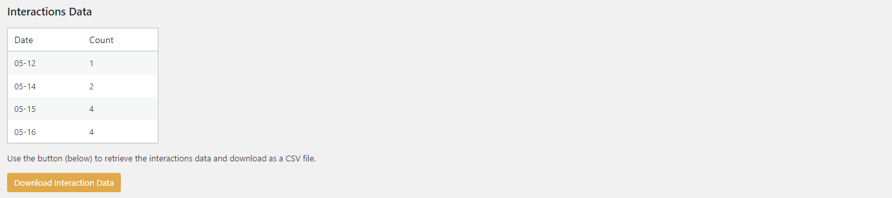

# Using the Interactions Data

The Interactions Data settings allow you to view, manage, and export the data related to user interactions with your **Kognetiks Chatbot for WordPress**. This data includes the number of interactions per day, which can help you understand user engagement and activity patterns. Follow these steps to understand and use these settings:

1. **Interactions Data Overview**:
   - **Description**: This section provides a summary of the interactions data collected by the chatbot.
   - **Details**:
     - **Date**: The specific date when interactions occurred.
     - **Count**: The number of interactions recorded on that date.

2. **Download Interaction Data**:
   - **Description**: This button allows you to download the interactions data as a `CSV` file.
   - **Action**: Click the "Download Interaction Data" button to retrieve the data.
   - **Usage**: Use this data for analysis, reporting, or further processing in tools like Excel or other data analysis software.

## Steps to Use

1. **View Summary**:
   - Review the Interactions Data table to see the number of interactions on specific dates. This can help you track user engagement over time and identify patterns or trends.

2. **Download Data**:
   - Click the "Download Interaction Data" button to export the interactions data as a `CSV` file. Save this file to your local machine for analysis or reporting.

## Tips

- **Trend Analysis**: Use the interactions data to identify trends in user engagement. For example, you might notice higher interaction counts on certain days of the week or after specific events or updates.
- **Performance Metrics**: Analyze the interactions data alongside other performance metrics to evaluate the effectiveness of your chatbot and make informed improvements.
- **Regular Monitoring**: Regularly download and review the interactions data to stay updated on user activity and engagement levels.

## Setting the Reporting Period

- The Reporting Period is set in the [Reporting Settings](reporting-settings.md) to display a summary of the data by `Daily`, `Monthly`, or `Yearly` totals.

- **NOTE:** The Interaction data is accumulated by each day and when exported retains this granularity. 

By using these settings, you can effectively manage and analyze the interactions data from your Kognetiks Chatbot, helping you gain insights into user engagement and improve the chatbot's performance.

---

- **[Back to the Overview](/overview.md)**
