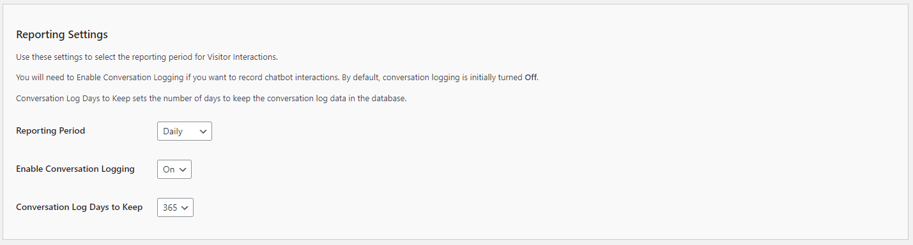

# Configuring the Reporting Settings for the Kognetiks Chatbot Plugin

The Reporting Settings allow you to manage how conversation data is logged and retained, providing insights into chatbot interactions and performance. Follow these steps to configure these options:

1. **Reporting Period**:
   - **Description**: This setting determines the frequency at which reports are aggregated.
   - **Options**: 
     - `Daily`: Generates reports every day.
     - `Monthly`: Generates reports every month.
     - `Yearly`: Generates reports every year.
   - **Selection**: Choose the frequency that best suits your monitoring and analysis needs. For regular insights, `Daily` is recommended.

2. **Enable Conversation Logging**:
   - **Description**: This toggle allows you to enable or disable the logging of conversation data.
   - **Options**: `On` or `Off`.
   - **Selection**: Choose `On` to enable conversation logging, or `Off` to disable it. Enabling logging is useful for tracking interactions and gaining insights into user behavior.

3. **Conversation Log Days to Keep**:
   - **Description**: This setting determines how long conversation logs are retained before they are deleted.
   - **Options**: One of `1`, `7`, `30`, `60`, `90`, `180`, `365` days or `Indefinitely` (i.e., retain forever).
   - **Selection**: Choose a retention period that balances your need for historical data with storage capacity. For example, `365` days keeps logs for a year.
   - **Important**: If you select `Indefinitely`, keep in mind that high chat volumes can quickly consume storage capacity.

## Steps to Configure

1. Navigate to the Reporting Settings section of the Kognetiks Chatbot plugin in your WordPress dashboard.

2. Set the `Reporting Period` dropdown to the desired frequency (`Daily`, `Weekly`, or `Monthly`).

3. Toggle the `Enable Conversation Logging` setting to `On` to start logging conversations.

4. Set the `Conversation Log Days to Keep` to the number of days you want to retain conversation logs.

5. Click 'Save Settings' to apply your changes.

## Tips

- **Regular Monitoring**: Choose `Daily` reporting for more frequent insights, helping you quickly identify and respond to trends or issues.

- **Data Retention**: Ensure your retention period aligns with data privacy policies and storage capabilities. Longer retention periods provide more historical context but require more storage.

- **Logging**: Enabling conversation logging is crucial for tracking chatbot performance and understanding user interactions. Make sure to periodically review and analyze the logged data.

By configuring these settings, you can effectively manage how conversation data is logged and reported, providing valuable insights into the performance and usage of your Kognetiks Chatbot.

---

- **[Back to Reporting Overview](reporting.md)**
- **[Back to the Overview](/overview.md)**
