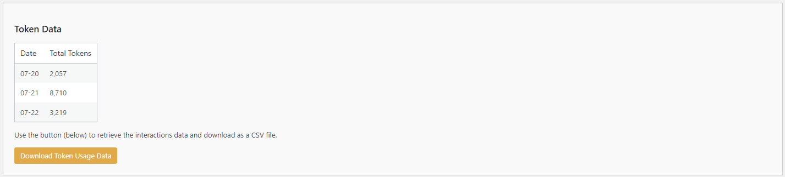

# Using the Token Data

The Token Data settings allow you to monitor and export the token usage data collected by the **Kognetiks Chatbot**. Tokens represent the smallest units of text processed by the chatbot, and tracking their usage helps in managing API costs and understanding chatbot activity. Follow these steps to understand and use these settings:

1. **Token Data Overview**:
   - **Description**: This section provides a summary of the token usage data collected by the chatbot.
   - **Details**:
     - **Date**: The specific date when token usage was recorded.
     - **Total Tokens**: The total number of tokens used on that date.

2. **Download Token Usage Data**:
   - **Description**: This button allows you to download the token usage data as a `CSV` file.
   - **Action**: Click the "Download Token Usage Data" button to retrieve the data.
   - **Usage**: Use this data for analysis, budgeting, or further processing in tools like Excel or other data analysis software.

## Steps to Use

1. **View Summary**:
   - Review the Token Data table to see the number of tokens used on specific dates. This can help you track the chatbot's activity and manage API usage.

2. **Download Data**:
   - Click the "Download Token Usage Data" button to export the token usage data as a `CSV` file. Save this file to your local machine for analysis or budgeting.

## Tips

- **Budget Management**: Use the token data to monitor and manage your API usage costs. Higher token usage may indicate increased activity or more complex interactions.

- **Usage Trends**: Analyze the token usage data to identify trends and patterns. For example, you might notice higher token usage on certain days, which could correlate with increased user engagement or specific events.

- **Regular Monitoring**: Regularly download and review the token usage data to stay updated on the chatbot's activity and ensure you stay within your API usage limits.

## Setting the Reporting Period

- The Reporting Period is set in the [Reporting Settings](reporting-settings.md) to display a summary of the data by `Daily`, `Monthly`, or `Yearly` totals.

- **NOTE:** The token data is accumulated by each day and when exported retains this granularity. 

By using these settings, you can effectively monitor and analyze the token usage data from your Kognetiks Chatbot, helping you manage costs and gain insights into chatbot activity.

---

- **[Back to Reporting Overview](reporting.md)**
- **[Back to the Overview](/overview.md)**
