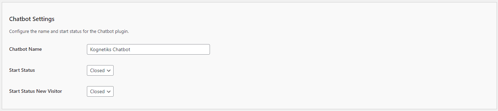
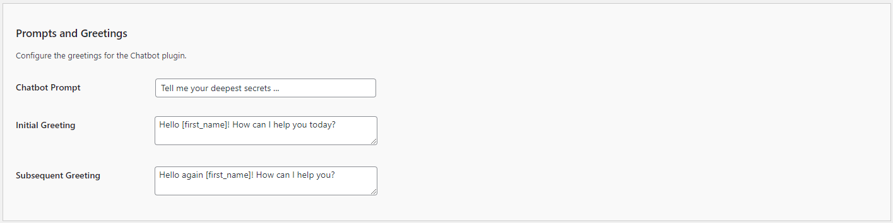
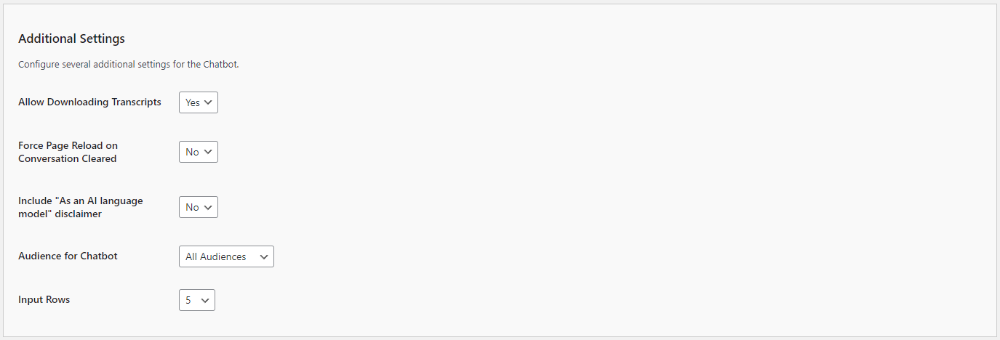

# Chatbot Settings

The General Settings allow you to customize the basic behavior and appearance of your Kognetiks Chatbot. Follow these steps to set up these options:

## General Settings

1. **Chatbot Name**:
   - **Description**: This field allows you to set the name of your chatbot.
   - **Example**: You can name it something like `Kognetiks Chatbot` to align with your brand.

2. **Start Status**:
   - **Description**: This setting determines the initial status of the chatbot when the page loads.
   - **Options**: `Closed` or `Open`.
   - **Selection**: Choose `Closed` if you want the chatbot to be minimized by default, or `Open` if you want it to be visible.

3. **Start Status New Visitor**:
   - **Description**: This setting determines the initial status of the chatbot for new visitors.
   - **Options**: `Closed` or `Open`.
   - **Selection**: Similar to the Start Status, choose `Closed` or `Open` based on your preference for new visitors.

## Prompts and Greetings

1. **Chatbot Prompt**:
   - **Description**: This is the initial prompt that appears in the chatbot input field.
   - **Example**: "Tell me your deepest secrets ..." can be customized to something more appropriate for your audience and use case.

2. **Initial Greeting**:
   - **Description**: This is the message the chatbot sends when a user first opens it.
   - **Example**: "Hello [first_name]! How can I help you today?" Use placeholders like `[first_name]` to personalize the greeting.

3. **Subsequent Greeting**:
   - **Description**: This message appears when a returning user opens the chatbot.
   - **Example**: "Hello again [first_name]! How can I help you?" Customize this to acknowledge returning visitors.

## Additional Settings

1. **Allow Speech Recognition**:
   - **Description**: This toggle allows you to allow chatbot users to speak to the chatbot if support by their browser.
   - **Options**: `Yes` or `No`.
   - **Selection**: Choose `Yes` if you want to allow a users to speak to the chatbot.
   - **Note**: Speech recognition is only supported in modern browsers such as Google Chrome, Microsoft Edge, and Safari. It may not function correctly in other browsers, including older versions of Internet Explorer or Firefox.

2. **Allow Downloading Transcripts**:
   - **Description**: This toggle allows you to allow chatbot users to download transcripts.
   - **Options**: `Yes` or `No`.
   - **Selection**: Choose `Yes` if you want to allow a transcript download.

3. **Include "As an AI language model" disclaimer**:
   - **Description**: This toggle allows you to include a disclaimer about the AI nature of the chatbot.
   - **Options**: `Yes` or `No`.
   - **Selection**: Choose `Yes` if you want to display this disclaimer, which can help manage user expectations.

4. **Force Page Reload on Conversation Clear**:
   - **Description**: This toggle allows you to force the webpage to reload when the chatbot conversation is cleared.
   - **Options**: `Yes` or `No`.
   - **Selection**: Choose `Yes` if you want to force a page reload.

5. **Conversation Continuation**:
   - **Description**: This toggle allows you to enable conversation continuation when returning to a page with an earlier chat.
   - **Options**: `On` or `Off`.
   - **Selection**: Choose `On` if you want to enable conversation continuation.   

6. **Audience for Chatbot**:
   - **Description**: This setting allows you to specify the intended audience for the chatbot.
   - **Options**: `All`, `Visitors`, `Logged-in` etc.
   - **Selection**: Choose the appropriate audience based on the content and purpose of your chatbot.

7. **Input Rows**:
   - **Description**: This setting determines the number of rows in the chatbot input field.
   - **Options**: Set a numeric value.
   - **Selection**: Choose a value like `5` to allow more space for user input, or adjust based on your layout preferences.

## Steps to Configure

1. Navigate to the General Settings section of the Kognetiks Chatbot plugin in your WordPress dashboard.

2. Enter the desired `Chatbot Name`.

3. Set the `Start Status` and `Start Status New Visitor` according to your preference.

4. Customize the `Chatbot Prompt` with a message that fits your use case.

5. Write a personalized `Initial Greeting` to welcome new users.

6. Create a `Subsequent Greeting` for returning users.

7. Decide whether to include the "As an AI language model" disclaimer by toggling the option to `Yes` or `No`.

8. Select the appropriate `Audience for Chatbot` based on your content.

9. Set the `Input Rows` to the desired number.

10. Save the settings.

## Tips

- **Personalization**: Use placeholders like `[first_name]` to make interactions more personalized and engaging.

- **Greeting Messages**: Keep initial and subsequent greetings friendly and helpful to create a positive user experience.

- **User Expectations**: Including disclaimers can help manage expectations and improve user understanding of the chatbot’s capabilities.

By configuring these settings, you ensure that your Kognetiks Chatbot is customized to provide a welcoming and user-friendly experience for your website visitors.

---

- **[Back to the Overview](/overview.md)**
