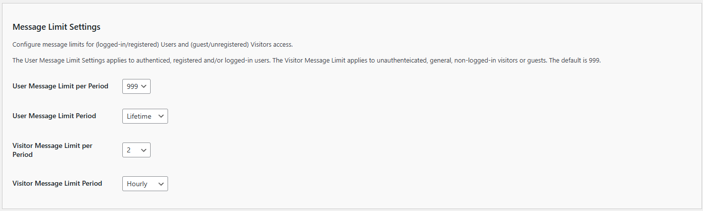

# Chatbot Settings

The General Settings allow you to customize the basic behavior and appearance of your Kognetiks Chatbot. Follow these steps to set up these options:

## AI Platform Selection

1. **AI Platform Choice**:

   - **Description**: This setting determines which AI model provider will be used for conversational AI capabilities.
   - **Options**: `OpenAI`, `Azure OpenAI`, `NVIDIA`, `Anthropic`, `DeepSeek`, `Local Server` and others to be announced.
   - **Default Value**: By default this value will be set to `OpenAI` as the model provider of choice.
   - **Note**: An valid API key obtained from the respective model vendor is required for the chatbot to operate correctly.

   Also see **[API/ChatGPT Settings](api-chatgpt-settings/api-chatgpt-model-settings.md)**

   Also see **[API/NVIDIA Settings](api-nvidia-settings/api-nvidia-model-settings.md)**

## General Settings

1. **Chatbot Name**:
   - **Description**: This field allows you to set the name of your chatbot.
   - **Example**: You can name it something like `Kognetiks Chatbot` to align with your brand.

2. **Start Status**:
   - **Description**: This setting determines the initial status of the chatbot when the page loads.
   - **Options**: `Closed` or `Open`.
   - **Selection**: Choose `Closed` if you want the chatbot to be minimized by default, or `Open` if you want it to be visible.

3. **Start Status New Visitor**:
   - **Description**: This setting determines the initial status of the chatbot for new visitors.
   - **Options**: `Closed` or `Open`.
   - **Selection**: Similar to the Start Status, choose `Closed` or `Open` based on your preference for new visitors.

## Message Limit Settings

1. **Display Message Count**:
   - **Description**: This setting determines if the message count is displayed in the chatbot's response, such as `(29/50)`, i.e., 29 prompts out of 50 limited, to help visitors and logged-in users understand how many exchanges they have had with the chatbot.
   - **Default Value**: The default value is `No`, i.e., don't display the count.
   - **Selection**: Choose `Yes` to display the message count.  Or choose `No` to exclude the message count from the response.

1. **User Message Limit per Period**:
   - **Description**: This setting limits the number of messages logged-in users can send to the chatbot per day. It helps manage API usage and costs.
   - **Default Value**: The default limit is set to 999 messages per day.
   - **Customization**: You can adjust this number based on your needs. Enter the desired limit in the provided field.

2. **User Message Limit Period**:
   - **Description**:This setting defines the time period during which non-logged-in users (visitors) and logged-in users can send messages to the chatbot. It allows you to manage how often users can interact with the chatbot and helps regulate API usage and associated costs.
   - **Default Value**: By default, users are allowed to send up to 999 messages per day.
   - **Customization**: You can customize the number of allowed messages and the reset period based on your specific needs. Enter the desired message limit in the provided field. The following time periods are available for customization:
   
      - **Hourly**: Resets the message count every hour, providing a more granular control over usage within a single day. This is useful if you want to limit message bursts within short time frames.
      - **Daily**: Resets the message count once per day. This is the most common setting, providing users with a fixed number of messages each day.
      - **Weekly**: Resets the message count once every week. This can help spread out usage over a longer period, ideal for scenarios where more extended engagement is anticipated.
      - **Monthly**: Resets the message count at the start of each month. Useful for managing API usage on a month-to-month basis, ensuring that your usage aligns with monthly API cost limits.
      - **Quarterly**: Resets the message count every three months. This option is useful for managing seasonal fluctuations in chatbot usage.
      - **Yearly**: Resets the message count once per year. This is ideal for long-term planning and budgeting for API usage.
   - **NOTE**: Lifetime: No reset occurs. This option allows unlimited messages over a user's lifetime, which can be useful for creating limited-time access.
   
3. **Visitor Message Limit**:
   - **Description**: This setting limits the number of messages non-logged-in users (visitors) can send to the chatbot per day. It also helps manage API usage and costs.
   - **Default Value**: The default limit is set to 999 messages per day.
   - **Customization**: You can adjust this number based on your needs. Enter the desired limit in the provided field.

4. **Visitor Message Limit per Period**:
   - **Description**:This setting defines the time period during which non-logged-in users (visitors) and logged-in users can send messages to the chatbot. It allows you to manage how often users can interact with the chatbot and helps regulate API usage and associated costs.
   - **Default Value**: By default, users are allowed to send up to 999 messages per day.
   - **Customization**: You can customize the number of allowed messages and the reset period based on your specific needs. Enter the desired message limit in the provided field. The following time periods are available for customization:
   
      - **Hourly**: Resets the message count every hour, providing a more granular control over usage within a single day. This is useful if you want to limit message bursts within short time frames.
      - **Daily**: Resets the message count once per day. This is the most common setting, providing users with a fixed number of messages each day.
      - **Weekly**: Resets the message count once every week. This can help spread out usage over a longer period, ideal for scenarios where more extended engagement is anticipated.
      - **Monthly**: Resets the message count at the start of each month. Useful for managing API usage on a month-to-month basis, ensuring that your usage aligns with monthly API cost limits.
      - **Quarterly**: Resets the message count every three months. This option is useful for managing seasonal fluctuations in chatbot usage.
      - **Yearly**: Resets the message count once per year. This is ideal for long-term planning and budgeting for API usage.
   - **NOTE**: Lifetime: No reset occurs. This option allows unlimited messages over a user's lifetime, which can be useful for creating limited-time access.

## Prompts and Greetings

1. **Chatbot Prompt**:
   - **Description**: This is the initial prompt that appears in the chatbot input field.
   - **Example**: "Tell me your deepest secrets ..." can be customized to something more appropriate for your audience and use case.

2. **Initial Greeting**:
   - **Description**: This is the message the chatbot sends when a user first opens it.
   - **Example**: "Hello [first_name]! How can I help you today?" Use placeholders like `[first_name]` to personalize the greeting.

3. **Subsequent Greeting**:
   - **Description**: This message appears when a returning user opens the chatbot.
   - **Example**: "Hello again [first_name]! How can I help you?" Customize this to acknowledge returning visitors.

## Additional Settings

1. **Allow Speech Recognition**:
   - **Description**: This toggle allows you to allow chatbot users to speak to the chatbot if support by their browser.
   - **Options**: `Yes` or `No`.
   - **Selection**: Choose `Yes` if you want to allow a users to speak to the chatbot.
   - **Note**: Speech recognition is only supported in modern browsers such as Google Chrome, Microsoft Edge, and Safari. It may not function correctly in other browsers, including older versions of Internet Explorer or Firefox.

2. **Allow Downloading Transcripts**:
   - **Description**: This toggle allows you to allow chatbot users to download transcripts.
   - **Options**: `Yes` or `No`.
   - **Selection**: Choose `Yes` if you want to allow a transcript download.

3. **Include "As an AI language model" disclaimer**:
   - **Description**: This toggle allows you to include a disclaimer about the AI nature of the chatbot.
   - **Options**: `Yes` or `No`.
   - **Selection**: Choose `Yes` if you want to display this disclaimer, which can help manage user expectations.

4. **Force Page Reload on Conversation Clear**:
   - **Description**: This toggle allows you to force the webpage to reload when the chatbot conversation is cleared.
   - **Options**: `Yes` or `No`.
   - **Selection**: Choose `Yes` if you want to force a page reload.

5. **Conversation Continuation**:
   - **Description**: This toggle allows you to enable conversation continuation when returning to a page with an earlier chat.
   - **Options**: `On` or `Off`.
   - **Selection**: Choose `On` if you want to enable conversation continuation.   

6. **Audience for Chatbot**:
   - **Description**: This setting allows you to specify the intended audience for the chatbot.
   - **Options**: `All`, `Visitors`, `Logged-in` etc.
   - **Selection**: Choose the appropriate audience based on the content and purpose of your chatbot.

7. **Input Rows**:
   - **Description**: This setting determines the number of rows in the chatbot input field.
   - **Options**: Set a numeric value.
   - **Selection**: Choose a value like `5` to allow more space for user input, or adjust based on your layout preferences.

## Advanced Search Settings

1. **Enable Advanced Content Search**:

   - **Description**: When enabled, this feature allows the chatbot to pull information from your site's existing content, such as posts, pages, products, and other custom post types, to provide richer and more accurate answers.
   - **Options**: `Yes` or `No`.
   - **Selection**: Choose `Yes` if you want the AI to reference your local content when responding to user queries.

## Steps to Configure

1. Navigate to the General Settings section of the Kognetiks Chatbot plugin in your WordPress dashboard.

2. Enter the desired `Chatbot Name`.

3. Set the `Start Status` and `Start Status New Visitor` according to your preference.

4. Select a `User Message Limit per Perod` or use the default.

5. Select a `User Message Limit Period` or use the default.

6. Select a `Visitor Message Limit per Perod` or use the default.

7. Select a `Visitor Message Limit Period` or use the default.

8. Customize the `Chatbot Prompt` with a message that fits your use case.

9. Write a personalized `Initial Greeting` to welcome new users.

10. Create a `Subsequent Greeting` for returning users.

11. Decide whether to include the "As an AI language model" disclaimer by toggling the option to `Yes` or `No`.

12. Select the appropriate `Audience for Chatbot` based on your content.

13. Set the `Input Rows` to the desired number.

14. Save the settings.

## Tips

By configuring these settings, you ensure that your Kognetiks Chatbot plugin operates smoothly and efficiently, providing a seamless experience for both logged-in users and visitors.

- **Monitoring Usage**: Regularly monitor API usage in the AI Platform vendor's dashboard to ensure that your limits are appropriate and adjust them as necessary.

- **Cost Management**: Setting appropriate message limits helps control costs associated with API usage.

- **Personalization**: Use placeholders like `[first_name]` to make interactions more personalized and engaging.

- **Greeting Messages**: Keep initial and subsequent greetings friendly and helpful to create a positive user experience.

- **User Expectations**: Including disclaimers can help manage expectations and improve user understanding of the chatbot's capabilities.

By configuring these settings, you ensure that your Kognetiks Chatbot is customized to provide a welcoming and user-friendly experience for your website visitors.

---

- **[Back to the Overview](/overview.md)**
