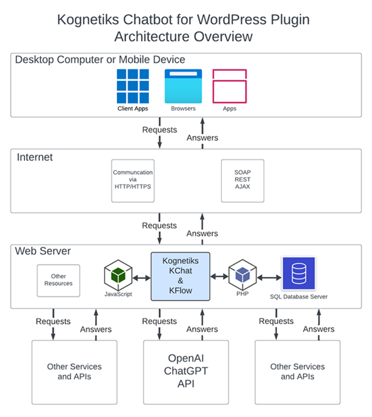

# How the Kognetiks Chatbot Plugin Works: A Simple Explanation

Imagine you are having a conversation with a helpful assistant on a website. This assistant, or chatbot, is designed to provide you with information and answers to your questions.

Here's how it all works, step by step, using the diagram as our guide:

1. **Desktop Computer or Mobile Device**:
   - You, the user, interact with the chatbot using various devices like a desktop computer, a mobile phone, or a tablet.

   - You can access the chatbot through different applications, such as web browsers (like Chrome or Safari) or client apps.

2. **Internet**:
   - When you ask a question, your device sends this request over the internet.

   - The internet acts as a bridge, carrying your request to the web server where the chatbot lives.

3. **Web Server**:
   - The web server is where the Kognetiks Chatbot (KChat) and its flow system (KFlow) are hosted.

   - The web server processes your request and communicates with various components to find the right answer.

4. **Components on the Web Server**:

   - **JavaScript and PHP**: These are programming languages that help the chatbot process your request. JavaScript handles things on the user's side, making sure the chatbot responds quickly and smoothly. PHP works on the server side, managing the logic and data processing.

   - **SQL Database Server**: This is where the chatbot stores and retrieves information. When you ask a question, the chatbot might need to look up information in this database to provide an accurate answer.

   - **OpenAI ChatGPT API**: Sometimes, the chatbot needs advanced language understanding to answer your questions. It uses the OpenAI ChatGPT API, which is a powerful tool that helps the chatbot understand and generate human-like responses.

   - **Other Services and APIs**: The chatbot might also reach out to other services and APIs (Application Programming Interfaces) to gather additional information or perform specific tasks.

5. **Flow of Requests and Answers**:

   - Your question travels from your device to the web server via the internet.
   - The web server processes your question using JavaScript, PHP, and may consult the SQL Database or the OpenAI ChatGPT API.
   - Once the chatbot has the information it needs, it sends the answer back to your device through the internet.
   - Your device then displays the chatbot's response, allowing you to read the answer and continue the conversation.

# Summary

The Kognetiks Chatbot is like a smart assistant on a website that helps answer your questions. It works by sending your requests over the internet to a web server, where various tools and databases process your questions and find the best answers. This process happens quickly, providing you with the information you need in a smooth and efficient manner.

---

- **[Back to the Overview](/overview.md)**