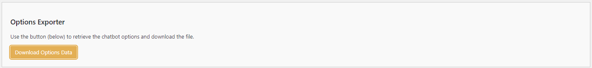
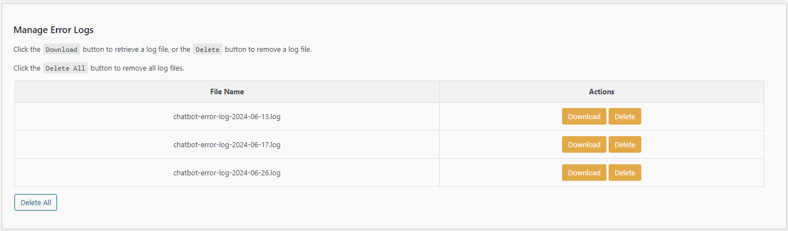
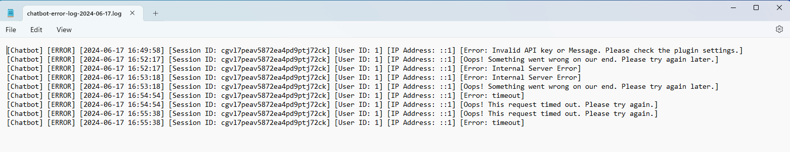
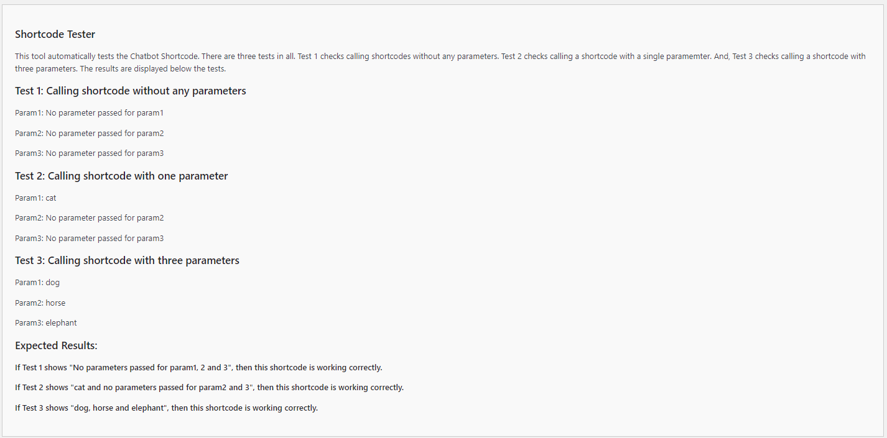
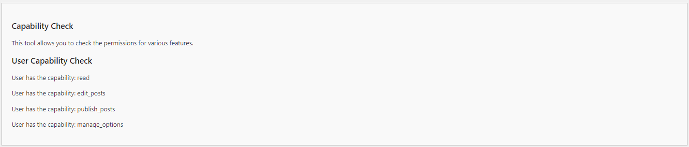

# Tools

**NOTE:** The Tools tab is only visible when the ```Chatbot Diagnostics``` option is set to any value other than ```Off```.  By default, the value is initially ```Off```.

To enable the Tools tab, navigate to the Chatbot Settings, then to the Messages tab.  Once there scroll down until you find the ```Chatbot Diagnostics``` setting, then choose ```Error```, then click ```Save Settings```.  When the Chatbot Settings are reloaded, the Tools tab will be available for to select.

There are three tools currently available:

- Options Exporter
- Manage Error Logs
- Shortcode Tester
- Capability Check

Each tool is briefly described below.

---

## Options Exporter

Export the Chatbot options to a file.  This excludes sensitive information such as your API key.



### Steps:

1. **Choose the format for exporting the chatbot options**:
   - Options: JSON, CSV
   - **TIP**: if you select a new output format, first click the ```Save Options``` button before clicking the ```Download Options Data```.

2. **Download Options Data**:
   - Use the ```Download Options Data``` button to retrieve the chatbot options and download the file.

---

## Manage Error Logs:

The Manage Error Logs section provides direct access to the chatbot's unique errors.  If you're experiencing a problem with the chatbot, please check the error logs to see if you can determine what might be the problem.



## Example Error Log



### Steps:

1. **Download**
    - Choose ```Download``` to retrieve and save locally the selected error log.

2. **Delete**
    - Choose ```Delete``` to delete the selected error log.

3. **Delete All**
    - Chose ```Delete All``` to delete ALL error logs listed.

---

## Automated Shortcode Tester

This tool allows you to test that shortcode are working as expected. The results are displayed accordingly.  If the parameter has been ignored, then the results will show ```No parameter pass for param1, 2 or 3```.  The expected results are documented below.



### Test 1: Calling shortcode without any parameters

- **Input**: `[shortcode]`
- **Output**:
  - Param1: No parameter passed for param1
  - Param2: No parameter passed for param2
  - Param3: No parameter passed for param3

### Test 2: Calling shortcode with one parameter

- **Input**: `[shortcode param1=cat]`
- **Output**:
  - Param1: cat
  - Param2: No parameter passed for param2
  - Param3: No parameter passed for param3

### Test 3: Calling shortcode with three parameters

- **Input**: `[shortcode param1=dog param2=horse param3=elephant]`
- **Output**:
  - Param1: dog
  - Param2: horse
  - Param3: elephant

### Expected Results and Interpretation

- If Test 1 shows "No parameters passed for param1, 2, and 3", then the shortcode is working correctly.
- If Test 2 shows "cat and no parameters passed for param2 and 3", then the shortcode is working correctly.
- If Test 3 shows "dog, horse, and elephant", then the shortcode is working correctly.

---

## Capability Check

This tool allows you to check the permissions for various roles.  If a capability is not listed, then the user is not authorized for the capability.  As an Administrator you should have read, edit, publish and manage capabilities.



### User Capability Check

- **Output**:
  - User has the capability: read
  - User has the capability: edit_posts
  - User has the capability: publish_posts
  - User has the capability: manage_options

---

- **[Back to the Overview](/overview.md)**
